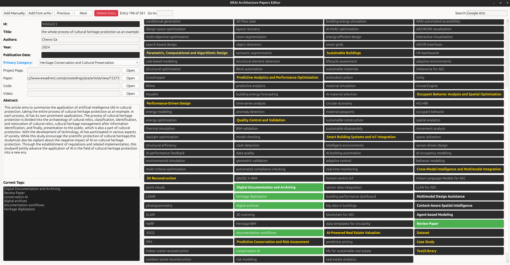

# Contributing Guide

Thank you for your interest in contributing to the **Awesome XRAI for Architecture** repository! This document will guide you through the contribution process.

## 🚨 Important: All contributions require approval

All changes to this repository must be reviewed and approved by the repository maintainer before being merged. This ensures quality and consistency of the research database.

## 🤝 How to Contribute

### For External Contributors (Recommended)

1. **Fork the repository** on GitHub

2. **Clone your fork locally:**

    ```bash
    git clone https://github.com/YOUR_USERNAME/Awesome-XRAI-for-Architecture.git
    cd Awesome-XRAI-for-Architecture
    ```

3. **Create a new branch for your contribution:**

   ```bash
   git checkout -b add-new-papers
   # or
   git checkout -b fix-paper-info
   ```

4. **Make your changes** (see sections below)

5. **Push to your fork:**

    ```bash
    git push origin add-new-papers
    ```

6. **Create a Pull Request** on GitHub

7. **Wait for review and approval** - The maintainer will review your changes

8. **Address any feedback** if requested

9. **Your PR will be merged** after approval

### For Repository Collaborators

If you have been added as a collaborator:

1. **Clone the repository:**

   ```bash
   git clone https://github.com/prakashknaikade/Awesome-XRAI-for-Architecture.git
   cd Awesome-XRAI-for-Architecture
   ```

2. **Create a new branch:**

   ```bash
   git checkout -b your-feature-branch
   ```

3. **Make changes and create a Pull Request** (never push directly to `main`)

## Adding Papers

We use a custom YAML editor to maintain the paper database. To add or edit papers:

### Method 1: Using the YAML Editor (Recommended)

1. Install dependencies:

    ```bash
    pip install -r requirements.txt
    ```

2. Install Poppler (required for PDF processing):
    - **Ubuntu/Debian:**

      ```bash
      sudo apt-get install poppler-utils
      ```

    - **macOS:**

      ```bash
      brew install poppler
      ```

    - **Windows:**
      - Download and install from: <https://github.com/oschwartz10612/poppler-windows/releases/>
      - Add the `bin` directory to your system PATH

3. Run the YAML editor:

    ```bash
    python src/yaml_editor.py
    ```

    or

    ```bash
    python -m src.yaml_editor
    ```

It looks like following:
 

4. Use the editor to:

   - Add new papers manually by entering each fieald
   - Add new papers using the "Add from arXiv" button
   - Edit existing entries
   - Add tags, links, and other metadata
   - Preview thumbnails

5. The editor will automatically save changes to `awesome_xrai_architecture_papers.yaml`

### Method 2: Manual YAML Editing

If you prefer to edit the YAML file directly, add your paper entry to `awesome_xrai_architecture_papers.yaml`:

```yaml
- id: "unique id"
  title: "Your Paper Title"
  authors: ["Author 1", "Author 2", "Author 3"]
  year: 2024
  venue: "Conference/Journal Name"
  paper_url: "https://arxiv.org/abs/xxxx.xxxxx"
  code_url: "https://github.com/username/repo"    # optional
  project_url: "https://project-website.com"     # optional
  tags: ["XR", "Architecture", "Design"]
  primary_category: "XR in Architectural Design"
  abstract: "Brief description of the paper and its contributions..."
```

### Required Fields

- `id`: unique id
- `title`: Paper title
- `authors`: List of authors
- `year`: Publication year
- `primary_category`: Main category (see categories below)
- `abstract`: Paper abstract

### Optional Fields

- `venue`: Conference/journal name
- `paper_url`: Link to paper (arXiv, DOI, etc.)
- `code_url`: Link to code repository
- `project_url`: Link to project page
- `tags`: List of relevant tags

### Paper Categories

- `XR in Architectural Design`
- `AI for Architecture`
- `Generative Design`
- `Building Information Modeling (BIM)`
- `Architectural Visualization`
- `Smart Buildings`
- `Computational Design`

## 🔧 Testing Your Changes

Before submitting a PR, please test your changes:

1. **Validate YAML syntax:**

   ```bash
   python -c "import yaml; yaml.safe_load(open('awesome_xrai_architecture_papers.yaml'))"
   ```

2. **Test HTML generation:**

   ```bash
   python src/generate.py awesome_xrai_architecture_papers.yaml index.html
   ```

   Open the generated index.html file in browser and check for any mistakes.

3. **Generate updated README (Important):**

   ```bash
   python generate_readme.py
   ```

## 📋 Pull Request Guidelines

### PR Requirements

- **Clear description** of what you're adding/changing
- **Working links** to papers and resources
- **Appropriate categorization** and tags
- **Proper formatting** following existing style
- **One topic per PR** (don't mix unrelated changes)

## 🚫 What NOT to Include

Please don't add:

- Papers not related to XR/AI in Architecture
- Broken or inaccessible links
- Duplicate entries
- Incomplete information (missing abstracts, authors, etc.)
- Personal projects without peer review (unless in appropriate section)

## 🛠️ Adding Other Resources

For non-paper resources (tools, datasets, tutorials):

1. **Fork and create a branch**
2. **Edit the appropriate section** in README.md
3. **Follow existing formatting**
4. **Create a Pull Request**

## 🆘 Need Help?

- **Check existing issues** on GitHub
- **Look at recent PRs** for examples
- **Create an issue** if you're unsure about something
- **Ask questions** in your PR description

---

## ⚖️ Code of Conduct

By contributing to this repository, you agree to:

- Provide accurate and verifiable information
- Respect intellectual property rights
- Follow the contribution guidelines
- Be respectful in all interactions
- Wait for approval before merging changes

Thank you for helping make this resource better for the XRAI Architecture community! 🏗️✨
