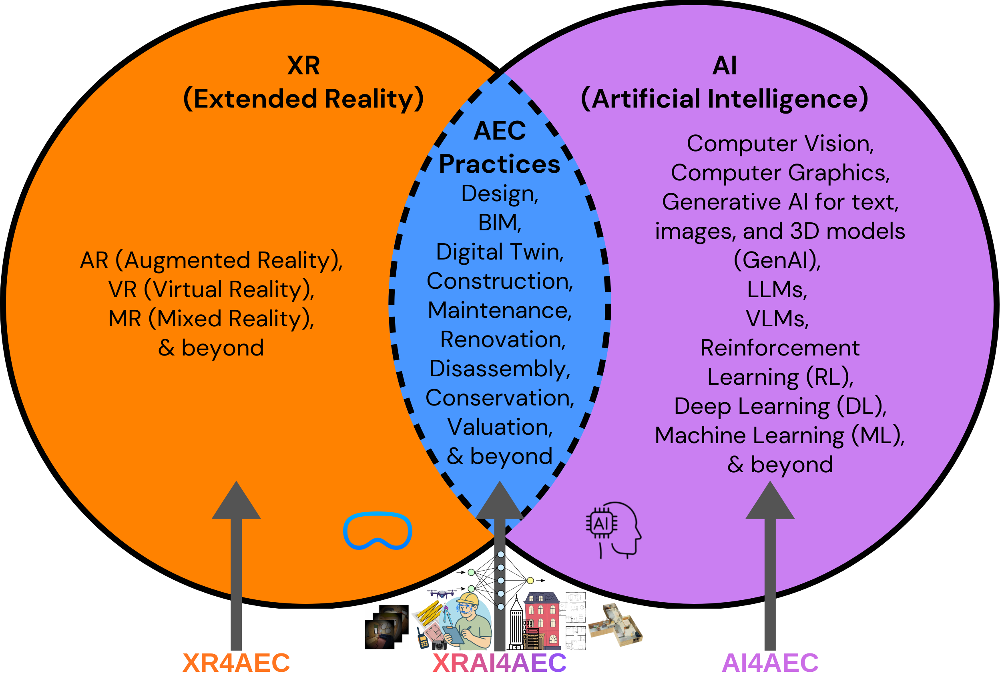

# Awesome XRAI for AEC - Buildings and Spaces

  A curated collection of resources focused on XR+AI for AEC (<i><b>XRAI4AEC</b></i>) and related technologies such as (2D/3D) computer vision, computer graphics, LLMs, VLMS, GenAI, deep/machine learning, data science, and AR/VR for Design Generation, BIM, Digital Twin, LCA, Dissaseembly Planning, Real Estate Valuation, and more for Intelligent, Sustainable, and Human-Centric Built Environments.

  [**Our Paper 📄**](https://doi.org/10.5281/zenodo.20283895) | [**Browse Paper Database 🛢️**](https://prakashknaikade.github.io/Awesome-XRAI-for-Architecture/) | [**Contribute 🤝🏼**](CONTRIBUTING.md) | [**Prakash Naikade 👤**](https://prakashknaikade.github.io/)

## Contents

- [Paper Database &amp; Documentation](#paper-database--documentation)
- [Tools &amp; Utilities](#tools--utilities)
- [Learning Resources](#learning-resources)
- [Research Institutes for Collaboration](#research-institutes-for-collaboration)
- [Changelog](#changelog)
- [List of Papers](#list-of-papers)
  - [AI-Driven Design and Generative Architecture](#ai-driven-design-and-generative-architecture)
  - [Reality Capture and Digital Twins](#reality-capture-and-digital-twins)
  - [Computational BIM and Intelligent Operations](#computational-bim-and-intelligent-operations)
  - [Heritage Conservation and Cultural Preservation](#heritage-conservation-and-cultural-preservation)
  - [Sustainability and Environmental Performance](#sustainability-and-environmental-performance)
  - [Sustainable Real Estate Valuation and Economics](#sustainable-real-estate-valuation-and-economics)
  - [Human-Computer Interaction and Human-Building Interaction](#human-computer-interaction-and-human-building-interaction)
- [Credits](#credits)

## Paper Database & Documentation

### Paper Database

Visit our comprehensive, searchable database of papers:
🔍 [Paper Database](https://prakashknaikade.github.io/Awesome-XRAI-for-Architecture/)

You can also check [list of papers](#list-of-papers) here, but we recoomend to explore our [searchable paper database](https://prakashknaikade.github.io/Awesome-XRAI-for-Architecture/).

### Datasets

- [Aria Synthetic Environments Dataset](https://www.projectaria.com/datasets/ase/)
- [Scan-to-BIM-to-Sim](https://data.mendeley.com/datasets/znxxsgn2ky/1)
- [SceneCad](https://github.com/skanti/SceneCAD?tab=readme-ov-file#download-data)
- [Structured3D](https://structured3d-dataset.org/)
- [3D Scene Graph](https://3dscenegraph.stanford.edu/database.html)
- [ScanNet++](https://scannetpp.mlsg.cit.tum.de/scannetpp/)

## Tools & Utilities

### Data Processing

- [Kapture](https://github.com/naver/kapture) - Unified data format for visual localization

- [camorph](https://github.com/Fraunhofer-IIS/camorph) - Camera parameter conversion

### 3D Viewers (for Web, Game Engines)

- [3DGS Unity Plugin](https://github.com/aras-p/UnityGaussianSplatting)

- [3DGS Unreal Plugin](https://github.com/xverse-engine/XV3DGS-UEPlugin)

- [PlayCanvas for 3D Web](https://github.com/playcanvas)

## Learning Resources

### Courses

#### Machine Learning / Computer Vision / Graphics Courses

- [Deep Learning for Computer Vision](https://cs231n.stanford.edu/2025/schedule.html) → [Lecture Videos YT](https://www.youtube.com/playlist?list=PLoROMvodv4rOmsNzYBMe0gJY2XS8AQg16)

- [Ray Tracing in One Weekend](https://raytracing.github.io/books/RayTracingInOneWeekend.html)

- [Scratch a Pixel](https://www.scratchapixel.com/index.html)
- [Physically Based Rendering: From Theory To Implementation](https://pbr-book.org/3ed-2018/contents)

- [3D Computer Vision](https://uni-tuebingen.de/fakultaeten/mathematisch-naturwissenschaftliche-fakultaet/fachbereiche/informatik/lehrstuehle/autonomous-vision/lectures/computer-vision/)

- [MIT Inverse Graphics](https://www.scenerepresentations.org/courses/2023/fall/inverse-graphics/)

#### AEC Related Courses (BIM, LCA, etc)

- [BIM by TÜV SÜD](https://www.tuvsud.com/en-ph/services/training/e-learning-courses/building-information-modeling-bim-basics)

- [BIM by Computer Integrated Construction Research Group at Penn State University](https://bim.psu.edu/)

## Research Institutes for Collaboration

Here are some organizations we can collaborate within XRAI4AEC domain:

### Industrial Companies/Research Labs

- [Autodesk](https://www.research.autodesk.com/)
- [Digital Reality Corp](https://drc.co/)
- [Madaster](https://madaster.com/)
- [Matterport](https://matterport.com/)
- [Pix4D](https://www.pix4d.com/)
- [Hilti](https://www.hilti.com/)

### Academic Research Groups/Labs

- [AI:Xpertise Lab | XRAI4AEC | CREATE, AAU]()
- [Gradient Spaces Lab | Stanford](https://gradientspaces.stanford.edu/)
- [Design++ Lab | ETH Zurich](https://designplusplus.ethz.ch/)
- [XAIA laboratory](https://xaialab.org/)
- [ITA Institute of Technology in Architecture | ETH Zurich](https://ita.arch.ethz.ch/)
- [More Institutes at – Department of Architecture | ETH Zurich](https://arch.ethz.ch/en/departement/institute.html)
- [Circular Engineering for Architecture | ETH Zurich](https://cea.ibi.ethz.ch/)
- [Institute of Construction & Infrastructure Management | ETH Zurich](https://ibi.ethz.ch/en/)
- [More Institutes at – Dept. of Civil, Environmental and Geomatic Engineering | ETH Zurich](https://baug.ethz.ch/en/department/institutes.html)
- [City Science - MIT Media Lab](https://www.media.mit.edu/groups/city-science/overview/)
- [More research groups at MIT Media Lab](https://www.media.mit.edu/research/?filter=groups_centers)
- [3D AI Lab | TUM](https://www.3dunderstanding.org/index.html)
- [Spatial Computing Lab | TUM](https://www.cee.ed.tum.de/en/ccbe/research/research-groups/spatial-computing/)
- [Digital Structures Lab | MIT](http://digitalstructures.mit.edu/)
- [Virginia Center for Housing Research (VCHR)/Building Technology | VT](https://mlsoc.vt.edu/research/vchr.html)
- [Sustainable Built Environment/Circular Economy | EMPA](https://www.empa.ch/circular-economy)

## Changelog

*Recent additions (last 60 days):*

**June 04, 2026**

- The Scene Language: Representing Scenes with Programs, Words, and Embeddings → *Reality Capture and Digital Twins*
- BlenderAlchemy: Editing 3D Graphics with Vision-Language Models → *Reality Capture and Digital Twins*

# List of Papers

## AI-Driven Design and Generative Architecture

### 2025

### 1. AI-Infused Design - Merging parametric models for architectural design

**Authors**: Adam Sebestyen, Ozan Özdenizci, Robert Legenstein, Urs Hirschberg

<b>Abstract</b>

This paper presents ongoing work on developing 3D Generative AI tools based on parametric models to facilitate novel types of Design Space Exploration (DSE) to overcome human biases and expand the range of feasible design solutions. By integrating parametric models and neural networks, the study demonstrates how 3D-mesh based datasets generated from different parametric models can be combined in deep learning to create more diverse design spaces. Specifically, we compare training on the same datasets with an unconditioned Variational Autoencoder (VAE) and with conditioned Denoising Diffusion Models (DDMs). We present a novel approach of mixing DDM design spaces and contrast this method with our previous work using a VAE. The paper compares the outputs of VAE and DDMs, highlighting their respective strengths and weaknesses, and proposes a hybrid generative AI model combining both approaches to harness their complementary advantages.

**Links**: [📄 Paper](https://www.researchgate.net/publication/384379568_AI-Infused_Design_-_Merging_parametric_models_for_architectural_design)

### 2. ArchSeek: Retrieving Architectural Case Studies Using Vision-Language Models

**Authors**: Danrui Li, Yichao Shi, Yaluo Wang, Ziying Shi, Mubbasir Kapadia

<b>Abstract</b>

Efficiently searching for relevant case studies is critical in architectural design, as designers rely on precedent examples to guide or inspire their ongoing projects. However, traditional text-based search tools struggle to capture the inherently visual and complex nature of architectural knowledge, often leading to time-consuming and imprecise exploration. This paper introduces ArchSeek, an innovative case study search system with recommendation capability, tailored for architecture design professionals. Powered by the visual understanding capabilities from vision-language models and cross-modal embeddings, it enables text and image queries with fine-grained control, and interaction-based design case recommendations. It offers architects a more efficient, personalized way to discover design inspirations, with potential applications across other visually driven design fields. The source code is available at https://github.com/danruili/ArchSeek.

**Links**: [📄 Paper](https://arxiv.org/pdf/2503.18680v1.pdf) | [💻 Code](https://github.com/danruili/ArchSeek)

### 3. ReSpace: Text-Driven 3D Scene Synthesis and Editing with Preference Alignment

**Authors**: Martin JJ. Bucher, Iro Armeni

<b>Abstract</b>

Scene synthesis and editing has emerged as a promising direction in computer graphics. Current trained approaches for 3D indoor scenes either oversimplify object semantics through one-hot class encodings (e.g., 'chair' or 'table'), require masked diffusion for editing, ignore room boundaries, or rely on floor plan renderings that fail to capture complex layouts. In contrast, LLM-based methods enable richer semantics via natural language (e.g., 'modern studio with light wood furniture') but do not support editing, remain limited to rectangular layouts or rely on weak spatial reasoning from implicit world models. We introduce ReSpace, a generative framework for text-driven 3D indoor scene synthesis and editing using autoregressive language models. Our approach features a compact structured scene representation with explicit room boundaries that frames scene editing as a next-token prediction task. We leverage a dual-stage training approach combining supervised fine-tuning and preference alignment, enabling a specially trained language model for object addition that accounts for user instructions, spatial geometry, object semantics, and scene-level composition. For scene editing, we employ a zero-shot LLM to handle object removal and prompts for addition. We further introduce a novel voxelization-based evaluation that captures fine-grained geometry beyond 3D bounding boxes. Experimental results surpass state-of-the-art on object addition while maintaining competitive results on full scene synthesis.

**Links**: [📄 Paper](https://arxiv.org/pdf/2506.02459.pdf) | [🌐 Project Page](https://respace.mnbucher.com/) | [💻 Code](https://github.com/GradientSpaces/respace) | [🎥 Video](https://www.youtube.com/watch?v=2IMHWJqgDPg)

### 4. ReStyle3D: Scene-Level Appearance Transfer with Semantic Correspondences

**Authors**: Liyuan Zhu, Shengqu Cai, Shengyu Huang, Gordon Wetzstein, Naji Khosravan, Iro Armeni

<b>Abstract</b>

We introduce ReStyle3D, a novel framework for scene-level appearance transfer from a single style image to a real-world scene represented by multiple views. The method combines explicit semantic correspondences with multi-view consistency to achieve precise and coherent stylization. Unlike conventional stylization methods that apply a reference style globally, ReStyle3D uses open-vocabulary segmentation to establish dense, instance-level correspondences between the style and real-world images. This ensures that each object is stylized with semantically matched textures. It first transfers the style to a single view using a training-free semantic-attention mechanism in a diffusion model. It then lifts the stylization to additional views via a learned warp-and-refine network guided by monocular depth and pixel-wise correspondences. Experiments show that ReStyle3D consistently outperforms prior methods in structure preservation, perceptual style similarity, and multi-view coherence. User studies further validate its ability to produce photo-realistic, semantically faithful results. Our code, pretrained models, and dataset will be publicly released, to support new applications in interior design, virtual staging, and 3D-consistent stylization.

**Links**: [📄 Paper](https://arxiv.org/pdf/2502.10377.pdf) | [🌐 Project Page](https://restyle3d.github.io/) | [💻 Code](https://github.com/GradientSpaces/ReStyle3D) | [🎥 Video](https://www.youtube.com/watch?v=93FkXriWv2w)

### 5. Rethinking Architectural Design Process using Integrated Parametric Design and Machine Learning Principles

**Authors**: Alexis Andreou, Odysseas Kontovourkis, Solon Solomou, Andreas Savvides

<b>Abstract</b>

Artificial Intelligence (AI) has the potential to process vast amounts of subjective and conflicting information in architecture. However, it has mostly been used as a tool for managing information rather than as a means of enhancing the creative design process. This work proposes an innovative way to enhance the architectural design process by incorporating Machine Learning (ML), a type of Artificial Intelligence (AI), into a parametric architectural design process. ML would act as a mediator between the architects' inputs and the end-users' needs. The objective of this work is to explore how Machine Learning (ML) can be utilized to visualize creative designs by transforming information from one form to another - for instance, from text to image or image to 3D architectural shapes. Additionally, the aim is to develop a process that can generate comprehensive conceptual shapes through a request in the form of an image and/or text. The suggested method essentially involves the following steps: Model creation, Revisualization, Performance evaluation. By utilizing this process, end-users can participate in the design process without negatively affecting the quality of the final product. However, the focus of this approach is not to create a final, fully-realized product, but rather to utilize abstraction and processing to generate a more understandable outcome. In the future, the algorithm will be improved and customized to produce more relevant and specific results, depending on the preferences of end-users and the input of architects.

**Links**: [📄 Paper](https://papers.cumincad.org/data/works/att/ecaade2023_328.pdf)

### 2024

### 1. AI-Assisted Design: Utilising artificial intelligence as a generative form-finding tool in architectural design studio teaching

**Authors**: Asterios Agkathidis, Yang Song, Ioanna Symeonidou

<b>Abstract</b>

Artificial Intelligence (AI) tools are currently making a dynamic appearance in the architectural realm. Social media are being bombarded by word-to-image/image-to-image generated illustrations of fictive buildings generated by tools such as 'Midjourney', 'DALL-E', 'Stable Diffusion' and others. Architects appear to be fascinated by the rapidly generated and inspiring 'designs' while others criticise them as superficial and formalistic. In continuation to previous research on Generative Design, (Agkathidis, 2015), this paper aims to investigate whether there is an appropriate way to integrate these new technologies as a generative tool in the educational architectural design process. To answer this question, we developed a design workflow consisting of four phases and tested it for two semesters in an architectural design studio in parallel to other studio units using conventional design methods but working on the same site. The studio outputs were evaluated by guest critics, moderators and external examiners. Furthermore, the design framework was evaluated by the students through an anonymous survey. Our findings highlight the advantages and challenges of the utilisation of AI image synthesis tools in the educational design process of an architectural design approach.

**Links**: [📄 Paper](https://www.researchgate.net/publication/381917897_AI-Assisted_Design_Utilising_artificial_intelligence_as_a_generative_form-finding_tool_in_architectural_design_studio_teaching)

### 2. AI-Enhanced Performative Building Design Optimization and Exploration: A Design Framework Combining Computational Design Optimization and Generative AI

**Authors**: CHUWEN ZHONG, YI'AN SHI, LOK HANG CHEUNG, LIKAI WANG

<b>Abstract</b>

When using computational optimization for early-stage architectural design, most optimization applications often produce abstract design geometries with minimal details and information in relation to architectural design, such as design languages and styles. Meanwhile, Generative AI (GAI), including Natural Language Processing (NLP) and Computer Vision (CV), hold great potential to assist designers in efficiently exploring architectural design references, but the generated images are often blamed for having limited relevance to the context and building performance. To address the limitation in computational optimization and leverage the capability of GAI in design exploration, this study proposes a design framework that incorporates Performative/Performance-based Design Optimization (PDO) and GAI programs for early-stage architectural design. A case study is demonstrated by designing a high-rise mixed-use residential tower in Hong Kong. The result shows that the PDO-GAI approach can help designers efficiently proceed with both diverging exploration and converging development.

**Links**: [📄 Paper](https://caadria2024.org/wp-content/uploads/2024/04/15-AI-ENHANCED-PERFORMATIVE-BUILDING-DESIGN-OPTIMIZATION-AND-EXPLORATION.pdf)

### 3. Autodesk customer stories

**Authors**: Autodesk

<b>Abstract</b>

Autodesk customer stories
Learn about the builders, engineers, manufacturers, designers, 3D artists, and production teams who are reshaping the design and make industries—and the world.

**Links**: [📄 Paper](https://www.autodesk.com/customer-stories)

### 4. Building a sustainable campus for the world’s first climate-positive university

**Authors**: Matt Alderton, Autodesk

<b>Abstract</b>

In Rwanda, the world’s first climate-positive university offers a template for responsible growth in Africa.

**Links**: [📄 Paper](https://www.autodesk.com/design-make/articles/sustainable-campus)

### 5. ChatHouseDiffusion: Prompt-Guided Generation and Editing of Floor Plans

**Authors**: Sizhong Qin, Chengyu He, Qiaoyun Chen, Sen Yang, Wenjie Liao, Yi Gu, Xinzheng Lu

<b>Abstract</b>

The generation and editing of floor plans are critical in architectural planning, requiring a high degree of flexibility and efficiency. Existing methods demand extensive input information and lack the capability for interactive adaptation to user modifications. This paper introduces ChatHouseDiffusion, which leverages large language models (LLMs) to interpret natural language input, employs graphormer to encode topological relationships, and uses diffusion models to flexibly generate and edit floor plans. This approach allows iterative design adjustments based on user ideas, significantly enhancing design efficiency. Compared to existing models, ChatHouseDiffusion achieves higher Intersection over Union (IoU) scores, permitting precise, localized adjustments without the need for complete redesigns, thus offering greater practicality. Experiments demonstrate that our model not only strictly adheres to user specifications but also facilitates a more intuitive design process through its interactive capabilities.

**Links**: [📄 Paper](https://arxiv.org/pdf/2410.11908v1.pdf)

### 6. Generative AI for Architectural Design: A Literature Review

**Authors**: Chengyuan Li, Tianyu Zhang, Xusheng Du, Ye Zhang, Haoran Xie

<b>Abstract</b>

Generative Artificial Intelligence (AI) has pioneered new methodological paradigms in architectural design, significantly expanding the innovative potential and efficiency of the design process. This paper explores the extensive applications of generative AI technologies in architectural design, a trend that has benefited from the rapid development of deep generative models. This article provides a comprehensive review of the basic principles of generative AI and large-scale models and highlights the applications in the generation of 2D images, videos, and 3D models. In addition, by reviewing the latest literature from 2020, this paper scrutinizes the impact of generative AI technologies at different stages of architectural design, from generating initial architectural 3D forms to producing final architectural imagery. The marked trend of research growth indicates an increasing inclination within the architectural design community towards embracing generative AI, thereby catalyzing a shared enthusiasm for research. These research cases and methodologies have not only proven to enhance efficiency and innovation significantly but have also posed challenges to the conventional boundaries of architectural creativity. Finally, we point out new directions for design innovation and articulate fresh trajectories for applying generative AI in the architectural domain. This article provides the first comprehensive literature review about generative AI for architectural design, and we believe this work can facilitate more research work on this significant topic in architecture.

**Links**: [📄 Paper](https://arxiv.org/pdf/2404.01335v1.pdf)

### 7. HouseCrafter: Lifting Floorplans to 3D Scenes with 2D Diffusion Model

**Authors**: Hieu T. Nguyen, Yiwen Chen, Vikram Voleti, Varun Jampani, Huaizu Jiang

<b>Abstract</b>

We introduce HouseCrafter, a novel approach that can lift a floorplan into a complete large 3D indoor scene (e.g., a house). Our key insight is to adapt a 2D diffusion model, which is trained on web-scale images, to generate consistent multi-view color (RGB) and depth (D) images across different locations of the scene. Specifically, the RGB-D images are generated autoregressively in a batch-wise manner along sampled locations based on the floorplan, where previously generated images are used as condition to the diffusion model to produce images at nearby locations. The global floorplan and attention design in the diffusion model ensures the consistency of the generated images, from which a 3D scene can be reconstructed. Through extensive evaluation on the 3D-Front dataset, we demonstrate that HouseCraft can generate high-quality house-scale 3D scenes. Ablation studies also validate the effectiveness of different design choices. We will release our code and model weights.

**Links**: [📄 Paper](https://arxiv.org/pdf/2406.20077v1.pdf) | [🌐 Project Page](https://neu-vi.github.io/houseCrafter/)

### 8. I-Design: Personalized LLM Interior Designer

**Authors**: Ata Çelen, Guo Han, Konrad Schindler, Luc Van Gool, Iro Armeni, Anton Obukhov, Xi Wang

<b>Abstract</b>

Interior design allows us to be who we are and live how we want - each design is as unique as our distinct personality. However, it is not trivial for non-professionals to express and materialize this since it requires aligning functional and visual expectations with the constraints of physical space; this renders interior design a luxury. To make it more accessible, we present I-Design, a personalized interior designer that allows users to generate and visualize their design goals through natural language communication. I-Design starts with a team of large language model agents that engage in dialogues and logical reasoning with one another, transforming textual user input into feasible scene graph designs with relative object relationships. Subsequently, an effective placement algorithm determines optimal locations for each object within the scene. The final design is then constructed in 3D by retrieving and integrating assets from an existing object database. Additionally, we propose a new evaluation protocol that utilizes a vision-language model and complements the design pipeline. Extensive quantitative and qualitative experiments show that I-Design outperforms existing methods in delivering high-quality 3D design solutions and aligning with abstract concepts that match user input, showcasing its advantages across detailed 3D arrangement and conceptual fidelity.

**Links**: [📄 Paper](https://arxiv.org/pdf/2404.02838.pdf) | [🌐 Project Page](https://atcelen.github.io/I-Design/) | [💻 Code](https://github.com/atcelen/IDesign/) | [🎥 Video](https://youtu.be/Qx2Z3rPb5k0)

### 9. Living Building Challenge

**Authors**: Living-Future

<b>Abstract</b>

The Living Building Challenge represents a dramatic shift from a paradigm of doing less harm to one in which we view our role as a steward and co-creator of a true Living Future®. It aims to define the path to a regenerative built environment today and acts to rapidly diminish the gap between current limits and the end-game positive solutions we seek.

The Challenge aims to transform how we think about every single act of design and construction into an opportunity to positively impact the greater community of life and the cultural fabric of our human communities. The program has always been a bit of a Trojan horse—a philosophical worldview cloaked within the frame of a certification program. The Challenge is successful because it satisfies our left-brain craving for order and thresholds and our right-brain intuition that the focus needs to be on our relationship with and understanding of the whole of life.

As such, the program is a philosophy first, an advocacy tool second, and a certification program third. Within the larger Living Future Challenge framework that covers the creation of all human artifacts and edifices, the Living Building Challenge focuses on humanity’s most abundant creations—its buildings. It is, in essence, a unified tool for transformative thought, allowing us to envision a future that is socially just, culturally rich, and ecologically restorative.

**Links**: [📄 Paper](https://living-future.org/lbc/)

### 10. SceneFactor: Factored Latent 3D Diffusion for Controllable 3D Scene Generation

**Authors**: Alexey Bokhovkin, Quan Meng, Shubham Tulsiani, Angela Dai

<b>Abstract</b>

We present SceneFactor, a diffusion-based approach for large-scale 3D scene generation that enables controllable generation and effortless editing. SceneFactor enables text-guided 3D scene synthesis through our factored diffusion formulation, leveraging latent semantic and geometric manifolds for generation of arbitrary-sized 3D scenes. While text input enables easy, controllable generation, text guidance remains imprecise for intuitive, localized editing and manipulation of the generated 3D scenes. Our factored semantic diffusion generates a proxy semantic space composed of semantic 3D boxes that enables controllable editing of generated scenes by adding, removing, changing the size of the semantic 3D proxy boxes that guides high-fidelity, consistent 3D geometric editing. Extensive experiments demonstrate that our approach enables high-fidelity 3D scene synthesis with effective controllable editing through our factored diffusion approach.

**Links**: [📄 Paper](https://arxiv.org/pdf/2412.01801.pdf) | [🌐 Project Page](https://alexeybokhovkin.github.io/scenefactor/) | [💻 Code](https://github.com/alexeybokhovkin/SceneFactor) | [🎥 Video](https://www.youtube.com/watch?v=wZqX09IFveA)

### 11. SimpliCity: Reconstructing Buildings with Simple Regularized 3D Models

**Authors**: Jean-Philippe Bauchet, Raphael Sulzer, Florent Lafarge, Yuliya Tarabalka

<b>Abstract</b>

Automatic methods for reconstructing buildings from airborne LiDAR point clouds focus on producing accurate 3D models in a fast and scalable manner, but they overlook the problem of delivering simple and regularized models to practitioners. As a result, output meshes often suffer from connectivity approximations around corners with either the presence of multiple vertices and tiny facets, or the necessity to break the planarity constraint on roof sections and facade components. We propose a 2D planimetric arrangement-based framework to address this problem. We first regularize, not the 3D planes as commonly done in the literature, but a 2D polyhedral partition constructed from the planes. Second, we extrude this partition to 3D by an optimization process that guarantees the planarity of the roof sections as well as the preservation of the vertical discontinuities and horizontal rooftop edges. We show the benefits of our approach against existing methods by producing simpler 3D models while offering a similar fidelity and efficiency.

**Links**: [📄 Paper](https://arxiv.org/pdf/2404.08104.pdf)

### 12. Sketch-to-Architecture: Generative AI-aided Architectural Design

**Authors**: Pengzhi Li, Baijuan Li, Zhiheng Li

<b>Abstract</b>

Recently, the development of large-scale models has paved the way for various interdisciplinary research, including architecture. By using generative AI, we present a novel workflow that utilizes AI models to generate conceptual floorplans and 3D models from simple sketches, enabling rapid ideation and controlled generation of architectural renderings based on textual descriptions. Our work demonstrates the potential of generative AI in the architectural design process, pointing towards a new direction of computer-aided architectural design.

**Links**: [📄 Paper](https://arxiv.org/pdf/2403.20186v1.pdf) | [🌐 Project Page](https://zrealli.github.io/sketch2arc)

### 2023

### 1. BIM and Machine Learning (ML) Integration in Design Coordination: Using ML to automate object classification for clash detection

**Authors**: Ahmadpanah, Hooshiar, Haidar, Adonis and Latifi, Seyed Mostafa

<b>Abstract</b>

Amongst the countless benefits of BIM, clash detection appears to be one of the most recognized ones. This is due to the automated manner in which clashes can be detected in the design stage in comparison to the cumbersome drawing-based clash detection applied in traditional design coordination. When BIM clash detection software, such as Navisworks or Solibri, is used, thousands of clashes can be detected automatically, and a report is generated containing a list of all the clashes with an image of each clash. In most cases, a large number of irrelevant/ignorable clashes can be found, making it extremely difficult and time-consuming to classify those clashes in order to assign responsibilities to manage those clashes, and more importantly specifying which clashes are relevant and which are not. Therefore, finding an automated machine-enabled method to classify clashes into relevant and irrelevant appears to be indispensable. This paper provides the first step towards this automation by developing a Machine Learning (ML) algorithm capable of recognizing the types of elements from images that are originated from the clash detection report. To achieve this, a Deep Learning (DL) algorithm called ‘YOLO’, that is based on object recognition, is developed, and a set of various images indicating different kinds of clashes are used as the dataset. Using the “Makesense” platform, the images are labeled into different categories to feed the algorithm. The algorithm was able to recognize trusses and beams from the images saved in the data set, which is the first step towards object classification. The paper contributes to the knowledge by, firstly, enabling the clashes to be classified based on images rather than numeric information data, and secondly, by applying the DL algorithm that is used in many author industries in the context of clash detection within a construction project.

**Links**: [📄 Paper](http://papers.cumincad.org/cgi-bin/works/paper/ecaade2023_89)

### 2. BuilDiff: 3D Building Shape Generation using Single-Image Conditional Point Cloud Diffusion Models

**Authors**: Yao Wei, George Vosselman, Michael Ying Yang

<b>Abstract</b>

3D building generation with low data acquisition costs, such as single image-to-3D, becomes increasingly important. However, most of the existing single image-to-3D building creation works are restricted to those images with specific viewing angles, hence they are difficult to scale to general-view images that commonly appear in practical cases. To fill this gap, we propose a novel 3D building shape generation method exploiting point cloud diffusion models with image conditioning schemes, which demonstrates flexibility to the input images. By cooperating two conditional diffusion models and introducing a regularization strategy during denoising process, our method is able to synthesize building roofs while maintaining the overall structures. We validate our framework on two newly built datasets and extensive experiments show that our method outperforms previous works in terms of building generation quality.

**Links**: [📄 Paper](https://arxiv.org/pdf/2309.00158.pdf)

### 3. Exploring Creative AI Thinking in the Design Process: The Design Intelligence Strategy

**Authors**: ANGELICA PAIVA PONZIO, SARA REGIANE CHORNOBAI,
CRISTIAN VINICIUS MACHADO FAGUNDES, RICARDO
CESAR RODRIGUES, GUSTAVO CUNHA HAFEZ JOSÉ

<b>Abstract</b>

This article is part of an exploratory and experimental applied research that seeks to discuss different design strategies with significant potential to stimulate creativity and innovation in the architectural design process. Envisioning a future in which machines are not merely used as tools for creating data, but also to play a role that can enhance the design process itself, this research presents as its fundamental question the possibility of employing a combinatorial use of diffusion models, associated to parametric modeling as a means of predicting, developing, and ultimately optimizing environmentally conscious design proposals. Thus, our ultimate goal is to outline a novel methodology not only capable of stimulating creativity, but also enriching critical thinking and problem-solving skills for sustainable solutions in the early stages of the design process. The strategy here called Design Intelligence Strategy, uses referential design thinking concepts and processes to generate, analyze, compare and (re)systematize data. The object of study is a small house unit with limited constraints, to be implemented in a climatic location through formally adaptive characteristics. The results indicate that the AI generated images have potential to guide the process to climate effective solutions, besides also being able to be implemented in academic studios.

**Links**: [📄 Paper](https://papers.cumincad.org/data/works/att/caadria2023_320.pdf)

### 4. Generative AI and the History of Architecture

**Authors**: Joern Ploennigs, Markus Berger

<b>Abstract</b>

Recent generative AI platforms are able to create texts or impressive images from simple text prompts. This makes them powerful tools for summarizing knowledge about architectural history or deriving new creative work in early design tasks like ideation, sketching and modelling. But, how good is the understanding of the generative AI models of the history of architecture? Has it learned to properly distinguish styles, or is it hallucinating information? In this chapter, we investigate this question for generative AI platforms for text and image generation for different architectural styles, to understand the capabilities and boundaries of knowledge of those tools. We also analyze how they are already being used by analyzing a data set of 101 million Midjourney queries to see if and how practitioners are already querying for specific architectural concepts.

**Links**: [📄 Paper](https://arxiv.org/pdf/2312.15106v1.pdf)

### 5. Integrating Parametric Modeling, BIM, and Building Performance Analysis into Augmented Reality for Architectural Design and Education

**Authors**: Kifah Alhazzaa, Wei Yan

<b>Abstract</b>

In 2020, about 38% of annual global carbon dioxide emissions come from buildings. Energy-efficient buildings that help mitigate the effects of climate change need a novel strategy to bridge the knowledge gap between construction practitioners and the advancement in building design methodology and environmental analysis. Parameters and forms of the building envelope have a major impact on energy efficiency, and Passive design methods are the most practical and cost-effective means of thermal and energy management in buildings if designed correctly during the preliminary stages. The purpose of this research is to determine whether the current augmented reality (AR) platform can successfully show the potential and significance of parametric design, as well as present a dynamic environmental analysis from the earliest stage of architectural design. In order to enhance the form finding phase of the design process and getting architecture students and professionals aware of the potential of parametric design for design alterations and optimization. The project aims to deliver the subject matter in a clear and engaging manner by the use of AR. In the developed AR app (ParametricAR) users will be able to sense scale, volume, and context, by placing virtual objects in the physical environment. Users will be able to study and evaluate the geometric and spatial design by walking around their building virtually in 1:1 scale. The innovative combination of parametric modeling, BIM, and real-time shadow analysis that was accomplished by ParametricAR served to enhance the user experience and resulted in the production of a package that expanded the user's capacity to develop and assess building forms. ParametricAR was successful in combining parametric modeling, BIM, and shadow analysis into a seamless AR experience that is compatible with the mobile AR hardware that is widely available now.

**Links**: [📄 Paper](https://dl.acm.org/doi/pdf/10.1145/3603421.3603431)

### 6. Towards AI-Architecture Liberty: A Comprehensive Survey on Design and Generation of Virtual Architecture by Deep Learning

**Authors**: Anqi Wang, Jiahua Dong, Lik-Hang Lee, Jiachuan Shen, Pan Hui

<b>Abstract</b>

3D shape generation techniques leveraging deep learning have garnered significant interest from both the computer vision and architectural design communities, promising to enrich the content in the virtual environment. However, research on virtual architectural design remains limited, particularly regarding designer-AI collaboration and deep learning-assisted design. In our survey, we reviewed 149 related articles (81.2% of articles published between 2019 and 2023) covering architectural design, 3D shape techniques, and virtual environments. Through scrutinizing the literature, we first identify the principles of virtual architecture and illuminate its current production challenges, including datasets, multimodality, design intuition, and generative frameworks. We then introduce the latest approaches to designing and generating virtual buildings leveraging 3D shape generation and summarize four characteristics of various approaches to virtual architecture. Based on our analysis, we expound on four research agendas, including agency, communication, user consideration, and integrating tools. Additionally, we highlight four important enablers of ubiquitous interaction with immersive systems in deep learning-assisted architectural generation. Our work contributes to fostering understanding between designers and deep learning techniques, broadening access to designer-AI collaboration. We advocate for interdisciplinary efforts to address this timely research topic, facilitating content designing and generation in the virtual environment.

**Links**: [📄 Paper](https://arxiv.org/pdf/2305.00510v4.pdf)

### 2022

### 1. Instant Neural Graphics Primitives with a Multiresolution Hash Encoding

**Authors**: Thomas Müller, Alex Evans, Christoph Schied, Alexander Keller

<b>Abstract</b>

Neural graphics primitives, parameterized by fully connected neural networks, can be costly to train and evaluate. We reduce this cost with a versatile new input encoding that permits the use of a smaller network without sacrificing quality, thus significantly reducing the number of floating point and memory access operations: a small neural network is augmented by a multiresolution hash table of trainable feature vectors whose values are optimized through stochastic gradient descent. The multiresolution structure allows the network to disambiguate hash collisions, making for a simple architecture that is trivial to parallelize on modern GPUs. We leverage this parallelism by implementing the whole system using fully-fused CUDA kernels with a focus on minimizing wasted bandwidth and compute operations. We achieve a combined speedup of several orders of magnitude, enabling training of high-quality neural graphics primitives in a matter of seconds, and rendering in tens of milliseconds at a resolution of ${1920\!\times\!1080}$.

**Links**: [📄 Paper](https://arxiv.org/pdf/2201.05989.pdf)

### 2. Visual comfort generative design framework based on parametric network in underground space

**Authors**: Yingbin Gui, Biao Zhou, Xiongyao Xie

<b>Abstract</b>

With the growing demand for a high-quality life, visual comfort (VC) is becoming increasingly important for improving the quality of underground spaces. The underground space landscape features can be defined by the spatial and material parameters of the components. This study proposes a novel parametric generative network (StepGN) for the 3D generative design of VC. It combines parametric modeling, VC evaluation, and a novel reinforcement learning (RL) model called encoded soft actor critic (ESAC) and simplifies the optimization of complex VC scenes into a parameter-generating optimization process. Among them, parametric modeling is used to generate a 3D underground space scene with components and material properties through parameterization, and the optimization of parameters depends on the evaluation and RL model. The evaluation model provides reward value, and a new ESAC algorithm is developed. It combines the soft actor-critic (SAC) algorithm with the encoder process and by setting the reward with a confidence threshold. In addition, the Swin cosine distance (SCD) is used to measure the diversity of the generated scenes. A comparison of the policy types and range conversion methods proves that the stochastic policy and Sigmoid function are more suitable for the generative design of VC. By comparing StepGN with a generative adversarial network-based generative network (VCGN) and other RL processes, it shows that StepGN can generate discrete distributions of the VC levels and can realize a high-comfort level scene, and the training speed and stability are considerably improved. Finally, StepGN is applied for the optimization of the Wujiaochang subway station scene in Shanghai, and it is proved that the VC of the generated results can provide a high comfort level.

**Links**: [📄 Paper](https://onlinelibrary.wiley.com/doi/epdf/10.1111/mice.12936)

### 2021

### 1. Early-Phase Performance-Driven Design using Generative Models

**Authors**: Spyridon Ampanavos, Ali Malkawi

<b>Abstract</b>

Current performance-driven building design methods are not widely adopted outside the research field for several reasons that make them difficult to integrate into a typical design process. In the early design phase, in particular, the time-intensity and the cognitive load associated with optimization and form parametrization are incompatible with design exploration, which requires quick iteration. This research introduces a novel method for performance-driven geometry generation that can afford interaction directly in the 3d modeling environment, eliminating the need for explicit parametrization, and is multiple orders faster than the equivalent form optimization. The method uses Machine Learning techniques to train a generative model offline. The generative model learns a distribution of optimal performing geometries and their simulation contexts based on a dataset that addresses the performance(s) of interest. By navigating the generative model's latent space, geometries with the desired characteristics can be quickly generated. A case study is presented, demonstrating the generation of a synthetic dataset and the use of a Variational Autoencoder (VAE) as a generative model for geometries with optimal solar gain. The results show that the VAE-generated geometries perform on average at least as well as the optimized ones, suggesting that the introduced method shows a feasible path towards more intuitive and interactive early-phase performance-driven design assistance.

**Links**: [📄 Paper](https://arxiv.org/pdf/2107.08572.pdf)

### 2020

### 1. SketchOpt: Sketch-based Parametric Model Retrieval for Generative Design

**Authors**: Mohammad Keshavarzi, Clayton Hutson, Chin-Yi Cheng, Mehdi Nourbakhsh, Michael Bergin, Mohammad Rahmani Asl

<b>Abstract</b>

Developing fully parametric building models for performance-based generative design tasks often requires proficiency in many advanced 3D modeling and visual programming, limiting its use for many building designers. Moreover, iterations of such models can be time-consuming tasks and sometimes limiting, as major changes in the layout design may result in remodeling the entire parametric definition. To address these challenges, we introduce a novel automated generative design system, which takes a basic floor plan sketch as an input and provides a parametric model prepared for multi-objective building optimization as output. Furthermore, the user-designer can assign various design variables for its desired building elements by using simple annotations in the drawing. The system would recognize the corresponding element and define variable constraints to prepare for a multi-objective optimization problem.

**Links**: [📄 Paper](https://arxiv.org/pdf/2009.00261.pdf)

### 2018

### 1. Generative Urban Design: Integrating Financial and Energy Goals for Automated Neighborhood Layout

**Authors**: Danil Nagy, Lorenzo Villaggi, and David Benjamin

<b>Abstract</b>

This paper demonstrates an application of Generative Design to an urban scale through the design of a real-world residential neighborhood development project in Alkmaar, Netherlands. Problems in urban design can benefit greatly from the Generative Design framework due to their complexity and the presence of many stakeholders with various and potentially conflicting demands. We demonstrate this potential complexity by optimizing for two important goals: the profitability of the project for the developer and the potential for energy generation of solar panels placed on the roofs of the buildings. This paper points to further research into the application of the Generative Design framework to solve design problems at an urban scale.

**Links**: [📄 Paper](https://dl.acm.org/doi/pdf/10.5555/3289750.3289775)

### 2017

### 1. Project Discover: An application of generative design for architectural space planning

**Authors**: Danil Nagy, Damon Lau, John Locke, James Stoddart, Lorenzo Villaggi, Ray Wang, Dale Zhao, David Benjamin

<b>Abstract</b>

This paper describes a flexible workflow for generative design applied to architectural space planning. We describe this workflow through an application for the design of a new office space. First, we describe a computational design model that can create a variety of office layouts including locating all necessary programs and people using a small set of input parameters. We then describe six unique objectives that evaluate each layout based on architectural performance as well as worker-specific preferences. Finally, we show the use of a multi-objective genetic algorithm (MOGA) to search through the high-dimensional space of all possible designs, and describe several visualization tools that can help a designer to navigate through this design space and choose good designs. We conclude by discussing the future of such computational workflows in design and architecture. Our hope is that they go beyond basic automation to create an expanded role for the human designer and a more dynamic and collaborative interaction between computer design software and human designers in the future.

**Links**: [📄 Paper](https://www.research.autodesk.com/app/uploads/2023/03/project-discover-an-application.pdf_recXlggwMF7WwIj7i.pdf) | [🌐 Project Page](https://www.research.autodesk.com/publications/project-discover-an-application-of-generative-design-for-architectural-space-planning/)

### 2014

### 1. Parametric design strategies for the generation of creative designs

**Authors**: JuHyun Lee, Ning Gu and Anthony P.Williams

<b>Abstract</b>

As one of the emerging Computer-Aided Design (CAD) technologies for digital design and visualisation in the Architecture, Engineering and Construction (AEC) domain, parametric design potentially offers an innovative way of generating new design solutions. Despite this potential, design strategies associated with algorithmic scripting are not well understood.This paper provides a comprehensive understanding of individual design strategies supporting creative solutions in parametric design, using the combined application of protocol analysis and Consensual Assessment Technique (CAT).The article examines the generative and evolutionary aspects of parametric design that play an important role in the generation of creative designs.An in-depth analysis conceptualises designers’ parametric design strategies into problem-forwarding strategy and solution reflecting strategy.The solution-reflecting strategy focusing on the solution space of designing has potential to produce creative solutions by parametric design.A more in-depth understanding of parametric design strategies supports its effective adaptation to better serve the needs of digital design and visualisation in the AEC industry

**Links**: [📄 Paper](https://papers.cumincad.org/data/works/att/ijac201412303.pdf)

## Reality Capture and Digital Twins

### 2025

### 1. Automated BIM-to-scan point cloud semantic segmentation using a domain adaptation network with hybrid attention and whitening (DawNet)

**Authors**: Difeng Hu,Vincent J.L. Gan,
Ruoming Zhai

<b>Abstract</b>

Deep learning-based point cloud semantic segmentation facilitates scene understanding and BIM modelling, but its success requires vast amount of labelled point clouds, which is laborious and time-consuming. To reduce point cloud annotation cost, researchers attempt to leverage synthetic point clouds, but the domain gap between synthetic and real point clouds deteriorates the segmentation accuracy. To address this issue, this study develops a BIM-to-Scan point cloud semantic segmentation approach to mitigate the domain gap between BIM and real point clouds, improving the segmentation performance on real point clouds. To this end, this study starts by proposing a BIM-based point cloud generation method, which uses FME and BIM models to automatically generate and label synthetic point clouds, decreasing the annotation cost. To fill the domain gap, a DawNet is invented by integrating a domain adaptation network with ZCA whitening operation and hybrid attention mechanism. Specifically, ResPointNet++ is used to extract geometric features and execute the segmentation task, which is then combined with a domain discriminator to perform domain adversarial learning, aligning the data distribution of BIM and real point clouds. To improve the performance of the DawNet, a residual learning block with whitening and a hybrid attention module are designed. These two modules help extract and exploit domain-invariant features to boost the generalisation and segmentation performance of the DawNet. Finally comprehensive experiments show that the proposed BIM-based method spends 0.5 person-hours to generate 0.45 billion labelled BIM point clouds, and that the developed DawNet achieves 17% and 11% more mIoU than ResPointNet++ and DANN. The ablation study also confirms the effectiveness of the hybrid attention module and ZCA whitening operation.

**Links**: [📄 Paper](https://www.sciencedirect.com/science/article/pii/S0926580524002097)

### 2. Automated Scan-to-BIM: A Deep Learning-Based Framework for Indoor Environments with Complex Furniture Elements

**Authors**: Mostafa Mahmoud, Zhebin Zhao, Wu Chen,
Mahmoud Adham, Yaxin Li

<b>Abstract</b>

Extensive 3D parametric datasets, such as Building Information Modeling (BIM) models, are crucial for reducing project costs, supporting planning, and enhancing operational efficiency in building management. However, conventional Scan-to-BIM methods rely heavily on manual or semi-automatic techniques, focusing on space-forming elements such as walls while often neglecting indoor space-occupying furniture. These methods struggle with incomplete point clouds, capturing shapes and orientations, and clustering inaccuracies. This paper presents an innovative and efficient deep learning-based framework to automatically reconstruct 3D models from point clouds. The framework accommodates diverse space-forming layouts and automatically generates parametric 3D BIM models for complex space-occupying elements like tables and chairs within the Revit platform. It also produces non-parametric 3D semantic representations of complete indoor scenes. Evaluation of publicly available and locally acquired datasets shows that the framework achieves over 98 % precision, recall, and F1-score, confirming its accuracy and effectiveness in generating complete 3D models. The reconstructed models preserve key real-world characteristics, including geometric fidelity, numerical attributes, spatial positioning, and various shapes and orientations of furniture. Seamless integration of deep learning and model-driven techniques overcomes the limitations of traditional Scan-to-BIM methods, providing an accurate and efficient solution for complex indoor space reconstruction.

**Links**: [📄 Paper](https://www.sciencedirect.com/science/article/pii/S2352710225008332)

### 3. CAGE: Continuity-Aware edGE Network Unlocks Robust Floorplan Reconstruction

**Authors**: Yiyi Liu, Chunyang Liu, Bohan Wang, Weiqin Jiao, Bojian Wu, Lubin Fan, Yuwei Chen, Fashuai Li, Biao Xiong

<b>Abstract</b>

We present CAGE (Continuity-Aware edGE) network, a robust framework for reconstructing vector floorplans directly from point-cloud density maps. Traditional corner-based polygon representations are highly sensitive to noise and incomplete observations, often resulting in fragmented or implausible layouts.Recent line grouping methods leverage structural cues to improve robustness but still struggle to recover fine geometric details. To address these limitations,we propose a native edge-centric formulation, modeling each wall segment as a directed, geometrically continuous edge. This representation enables inference of coherent floorplan structures, ensuring watertight, topologically valid room boundaries while improving robustness and reducing artifacts. Towards this design, we develop a dual-query transformer decoder that integrates perturbed and latent queries within a denoising framework, which not only stabilizes optimization but also accelerates convergence. Extensive experiments on Structured3D and SceneCAD show that CAGE achieves state-of-the-art performance, with F1 scores of 99.1% (rooms), 91.7% (corners), and 89.3% (angles). The method also demonstrates strong cross-dataset generalization, underscoring the efficacy of our architectural innovations. Code and pretrained models are available on our project page: https://github.com/ee-Liu/CAGE.git.

**Links**: [📄 Paper](https://arxiv.org/pdf/2509.15459.pdf) | [🌐 Project Page](https://ee-liu.github.io/CAGE_page/) | [💻 Code](https://github.com/ee-Liu/CAGE) | [🎥 Video](https://ee-liu.github.io/CAGE_page/static/videos/cage_video.mp4)

### 4. Decompositional Neural Scene Reconstruction with Generative Diffusion Prior

**Authors**: Junfeng Ni, Yu Liu, Ruijie Lu, Zirui Zhou, Song-Chun Zhu, Yixin Chen, Siyuan Huang

<b>Abstract</b>

Decompositional reconstruction of 3D scenes, with complete shapes and detailed texture of all objects within, is intriguing for downstream applications but remains challenging, particularly with sparse views as input. Recent approaches incorporate semantic or geometric regularization to address this issue, but they suffer significant degradation in underconstrained areas and fail to recover occluded regions. We argue that the key to solving this problem lies in supplementing missing information for these areas. To this end, we propose DP-Recon, which employs diffusion priors in the form of Score Distillation Sampling (SDS) to optimize the neural representation of each individual object under novel views. This provides additional information for the underconstrained areas, but directly incorporating diffusion prior raises potential conflicts between the reconstruction and generative guidance. Therefore, we further introduce a visibility-guided approach to dynamically adjust the per-pixel SDS loss weights. Together these components enhance both geometry and appearance recovery while remaining faithful to input images. Extensive experiments across Replica and ScanNet++ demonstrate that our method significantly outperforms SOTA methods. Notably, it achieves better object reconstruction under 10 views than the baselines under 100 views. Our method enables seamless text-based editing for geometry and appearance through SDS optimization and produces decomposed object meshes with detailed UV maps that support photorealistic Visual effects (VFX) editing. The project page is available at https://dp-recon.github.io/.

**Links**: [📄 Paper](https://arxiv.org/pdf/2503.14830.pdf)

### 5. ExCap3D: Expressive 3D Scene Understanding via Object Captioning with Varying Detail

**Authors**: Chandan Yeshwanth, David Rozenberszki, Angela Dai

<b>Abstract</b>

Generating text descriptions of objects in 3D indoor scenes is an important building block of embodied understanding. Existing methods do this by describing objects at a single level of detail, which often does not capture fine-grained details such as varying textures, materials, and shapes of the parts of objects. We propose the task of expressive 3D captioning: given an input 3D scene, describe objects at multiple levels of detail: a high-level object description, and a low-level description of the properties of its parts. To produce such captions, we present ExCap3D, an expressive 3D captioning model which takes as input a 3D scan, and for each detected object in the scan, generates a fine-grained collective description of the parts of the object, along with an object-level description conditioned on the part-level description. We design ExCap3D to encourage semantic consistency between the generated text descriptions, as well as textual similarity in the latent space, to further increase the quality of the generated captions. To enable this task, we generated the ExCap3D Dataset by leveraging a visual-language model (VLM) for multi-view captioning. The ExCap3D Dataset contains captions on the ScanNet++ dataset with varying levels of detail, comprising 190k text descriptions of 34k 3D objects in 947 indoor scenes. Our experiments show that the object- and part-level of detail captions generated by ExCap3D are of higher quality than those produced by state-of-the-art methods, with a Cider score improvement of 17% and 124% for object- and part-level details respectively. Our code, dataset and models will be made publicly available.

**Links**: [📄 Paper](https://arxiv.org/pdf/2503.17044.pdf)

### 6. Fast3R: Towards 3D Reconstruction of 1000+ Images in One Forward Pass

**Authors**: Jianing Yang, Alexander Sax, Kevin J. Liang, Mikael Henaff, Hao Tang, Ang Cao, Joyce Chai, Franziska Meier, Matt Feiszli

<b>Abstract</b>

Multi-view 3D reconstruction remains a core challenge in computer vision, particularly in applications requiring accurate and scalable representations across diverse perspectives. Current leading methods such as DUSt3R employ a fundamentally pairwise approach, processing images in pairs and necessitating costly global alignment procedures to reconstruct from multiple views. In this work, we propose Fast 3D Reconstruction (Fast3R), a novel multi-view generalization to DUSt3R that achieves efficient and scalable 3D reconstruction by processing many views in parallel. Fast3R's Transformer-based architecture forwards N images in a single forward pass, bypassing the need for iterative alignment. Through extensive experiments on camera pose estimation and 3D reconstruction, Fast3R demonstrates state-of-the-art performance, with significant improvements in inference speed and reduced error accumulation. These results establish Fast3R as a robust alternative for multi-view applications, offering enhanced scalability without compromising reconstruction accuracy.

**Links**: [📄 Paper](https://arxiv.org/pdf/2501.13928.pdf)

### 7. Floorplan-SLAM: A Real-Time, High-Accuracy, and Long-Term Multi-Session Point-Plane SLAM for Efficient Floorplan Reconstruction

**Authors**: Haolin Wang, Zeren Lv, Hao Wei, Haijiang Zhu, Yihong Wu

<b>Abstract</b>

Floorplan reconstruction provides structural priors essential for reliable indoor robot navigation and high-level scene understanding. However, existing approaches either require time-consuming offline processing with a complete map, or rely on expensive sensors and substantial computational resources. To address the problems, we propose Floorplan-SLAM, which incorporates floorplan reconstruction tightly into a multi-session SLAM system by seamlessly interacting with plane extraction, pose estimation, and back-end optimization, achieving real-time, high-accuracy, and long-term floorplan reconstruction using only a stereo camera. Specifically, we present a robust plane extraction algorithm that operates in a compact plane parameter space and leverages spatially complementary features to accurately detect planar structures, even in weakly textured scenes. Furthermore, we propose a floorplan reconstruction module tightly coupled with the SLAM system, which uses continuously optimized plane landmarks and poses to formulate and solve a novel optimization problem, thereby enabling real-time incremental floorplan reconstruction. Note that by leveraging the map merging capability of multi-session SLAM, our method supports long-term floorplan reconstruction across multiple sessions without redundant data collection. Experiments on the VECtor and the self-collected datasets indicate that Floorplan-SLAM significantly outperforms state-of-the-art methods in terms of plane extraction robustness, pose estimation accuracy, and floorplan reconstruction fidelity and speed, achieving real-time performance at 25-45 FPS without GPU acceleration, which reduces the floorplan reconstruction time for a 1000 square meters scene from over 10 hours to just 9.44 minutes.

**Links**: [📄 Paper](https://arxiv.org/pdf/2503.00397v2.pdf)

### 8. FloorplanMAE:A self-supervised framework for complete floorplan generation from partial inputs

**Authors**: Jun Yin, Jing Zhong, Pengyu Zeng, Peilin Li, Miao Zhang, Ran Luo, Shuai Lu

<b>Abstract</b>

In the architectural design process, floorplan design is often a dynamic and iterative process. Architects progressively draw various parts of the floorplan according to their ideas and requirements, continuously adjusting and refining throughout the design process. Therefore, the ability to predict a complete floorplan from a partial one holds significant value in the design process. Such prediction can help architects quickly generate preliminary designs, improve design efficiency, and reduce the workload associated with repeated modifications. To address this need, we propose FloorplanMAE, a self-supervised learning framework for restoring incomplete floor plans into complete ones. First, we developed a floor plan reconstruction dataset, FloorplanNet, specifically trained on architectural floor plans. Secondly, we propose a floor plan reconstruction method based on Masked Autoencoders (MAE), which reconstructs missing parts by masking sections of the floor plan and training a lightweight Vision Transformer (ViT). We evaluated the reconstruction accuracy of FloorplanMAE and compared it with state-of-the-art benchmarks. Additionally, we validated the model using real sketches from the early stages of architectural design. Experimental results show that the FloorplanMAE model can generate high-quality complete floor plans from incomplete partial plans. This framework provides a scalable solution for floor plan generation, with broad application prospects.

**Links**: [📄 Paper](https://arxiv.org/pdf/2506.08363.pdf)

### 9. HouseLayout3D: A Benchmark and Training-free Baseline for 3D Layout Estimation in the Wild

**Authors**: Valentin Bieri, Marie-Julie Rakotosaona, Keisuke Tateno, Francis Engelmann, Leonidas Guibas

<b>Abstract</b>

Current 3D layout estimation models are predominantly trained on synthetic datasets biased toward simplistic, single-floor scenes. This prevents them from generalizing to complex, multi-floor buildings, often forcing a per-floor processing approach that sacrifices global context. Few works have attempted to holistically address multi-floor layouts. In this work, we introduce HouseLayout3D, a real-world benchmark dataset, which highlights the limitations of existing research when handling expansive, architecturally complex spaces. Additionally, we propose MultiFloor3D, a baseline method leveraging recent advances in 3D reconstruction and 2D segmentation. Our approach significantly outperforms state-of-the-art methods on both our new and existing datasets. Remarkably, it does not require any layout-specific training.

**Links**: [📄 Paper](https://houselayout3d.github.io/assets/houselayout3d_paper.pdf) | [🌐 Project Page](https://houselayout3d.github.io/) | [💻 Code](https://github.com/valebi/house-layout-3d-eval)

### 10. Human-in-the-Loop Local Corrections of 3D Scene Layouts via Infilling

**Authors**: Christopher Xie, Armen Avetisyan, Henry Howard-Jenkins, Yawar Siddiqui, Julian Straub, Richard Newcombe, Vasileios Balntas, Jakob Engel

<b>Abstract</b>

We present a novel human-in-the-loop approach to estimate 3D scene layout that uses human feedback from an egocentric standpoint. We study this approach through introduction of a novel local correction task, where users identify local errors and prompt a model to automatically correct them. Building on SceneScript, a state-of-the-art framework for 3D scene layout estimation that leverages structured language, we propose a solution that structures this problem as "infilling", a task studied in natural language processing. We train a multi-task version of SceneScript that maintains performance on global predictions while significantly improving its local correction ability. We integrate this into a human-in-the-loop system, enabling a user to iteratively refine scene layout estimates via a low-friction "one-click fix'' workflow. Our system enables the final refined layout to diverge from the training distribution, allowing for more accurate modelling of complex layouts.

**Links**: [📄 Paper](https://arxiv.org/pdf/2503.11806.pdf)

### 11. Leveraging AI to Enhance XR in the AEC Industry

**Authors**: Sepehr Alizadehsalehi, Ahmad Hadavi

<b>Abstract</b>

The Architecture, Engineering, and Construction (AEC) industry will benefit significantly from integrating Artificial Intelligence (AI) and Extended Reality (XR) technologies. This paper explores the immense potential of AI-enhanced XR in tackling the industry challenges. While AI and XR are currently employed independently, this paper proposes a framework for their integration, aiming to optimize resource allocation, elevate safety protocols, and enhance project accuracy. Supported by a SWOT analysis, the study presents practical implications and proposed use cases showcasing the application of AI and XR in AEC projects. The paper provides a strategic roadmap for integrating AI-driven XR, emphasizing its potential to drive immediate and sustainable advancements in construction practices and set new industry benchmarks for innovation and efficiency.

**Links**: [📄 Paper](https://link.springer.com/chapter/10.1007/978-981-96-4051-5_105)

### 12. MUSt3R: Multi-view Network for Stereo 3D Reconstruction

**Authors**: Yohann Cabon, Lucas Stoffl, Leonid Antsfeld, Gabriela Csurka, Boris Chidlovskii, Jerome Revaud, Vincent Leroy

<b>Abstract</b>

DUSt3R introduced a novel paradigm in geometric computer vision by proposing a model that can provide dense and unconstrained Stereo 3D Reconstruction of arbitrary image collections with no prior information about camera calibration nor viewpoint poses. Under the hood, however, DUSt3R processes image pairs, regressing local 3D reconstructions that need to be aligned in a global coordinate system. The number of pairs, growing quadratically, is an inherent limitation that becomes especially concerning for robust and fast optimization in the case of large image collections. In this paper, we propose an extension of DUSt3R from pairs to multiple views, that addresses all aforementioned concerns. Indeed, we propose a Multi-view Network for Stereo 3D Reconstruction, or MUSt3R, that modifies the DUSt3R architecture by making it symmetric and extending it to directly predict 3D structure for all views in a common coordinate frame. Second, we entail the model with a multi-layer memory mechanism which allows to reduce the computational complexity and to scale the reconstruction to large collections, inferring thousands of 3D pointmaps at high frame-rates with limited added complexity. The framework is designed to perform 3D reconstruction both offline and online, and hence can be seamlessly applied to SfM and visual SLAM scenarios showing state-of-the-art performance on various 3D downstream tasks, including uncalibrated Visual Odometry, relative camera pose, scale and focal estimation, 3D reconstruction and multi-view depth estimation.

**Links**: [📄 Paper](https://arxiv.org/pdf/2503.01661.pdf) | [🌐 Project Page](https://europe.naverlabs.com/research/publications/must3r-multi-view-network-for-stereo-3d-reconstruction/) | [💻 Code](https://github.com/naver/must3r)

### 13. NeRFPrior: Learning Neural Radiance Field as a Prior for Indoor Scene Reconstruction

**Authors**: Wenyuan Zhang, Emily Yue-ting Jia, Junsheng Zhou, Baorui Ma, Kanle Shi, Yu-Shen Liu, Zhizhong Han

<b>Abstract</b>

Recently, it has shown that priors are vital for neural implicit functions to reconstruct high-quality surfaces from multi-view RGB images. However, current priors require large-scale pre-training, and merely provide geometric clues without considering the importance of color. In this paper, we present NeRFPrior, which adopts a neural radiance field as a prior to learn signed distance fields using volume rendering for surface reconstruction. Our NeRF prior can provide both geometric and color clues, and also get trained fast under the same scene without additional data. Based on the NeRF prior, we are enabled to learn a signed distance function (SDF) by explicitly imposing a multi-view consistency constraint on each ray intersection for surface inference. Specifically, at each ray intersection, we use the density in the prior as a coarse geometry estimation, while using the color near the surface as a clue to check its visibility from another view angle. For the textureless areas where the multi-view consistency constraint does not work well, we further introduce a depth consistency loss with confidence weights to infer the SDF. Our experimental results outperform the state-of-the-art methods under the widely used benchmarks.

**Links**: [📄 Paper](https://arxiv.org/pdf/2503.18361.pdf)

### 14. PolyGraph: A Graph-Based Method for Floorplan Reconstruction From 3D Scans

**Authors**: Q. Sun, C. Fang, S. Liu, Y. Sun, Y. Shang, Y. He

<b>Abstract</b>

The task of reconstructing indoor floorplans has become an increasingly popular subject, offering substantial benefits across various applications such as interior design, virtual reality, and robotics. Despite the growing interest, existing approaches frequently encounter challenges due to high computational costs and sensitivity to errors in primitive detection. In this article, we introduce PolyGraph, a new computational framework that combines a deep-learning based primitive detection network with an optimization-based reconstruction algorithm to facilitate high-quality reconstruction results. Specifically, we develop a novel guided wall point primitive estimation network capable of generating dense samples along wall boundaries. This network not only retains structural detail but also shows improved robustness in the detection phase. Then, PolyGraph utilizes wall points to establish a graph-based representation, formulating indoor floorplan reconstruction as a subgraph optimization problem. This approach significantly reduces the search space comparing to existing pixel-level optimization approaches. By utilizing “structural weight”, we seamlessly integrate the structural information of walls and rooms into graph representations, ensuring high-quality reconstruction results. Experimental results demonstrate PolyGraph's effectiveness and its advantages compared to other optimization-based approaches, showcasing its computational efficiency, and its ability to preserve structural integrity and capture fine details, as quantified by the structure metrics.

**Links**: [📄 Paper](https://ieeexplore.ieee.org/document/10899892)

### 15. QuickSplat: Fast 3D Surface Reconstruction via Learned Gaussian Initialization

**Authors**: Yueh-Cheng Liu, Lukas Höllein, Matthias Nießner, Angela Dai

<b>Abstract</b>

Surface reconstruction is fundamental to computer vision and graphics, enabling applications in 3D modeling, mixed reality, robotics, and more. Existing approaches based on volumetric rendering obtain promising results, but optimize on a per-scene basis, resulting in a slow optimization that can struggle to model under-observed or textureless regions. We introduce QuickSplat, which learns data-driven priors to generate dense initializations for 2D gaussian splatting optimization of large-scale indoor scenes. This provides a strong starting point for the reconstruction, which accelerates the convergence of the optimization and improves the geometry of flat wall structures. We further learn to jointly estimate the densification and update of the scene parameters during each iteration; our proposed densifier network predicts new Gaussians based on the rendering gradients of existing ones, removing the needs of heuristics for densification. Extensive experiments on large-scale indoor scene reconstruction demonstrate the superiority of our data-driven optimization. Concretely, we accelerate runtime by 8x, while decreasing depth errors by up to 48% in comparison to state of the art methods.

**Links**: [📄 Paper](https://arxiv.org/pdf/2505.05591.pdf) | [🌐 Project Page](https://liu115.github.io/quicksplat) | [💻 Code](https://github.com/liu115/QuickSplat) | [🎥 Video](https://youtu.be/2IA_gnFvFG8)

### 16. Radiance Meshes for Volumetric Reconstruction

**Authors**: Alexander Mai, Trevor Hedstrom, George Kopanas, Janne Kontkanen, Falko Kuester, Jonathan T. Barron

<b>Abstract</b>

We introduce radiance meshes, a technique for representing radiance fields with constant density tetrahedral cells produced with a Delaunay tetrahedralization. Unlike a Voronoi diagram, a Delaunay tetrahedralization yields simple triangles that are natively supported by existing hardware. As such, our model is able to perform exact and fast volume rendering using both rasterization and ray-tracing. We introduce a new rasterization method that achieves faster rendering speeds than all prior radiance field representations (assuming an equivalent number of primitives and resolution) across a variety of platforms. Optimizing the positions of Delaunay vertices introduces topological discontinuities (edge flips). To solve this, we use a Zip-NeRF-style backbone which allows us to express a smoothly varying field even when the topology changes. Our rendering method exactly evaluates the volume rendering equation and enables high quality, real-time view synthesis on standard consumer hardware. Our tetrahedral meshes also lend themselves to a variety of exciting applications including fisheye lens distortion, physics-based simulation, editing, and mesh extraction.

**Links**: [📄 Paper](https://arxiv.org/pdf/2512.04076.pdf)

### 17. ResPlan: A Large-Scale Vector-Graph Dataset of 17,000 Residential Floor Plans

**Authors**: Mohamed Abouagour, Eleftherios Garyfallidis

<b>Abstract</b>

We introduce ResPlan, a large-scale dataset of 17,000 detailed, structurally rich, and realistic residential floor plans, created to advance spatial AI research. Each plan includes precise annotations of architectural elements (walls, doors, windows, balconies) and functional spaces (such as kitchens, bedrooms, and bathrooms). ResPlan addresses key limitations of existing datasets such as RPLAN (Wu et al., 2019) and MSD (van Engelenburg et al., 2024) by offering enhanced visual fidelity and greater structural diversity, reflecting realistic and non-idealized residential layouts. Designed as a versatile, general-purpose resource, ResPlan supports a wide range of applications including robotics, reinforcement learning, generative AI, virtual and augmented reality, simulations, and game development. Plans are provided in both geometric and graph-based formats, enabling direct integration into simulation engines and fast 3D conversion. A key contribution is an open-source pipeline for geometry cleaning, alignment, and annotation refinement. Additionally, ResPlan includes structured representations of room connectivity, supporting graph-based spatial reasoning tasks. Finally, we present comparative analyses with existing benchmarks and outline several open benchmark tasks enabled by ResPlan. Ultimately, ResPlan offers a significant advance in scale, realism, and usability, providing a robust foundation for developing and benchmarking next-generation spatial intelligence systems.

**Links**: [📄 Paper](https://arxiv.org/pdf/2508.14006v1.pdf)

### 18. Scan-to-BIM-to-Sim: Automated reconstruction of digital and simulation models from point clouds with applications on bridges

**Authors**: Yunping Fang
, Stergios-Aristoteles Mitoulis, Daniel Boddice
,
Jialiang Yu
, Jelena Ninic

<b>Abstract</b>

The automation of 3D geometric model reconstruction from point clouds is essential for efficient management of critical infrastructure assets like bridges, significantly streamlining and enhancing inspection and structural analysis tasks. However, existing automated frameworks frequently encounter challenges due to substantial computational demands and the difficulties when applied to defective point clouds, which arise from adverse environmental conditions, measurement errors, and limitations of surveying equipment. Major limitations also exist in achieving real-time data exchange and mapping between Building Information Modelling (BIM) models and simulation (Sim) models. To address this gap, this paper proposes a comprehensive Scan-to-BIM-to-Sim framework that efficiently reconstructs bridge BIM models from imperfect point clouds and supports bidirec tional mapping between BIM and numerical simulations. The method proposes an improved edge detection for contour extraction from imperfect point cloud and parametric modelling for the direct generation of 3D models within BIM software. Additionally, it automates the exchange between BIM models and simulation software, facilitating bidirectional operation for real-time analysis and visualisation. The framework, validated using the Arial Aqueduct Bridge case, reduces modelling time and computational demands, thereby streamlining con struction simulations with improved accuracy and cost efficiency. The dataset collected for model generation and validation is openly available at https://doi.org/10.17632/znxxsgn2ky.1.

**Links**: [📄 Paper](https://www.sciencedirect.com/science/article/pii/S2590123025003743)

### 19. ScanEdit: Hierarchically-Guided Functional 3D Scan Editing

**Authors**: Mohamed el amine Boudjoghra, Ivan Laptev, Angela Dai

<b>Abstract</b>

With the fast pace of 3D capture technology and resulting abundance of 3D data, effective 3D scene editing becomes essential for a variety of graphics applications. In this work we present ScanEdit, an instruction-driven method for functional editing of complex, real-world 3D scans. To model large and interdependent sets of ob- jectswe propose a hierarchically-guided approach. Given a 3D scan decomposed into its object instances, we first construct a hierarchical scene graph representation to enable effective, tractable editing. We then leverage reason- ing capabilities of Large Language Models (LLMs) and translate high-level language instructions into actionable commands applied hierarchically to the scene graph. Fi- nally, ScanEdit integrates LLM-based guidance with ex- plicit physical constraints and generates realistic scenes where object arrangements obey both physics and common sense. In our extensive experimental evaluation ScanEdit outperforms state of the art and demonstrates excellent re- sults for a variety of real-world scenes and input instruc- tions.

**Links**: [📄 Paper](https://arxiv.org/pdf/2504.15049.pdf) | [🌐 Project Page](https://aminebdj.github.io/scanedit/) | [💻 Code](https://github.com/aminebdj/ScanEdit) | [🎥 Video](https://www.youtube.com/watch?v=Dfmu2g6pVlg)

### 20. The Scene Language: Representing Scenes with Programs, Words, and Embeddings

**Authors**: Yunzhi Zhang, Zizhang Li, Matt Zhou, Shangzhe Wu, Jiajun Wu

<b>Abstract</b>

We introduce the Scene Language, a visual scene representation that concisely and precisely describes the structure, semantics, and identity of visual scenes. It represents a scene with three key components: a program that specifies the hierarchical and relational structure of entities in the scene, words in natural language that summarize the semantic class of each entity, and embeddings that capture the visual identity of each entity. This representation can be inferred from pre-trained language models via a training-free inference technique, given text or image inputs. The resulting scene can be rendered into images using traditional, neural, or hybrid graphics renderers. Together, this forms a robust, automated system for high-quality 3D and 4D scene generation. Compared with existing representations like scene graphs, our proposed Scene Language generates complex scenes with higher fidelity, while explicitly modeling the scene structures to enable precise control and editing.

**Links**: [📄 Paper](https://arxiv.org/abs/2410.16770) | [🌐 Project Page](https://ai.stanford.edu/~yzzhang/projects/scene-language/) | [💻 Code](https://github.com/zzyunzhi/scene-language) | [🎥 Video](https://ai.stanford.edu/~yzzhang/projects/scene-language/resources_compressed/teaser.mp4#t=0.001)

### 21. WildGS-SLAM: Monocular Gaussian Splatting SLAM in Dynamic Environments

**Authors**: Jianhao Zheng, Zihan Zhu, Valentin Bieri, Marc Pollefeys, Songyou Peng, Iro Armeni

<b>Abstract</b>

We present WildGS-SLAM, a robust and efficient monocular RGB SLAM system designed to handle dynamic environments by leveraging uncertainty-aware geometric mapping. Unlike traditional SLAM systems, which assume static scenes, our approach integrates depth and uncertainty information to enhance tracking, mapping, and rendering performance in the presence of moving objects. We introduce an uncertainty map, predicted by a shallow multi-layer perceptron and DINOv2 features, to guide dynamic object removal during both tracking and mapping. This uncertainty map enhances dense bundle adjustment and Gaussian map optimization, improving reconstruction accuracy. Our system is evaluated on multiple datasets and demonstrates artifact-free view synthesis. Results showcase WildGS-SLAM's superior performance in dynamic environments compared to state-of-the-art methods.

**Links**: [📄 Paper](https://arxiv.org/pdf/2504.03886.pdf) | [🌐 Project Page](https://wildgs-slam.github.io/) | [💻 Code](https://github.com/GradientSpaces/WildGS-SLAM.git) | [🎥 Video](https://www.youtube.com/watch?v=xXuolzFvddQ&t=11s)

### 2024

### 1. Automated BIM generation for large-scale indoor complex environments based on deep learning

**Authors**: Mostafa Mahmoud, Wu Chen, Yang Yang, Yaxin Li

<b>Abstract</b>

Large volumes of 3D parametric datasets, such as building information modeling (BIM), are the foundation for developing and applying smart city and digital twin technologies. Those datasets are also considered valuable tools for efficiently managing rebuilt structures during the operation and maintenance stages. Nevertheless, current approaches developed for the scan-to-BIM process rely on manual or semi-automatic procedures and insufficiently leverage semantic data in point clouds. These methods struggle to accurately represent large-scale indoor complex layouts and extract details from irregular-shaped unstructured elements, causing inefficiencies in BIM model generation. To address these issues, we propose an innovative scan-to-BIM framework based on deep learning algorithms and raw point cloud data, enabling the automatic generation of 3D models for both structured and unstructured indoor elements. Initially, we propose an enhanced deep learning neural network to improve the point clouds' semantic segmentation accuracy. Subsequently, an efficient workflow is developed to reconstruct 3D building models of structured indoor scenes. The proposed workflow can reconstruct large-scale data with multiple room layouts of Manhattan or non-Manhattan structures and reconstruct 3D models automatically by using a BIM parametric algorithm implemented in Revit software. Moreover, we introduce a robust method for unstructured elements to automatically generate corresponding 3D BIM models, even when the incorporating semantic information is incomplete. The proposed approach was evaluated on synthetic and real data for different scales and complexities of indoor scenes. The results of the experiments demonstrate that the improved model significantly enhances the overall semantic segmentation accuracy compared to the baseline models. The proposed scan-to-BIM framework is efficient for indoor element 3D reconstruction, achieving precision, recall, and F-score values ranging from 96% to 99%. The generated BIM models are competitive with traditional methods regarding model completeness and geometric accuracy.

**Links**: [📄 Paper](https://www.sciencedirect.com/science/article/pii/S0926580524001122)

### 2. BlenderAlchemy: Editing 3D Graphics with Vision-Language Models

**Authors**: Ian Huang, Guandao Yang, Leonidas Guibas

<b>Abstract</b>

Graphics design is important for various applications, including movie production and game design. To create a high-quality scene, designers usually need to spend hours in software like Blender, in which they might need to interleave and repeat operations, such as connecting material nodes, hundreds of times. Moreover, slightly different design goals may require completely different sequences, making automation difficult. In this paper, we propose a system that leverages Vision-Language Models (VLMs), like GPT-4V, to intelligently search the design action space to arrive at an answer that can satisfy a user's intent. Specifically, we design a vision-based edit generator and state evaluator to work together to find the correct sequence of actions to achieve the goal. Inspired by the role of visual imagination in the human design process, we supplement the visual reasoning capabilities of VLMs with "imagined" reference images from image-generation models, providing visual grounding of abstract language descriptions. In this paper, we provide empirical evidence suggesting our system can produce simple but tedious Blender editing sequences for tasks such as editing procedural materials and geometry from text and/or reference images, as well as adjusting lighting configurations for product renderings in complex scenes.

**Links**: [📄 Paper](https://arxiv.org/abs/2404.17672) | [🌐 Project Page](https://ianhuang0630.github.io/BlenderAlchemyWeb/) | [💻 Code](https://github.com/ianhuang0630/BlenderAlchemyOfficial) | [🎥 Video](https://www.youtube.com/watch?v=Uof4OkOX-wU)

### 3. FRI-Net: Floorplan Reconstruction via Room-wise Implicit Representation

**Authors**: Honghao Xu, Juzhan Xu, Zeyu Huang, Pengfei Xu, Hui Huang, Ruizhen Hu

<b>Abstract</b>

In this paper, we introduce a novel method called FRI-Net for 2D floorplan reconstruction from 3D point cloud. Existing methods typically rely on corner regression or box regression, which lack consideration for the global shapes of rooms. To address these issues, we propose a novel approach using a room-wise implicit representation with structural regularization to characterize the shapes of rooms in floorplans. By incorporating geometric priors of room layouts in floorplans into our training strategy, the generated room polygons are more geometrically regular. We have conducted experiments on two challenging datasets, Structured3D and SceneCAD. Our method demonstrates improved performance compared to state-of-the-art methods, validating the effectiveness of our proposed representation for floorplan reconstruction.

**Links**: [📄 Paper](https://arxiv.org/pdf/2407.10687v1.pdf) | [💻 Code](https://github.com/Daisy-1227/FRI-Net)

### 4. Infrastructure digital twin technology: A new paradigm for future construction industry

**Authors**: Taofeeq D. Moshood, James OB. Rotimi, Wajiha Shahzad, J.A. Bamgbade

<b>Abstract</b>

The construction industry has traditionally been slow to adopt digital technology, resulting in inefficient workflows, frequent cost overruns, and delays. Moreover, its fragmented structure, inherent to market dynamics, exacerbates these challenges. Embracing digitalization and transitioning to Industry 4.0 can substantially enhance efficiency and productivity in construction through increased innovation and improved collaboration, ultimately reducing information gaps and data discrepancies. This study aims to assess the potential integration of digital twin technology across various construction stages, spanning from initial design to project delivery. Existing literature emphasizes the transformative power of digital twin technology in advancing building innovation and environmental sustainability. These virtual replicas are crucial in optimizing industrial manufacturing by harmonizing production processes and societal interactions. A focused examination of digital twin technology applications in construction highlights its ability to streamline coordination and facilitate data sharing among stakeholders. Property owners increasingly recognise the value of digital twin technology in local contexts, driving the digitization of design and collaboration methods in construction. Integrating digital twin technology right from a project's inception and extending it across design phases optimizes project delivery, enhances asset quality, and contributes to societal sustainability. As the nexus between digitalization and sustainability goals strengthens, the construction industry stands at the cusp of a significant transformative journey.

**Links**: [📄 Paper](https://www.sciencedirect.com/science/article/pii/S0160791X24000678)

### 5. Integrating Data from Terrestrial Laser Scanning and Unmanned Aerial Vehicle with LiDAR for BIM Developing

**Authors**: Wioleta Blaszczak-Bak, Andrea Masiero, Paweł Bąk, Kamil Kuderko

<b>Abstract</b>

The use of Building Information Modeling (BIM) in building construction and management is becoming increasingly common. Nevertheless, the generation of BIM models for already existing buildings is still an operation requiring a significant human effort. The generation of a geometrically reliable and complete BIM model requires geometric information on all the building parts. Since acquiring such information with a unique acquisition tool is quite hard, integration of data acquired with different acquisition tools and platforms is strongly recommended in order to obtain a geometrically complete 3D description of the building. This work presents a procedure for integrating data acquired with Terrestrial Laser Scanning (TLS), UAV (Unmanned Aerial Vehicle) LiDAR (Light Detection and Ranging) and Smartphone with LiDAR, showing the obtained results on two case studies, two buildings in the campus of the University of Warmia and Mazury in Olsztyn. Finally, a BIM model have been successfully generated in both the case studies by using the Blender software.

**Links**: [📄 Paper](https://isprs-archives.copernicus.org/articles/XLVIII-1-2024/25/2024/isprs-archives-XLVIII-1-2024-25-2024.pdf)

### 6. LoopSplat: Loop Closure by Registering 3D Gaussian Splats

**Authors**: Liyuan Zhu, Yue Li, Erik Sandström, Shengyu Huang, Konrad Schindler, Iro Armeni

<b>Abstract</b>

Simultaneous Localization and Mapping (SLAM) based on 3D Gaussian Splats (3DGS) has recently shown promise towards more accurate, dense 3D scene maps. However, existing 3DGS-based methods fail to address the global consistency of the scene via loop closure and/or global bundle adjustment. To this end, we propose LoopSplat, which takes RGB-D images as input and performs dense mapping with 3DGS submaps and frame-to-model tracking. LoopSplat triggers loop closure online and computes relative loop edge constraints between submaps directly via 3DGS registration, leading to improvements in efficiency and accuracy over traditional global-to-local point cloud registration. It uses a robust pose graph optimization formulation and rigidly aligns the submaps to achieve global consistency. Evaluation on the synthetic Replica and real-world TUM-RGBD, ScanNet, and ScanNet++ datasets demonstrates competitive or superior tracking, mapping, and rendering compared to existing methods for dense RGB-D SLAM. Code is available at loopsplat.github.io.

**Links**: [📄 Paper](https://arxiv.org/pdf/2408.10154.pdf) | [🌐 Project Page](https://loopsplat.github.io/) | [💻 Code](https://github.com/GradientSpaces/LoopSplat)

### 7. NC-SDF: Enhancing Indoor Scene Reconstruction Using Neural SDFs with View-Dependent Normal Compensation

**Authors**: Ziyi Chen, Xiaolong Wu, Yu Zhang

<b>Abstract</b>

State-of-the-art neural implicit surface representations have achieved impressive results in indoor scene reconstruction by incorporating monocular geometric priors as additional supervision. However, we have observed that multi-view inconsistency between such priors poses a challenge for high-quality reconstructions. In response, we present NC-SDF, a neural signed distance field (SDF) 3D reconstruction framework with view-dependent normal compensation (NC). Specifically, we integrate view-dependent biases in monocular normal priors into the neural implicit representation of the scene. By adaptively learning and correcting the biases, our NC-SDF effectively mitigates the adverse impact of inconsistent supervision, enhancing both the global consistency and local details in the reconstructions. To further refine the details, we introduce an informative pixel sampling strategy to pay more attention to intricate geometry with higher information content. Additionally, we design a hybrid geometry modeling approach to improve the neural implicit representation. Experiments on synthetic and real-world datasets demonstrate that NC-SDF outperforms existing approaches in terms of reconstruction quality.

**Links**: [📄 Paper](https://arxiv.org/pdf/2405.00340.pdf)

### 8. Novel View Synthesis of Structural Color Objects Created by Laser Markings

**Authors**: Prakash Naikade

<b>Abstract</b>

Transforming physical object into its high quality 3D digital twin using novel view
synthesis is crucial for researchers in the domain of automatic laser marking of any
color image on different metal substrates. Current Radiance Field methods have significantly advanced novel view synthesis of scenes captured with multiple photos or videos. But, they struggle to represent the scene with shiny objects. Moreover, multiview reconstruction of reflective objects with structural colors is extremely challenging because specular reflections are view-dependent and thus violate the multiview consistency, which is the cornerstone for most multiview reconstruction methods.
However, there is a general lack of synthetic datasets for objects with structural colors and a literature review on state-of-the-art (SOTA) novel view synthesis methods
for this kind of materials. Addressing these issues, we introduce a novel synthetic
dataset that is used to conduct quantitative and qualitative analysis on a SOTA
novel view synthesis methods. We demonstrate different techniques to improve the
scene representation of laser printed planar structural color objects, focusing on the
3D Gaussian Splatting (3D-GS) method, which performs exceptionally well on our
synthetic dataset. Our techniques, such as using geometric prior of planar structural
color objects while initializing scene with sparse structure-from-motion (SfM) point
cloud and the Anisotropy Regularizer, significantly improves the visual quality of view
synthesis. We design different capture setups to acquire images of objects and evaluate the visual quality of the scene with different capture setups. Additionally, we present comprehensive experimentation to demonstrate methods to simulate structural color objects using just captured images of laser-printed primaries. This comprehensive research aims to contribute to the advancement of novel view synthesis methods for scenes involving reflective objects with structural colors.

**Links**: [📄 Paper](https://doi.org/10.5281/zenodo.20258767) | [🌐 Project Page](https://prakashknaikade.github.io/publications/nvs_structural_color_object/)

### 9. PolyRoom: Room-aware Transformer for Floorplan Reconstruction

**Authors**: Yuzhou Liu, Lingjie Zhu, Xiaodong Ma, Hanqiao Ye, Xiang Gao, Xianwei Zheng, Shuhan Shen

<b>Abstract</b>

Reconstructing geometry and topology structures from raw unstructured data has always been an important research topic in indoor mapping research. In this paper, we aim to reconstruct the floorplan with a vectorized representation from point clouds. Despite significant advancements achieved in recent years, current methods still encounter several challenges, such as missing corners or edges, inaccuracies in corner positions or angles, self-intersecting or overlapping polygons, and potentially implausible topology. To tackle these challenges, we present PolyRoom, a room-aware Transformer that leverages uniform sampling representation, room-aware query initialization, and room-aware self-attention for floorplan reconstruction. Specifically, we adopt a uniform sampling floorplan representation to enable dense supervision during training and effective utilization of angle information. Additionally, we propose a room-aware query initialization scheme to prevent non-polygonal sequences and introduce room-aware self-attention to enhance memory efficiency and model performance. Experimental results on two widely used datasets demonstrate that PolyRoom surpasses current state-of-the-art methods both quantitatively and qualitatively. Our code is available at: https://github.com/3dv-casia/PolyRoom/.

**Links**: [📄 Paper](https://arxiv.org/pdf/2407.10439v1.pdf) | [💻 Code](https://github.com/3dv-casia/PolyRoom/)

### 10. SceneScript: Reconstructing Scenes With An Autoregressive Structured Language Model

**Authors**: Armen Avetisyan, Christopher Xie, Henry Howard-Jenkins, Tsun-Yi Yang, Samir Aroudj, Suvam Patra, Fuyang Zhang, Duncan Frost, Luke Holland, Campbell Orme, Jakob Engel, Edward Miller, Richard Newcombe, Vasileios Balntas

<b>Abstract</b>

We introduce SceneScript, a method that directly produces full scene models as a sequence of structured language commands using an autoregressive, token-based approach. Our proposed scene representation is inspired by recent successes in transformers & LLMs, and departs from more traditional methods which commonly describe scenes as meshes, voxel grids, point clouds or radiance fields. Our method infers the set of structured language commands directly from encoded visual data using a scene language encoder-decoder architecture. To train SceneScript, we generate and release a large-scale synthetic dataset called Aria Synthetic Environments consisting of 100k high-quality in-door scenes, with photorealistic and ground-truth annotated renders of egocentric scene walkthroughs. Our method gives state-of-the art results in architectural layout estimation, and competitive results in 3D object detection. Lastly, we explore an advantage for SceneScript, which is the ability to readily adapt to new commands via simple additions to the structured language, which we illustrate for tasks such as coarse 3D object part reconstruction.

**Links**: [📄 Paper](https://arxiv.org/pdf/2403.13064.pdf) | [🌐 Project Page](https://www.projectaria.com/scenescript/) | [💻 Code](https://github.com/facebookresearch/scenescript) | [🎥 Video](https://www.projectaria.com/scenescript/#)

### 11. WAFFLE: Multimodal Floorplan Understanding in the Wild

**Authors**: Keren Ganon, Morris Alper, Rachel Mikulinsky, Hadar Averbuch-Elor

<b>Abstract</b>

Buildings are a central feature of human culture and are increasingly being analyzed with computational methods. However, recent works on computational building understanding have largely focused on natural imagery of buildings, neglecting the fundamental element defining a building's structure -- its floorplan. Conversely, existing works on floorplan understanding are extremely limited in scope, often focusing on floorplans of a single semantic category and region (e.g. floorplans of apartments from a single country). In this work, we introduce WAFFLE, a novel multimodal floorplan understanding dataset of nearly 20K floorplan images and metadata curated from Internet data spanning diverse building types, locations, and data formats. By using a large language model and multimodal foundation models, we curate and extract semantic information from these images and their accompanying noisy metadata. We show that WAFFLE enables progress on new building understanding tasks, both discriminative and generative, which were not feasible using prior datasets. We will publicly release WAFFLE along with our code and trained models, providing the research community with a new foundation for learning the semantics of buildings.

**Links**: [📄 Paper](https://arxiv.org/pdf/2412.00955v2.pdf) | [🌐 Project Page](https://tau-vailab.github.io/WAFFLE/) | [💻 Code](https://github.com/TAU-VAILab/WAFFLE)

### 2023

### 1. 3D Gaussian Splatting for Real-Time Radiance Field Rendering

**Authors**: Bernhard Kerbl, Georgios Kopanas, Thomas Leimkühler, George Drettakis

<b>Abstract</b>

Radiance Field methods have recently revolutionized novel-view synthesis of scenes captured with multiple photos or videos. However, achieving high visual quality still requires neural networks that are costly to train and render, while recent faster methods inevitably trade off speed for quality. For unbounded and complete scenes (rather than isolated objects) and 1080p resolution rendering, no current method can achieve real-time display rates. We introduce three key elements that allow us to achieve state-of-the-art visual quality while maintaining competitive training times and importantly allow high-quality real-time (>= 30 fps) novel-view synthesis at 1080p resolution. First, starting from sparse points produced during camera calibration, we represent the scene with 3D Gaussians that preserve desirable properties of continuous volumetric radiance fields for scene optimization while avoiding unnecessary computation in empty space; Second, we perform interleaved optimization/density control of the 3D Gaussians, notably optimizing anisotropic covariance to achieve an accurate representation of the scene; Third, we develop a fast visibility-aware rendering algorithm that supports anisotropic splatting and both accelerates training and allows realtime rendering. We demonstrate state-of-the-art visual quality and real-time rendering on several established datasets.

**Links**: [📄 Paper](https://arxiv.org/pdf/2308.04079.pdf) | [🌐 Project Page](https://repo-sam.inria.fr/fungraph/3d-gaussian-splatting/) | [💻 Code](https://github.com/graphdeco-inria/gaussian-splatting) | [🎥 Video](https://youtu.be/T_kXY43VZnk)

### 2. A-Scan2BIM: Assistive Scan to Building Information Modeling

**Authors**: Weilian Song, Jieliang Luo, Dale Zhao, Yan Fu, Chin-Yi Cheng, Yasutaka Furukawa

<b>Abstract</b>

This paper proposes an assistive system for architects that converts a large-scale point cloud into a standardized digital representation of a building for Building Information Modeling (BIM) applications. The process is known as Scan-to-BIM, which requires many hours of manual work even for a single building floor by a professional architect. Given its challenging nature, the paper focuses on helping architects on the Scan-to-BIM process, instead of replacing them. Concretely, we propose an assistive Scan-to-BIM system that takes the raw sensor data and edit history (including the current BIM model), then auto-regressively predicts a sequence of model editing operations as APIs of a professional BIM software (i.e., Autodesk Revit). The paper also presents the first building-scale Scan2BIM dataset that contains a sequence of model editing operations as the APIs of Autodesk Revit. The dataset contains 89 hours of Scan2BIM modeling processes by professional architects over 16 scenes, spanning over 35,000 m^2. We report our system's reconstruction quality with standard metrics, and we introduce a novel metric that measures how natural the order of reconstructed operations is. A simple modification to the reconstruction module helps improve performance, and our method is far superior to two other baselines in the order metric. We will release data, code, and models at a-scan2bim.github.io.

**Links**: [📄 Paper](https://arxiv.org/pdf/2311.18166.pdf) | [🌐 Project Page](https://a-scan2bim.github.io/) | [💻 Code](https://github.com/weiliansong/A-Scan2BIM)

### 3. Automating the retrospective generation of As-is BIM models using machine learning

**Authors**: Phillip Schönfelder, 
Angelina Aziz, 
Benedikt Faltin, Markus König

<b>Abstract</b>

The manual creation of digital models of existing buildings for operations and maintenance is difficult and time-consuming. Machine learning and deep learning techniques have recently emerged to help automate this process. To assess the numerous publications in the field, this paper presents a systematic literature review and highlights potential research gaps and development opportunities. Following the procedure suggested by PRISMA (Preferred Reporting Items for Systematic Reviews and Meta-Analyses), 95 eligible publications are selected for the final review. The findings indicate that future research should explore alternative data sources, extract component attributes alongside geometries, and address retrospective infrastructure modeling, which remains widely unexplored. This paper sheds new insights on the latest research on using ML approaches to generate digital models of existing buildings, with the aim of providing guidance for researchers seeking ideas for future studies in this area.

**Links**: [📄 Paper](https://www.sciencedirect.com/science/article/pii/S0926580523001978)

### 4. DUSt3R: Geometric 3D Vision Made Easy

**Authors**: Shuzhe Wang, Vincent Leroy, Yohann Cabon, Boris Chidlovskii, Jerome Revaud

<b>Abstract</b>

Multi-view stereo reconstruction (MVS) in the wild requires to first estimate the camera parameters e.g. intrinsic and extrinsic parameters. These are usually tedious and cumbersome to obtain, yet they are mandatory to triangulate corresponding pixels in 3D space, which is the core of all best performing MVS algorithms. In this work, we take an opposite stance and introduce DUSt3R, a radically novel paradigm for Dense and Unconstrained Stereo 3D Reconstruction of arbitrary image collections, i.e. operating without prior information about camera calibration nor viewpoint poses. We cast the pairwise reconstruction problem as a regression of pointmaps, relaxing the hard constraints of usual projective camera models. We show that this formulation smoothly unifies the monocular and binocular reconstruction cases. In the case where more than two images are provided, we further propose a simple yet effective global alignment strategy that expresses all pairwise pointmaps in a common reference frame. We base our network architecture on standard Transformer encoders and decoders, allowing us to leverage powerful pretrained models. Our formulation directly provides a 3D model of the scene as well as depth information, but interestingly, we can seamlessly recover from it, pixel matches, relative and absolute camera. Exhaustive experiments on all these tasks showcase that the proposed DUSt3R can unify various 3D vision tasks and set new SoTAs on monocular/multi-view depth estimation as well as relative pose estimation. In summary, DUSt3R makes many geometric 3D vision tasks easy.

**Links**: [📄 Paper](https://arxiv.org/pdf/2312.14132.pdf) | [💻 Code](https://github.com/naver/dust3r)

### 5. Deep Learning from Parametrically Generated Virtual Buildings for Real-World Object Recognition

**Authors**: Mohammad Alawadhi, Wei Yan

<b>Abstract</b>

We study the use of parametric building information modeling (BIM) to automatically generate training data for artificial neural networks (ANNs) to recognize building objects in photos. Teaching artificial intelligence (AI) machines to detect building objects in images is the foundation toward AI-assisted semantic 3D reconstruction of existing buildings. However, there exists the challenge of acquiring training data which is typically human-annotated, that is, unless a computer machine can generate high-quality data to train itself for a certain task. In that vein, we trained ANNs solely on realistic computer-generated images of 3D BIM models which were parametrically and automatically generated using the BIMGenE program. The ANN training result demonstrated generalizability and good semantic segmentation on a test case as well as arbitrary photos of buildings that are outside the range of the training data, which is significant for the future of training AI with generated data for solving real-world architectural problems.

**Links**: [📄 Paper](https://arxiv.org/pdf/2302.05283.pdf)

### 6. I2-SDF: Intrinsic Indoor Scene Reconstruction and Editing via Raytracing in Neural SDFs

**Authors**: Jingsen Zhu, Yuchi Huo, Qi Ye, Fujun Luan, Jifan Li, Dianbing Xi, Lisha Wang, Rui Tang, Wei Hua, Hujun Bao, Rui Wang

<b>Abstract</b>

In this work, we present I$^2$-SDF, a new method for intrinsic indoor scene reconstruction and editing using differentiable Monte Carlo raytracing on neural signed distance fields (SDFs). Our holistic neural SDF-based framework jointly recovers the underlying shapes, incident radiance and materials from multi-view images. We introduce a novel bubble loss for fine-grained small objects and error-guided adaptive sampling scheme to largely improve the reconstruction quality on large-scale indoor scenes. Further, we propose to decompose the neural radiance field into spatially-varying material of the scene as a neural field through surface-based, differentiable Monte Carlo raytracing and emitter semantic segmentations, which enables physically based and photorealistic scene relighting and editing applications. Through a number of qualitative and quantitative experiments, we demonstrate the superior quality of our method on indoor scene reconstruction, novel view synthesis, and scene editing compared to state-of-the-art baselines.

**Links**: [📄 Paper](https://arxiv.org/pdf/2303.07634.pdf) | [🌐 Project Page](https://jingsenzhu.github.io/i2-sdf/) | [💻 Code](https://github.com/jingsenzhu/i2-sdf)

### 7. Modeling of 3D geometry uncertainty in Scan-to-BIM automatic indoor reconstruction

**Authors**: M. Jarząbek-Rychard, H.-G. Maas

<b>Abstract</b>

The rapidly expanding field of Scan-to-BIM applications highlights the importance of model uncertainty assessment in describing the quality of modeling results. Although there have been recent research advancements in point cloud-based building modeling, there has been limited investigation into accurately analyzing error propagation. This paper estimates the geometry uncertainty in 3D modeling based on a strict application of geodetic stochastic modeling. Statistical uncertainty is incorporated into the building reconstruction process and procedures that enable self-verification within this process are developed. The method can be successfully used to evaluate the dimensional uncertainty of generated BIMs, which is especially important in the field of civil engineering with high accuracy requirements concerning metric quality control. Follow-up research will also consider systematic errors and apply the methods to other 3D point cloud acquisition techniques.

**Links**: [📄 Paper](https://www.researchgate.net/publication/374352855_Modeling_of_3D_geometry_uncertainty_in_Scan-to-BIM_automatic_indoor_reconstruction)

### 8. PanoContext-Former: Panoramic Total Scene Understanding with a Transformer

**Authors**: Yuan Dong, Chuan Fang, Liefeng Bo, Zilong Dong, Ping Tan

<b>Abstract</b>

Panoramic image enables deeper understanding and more holistic perception of $360^\circ$ surrounding environment, which can naturally encode enriched scene context information compared to standard perspective image. Previous work has made lots of effort to solve the scene understanding task in a bottom-up form, thus each sub-task is processed separately and few correlations are explored in this procedure. In this paper, we propose a novel method using depth prior for holistic indoor scene understanding which recovers the objects' shapes, oriented bounding boxes and the 3D room layout simultaneously from a single panorama. In order to fully utilize the rich context information, we design a transformer-based context module to predict the representation and relationship among each component of the scene. In addition, we introduce a real-world dataset for scene understanding, including photo-realistic panoramas, high-fidelity depth images, accurately annotated room layouts, and oriented object bounding boxes and shapes. Experiments on the synthetic and real-world datasets demonstrate that our method outperforms previous panoramic scene understanding methods in terms of both layout estimation and 3D object detection.

**Links**: [📄 Paper](https://arxiv.org/pdf/2305.12497.pdf) | [🌐 Project Page](https://fangchuan.github.io/PanoContext-Former/) | [💻 Code](https://github.com/fdyuandong/ReplicaPano-Dataset)

### 9. Project Aria: A New Tool for Egocentric Multi-Modal AI Research

**Authors**: Jakob Engel, Kiran Somasundaram, Michael Goesele, Albert Sun, Alexander Gamino, Andrew Turner, Arjang Talattof, Arnie Yuan, Bilal Souti, Brighid Meredith, Cheng Peng, Chris Sweeney, Cole Wilson, Dan Barnes, Daniel DeTone, David Caruso, Derek Valleroy, Dinesh Ginjupalli, Duncan Frost, Edward Miller, Elias Mueggler, Evgeniy Oleinik, Fan Zhang, Guruprasad Somasundaram, Gustavo Solaira, Harry Lanaras, Henry Howard-Jenkins, Huixuan Tang, Hyo Jin Kim, Jaime Rivera, Ji Luo, Jing Dong, Julian Straub, Kevin Bailey, Kevin Eckenhoff, Lingni Ma, Luis Pesqueira, Mark Schwesinger, Maurizio Monge, Nan Yang, Nick Charron, Nikhil Raina, Omkar Parkhi, Peter Borschowa, Pierre Moulon, Prince Gupta, Raul Mur-Artal, Robbie Pennington, Sachin Kulkarni, Sagar Miglani, Santosh Gondi, Saransh Solanki, Sean Diener, Shangyi Cheng, Simon Green, Steve Saarinen, Suvam Patra, Tassos Mourikis, Thomas Whelan, Tripti Singh, Vasileios Balntas, Vijay Baiyya, Wilson Dreewes, Xiaqing Pan, Yang Lou, Yipu Zhao, Yusuf Mansour, Yuyang Zou, Zhaoyang Lv, Zijian Wang, Mingfei Yan, Carl Ren, Renzo De Nardi, Richard Newcombe

<b>Abstract</b>

Egocentric, multi-modal data as available on future augmented reality (AR) devices provides unique challenges and opportunities for machine perception. These future devices will need to be all-day wearable in a socially acceptable form-factor to support always available, context-aware and personalized AI applications. Our team at Meta Reality Labs Research built the Aria device, an egocentric, multi-modal data recording and streaming device with the goal to foster and accelerate research in this area. In this paper, we describe the Aria device hardware including its sensor configuration and the corresponding software tools that enable recording and processing of such data.

**Links**: [📄 Paper](https://arxiv.org/pdf/2308.13561.pdf) | [🌐 Project Page](https://www.projectaria.com/)

### 10. ScanNet++: A High-Fidelity Dataset of 3D Indoor Scenes

**Authors**: Chandan Yeshwanth, Yueh-Cheng Liu, Matthias Nießner, Angela Dai

<b>Abstract</b>

We present ScanNet++, a large-scale dataset that couples together capture of high-quality and commodity-level geometry and color of indoor scenes. Each scene is captured with a high-end laser scanner at sub-millimeter resolution, along with registered 33-megapixel images from a DSLR camera, and RGB-D streams from an iPhone. Scene reconstructions are further annotated with an open vocabulary of semantics, with label-ambiguous scenarios explicitly annotated for comprehensive semantic understanding. ScanNet++ enables a new real-world benchmark for novel view synthesis, both from high-quality RGB capture, and importantly also from commodity-level images, in addition to a new benchmark for 3D semantic scene understanding that comprehensively encapsulates diverse and ambiguous semantic labeling scenarios. Currently, ScanNet++ contains 460 scenes, 280,000 captured DSLR images, and over 3.7M iPhone RGBD frames.

**Links**: [📄 Paper](https://arxiv.org/pdf/2308.11417.pdf) | [🌐 Project Page](https://scannetpp.mlsg.cit.tum.de/scannetpp/) | [💻 Code](https://github.com/scannetpp/scannetpp) | [🎥 Video](https://www.youtube.com/watch?v=E6P9e2r6M8I)

### 11. SurfelNeRF: Neural Surfel Radiance Fields for Online Photorealistic Reconstruction of Indoor Scenes

**Authors**: Yiming Gao, Yan-Pei Cao, Ying Shan

<b>Abstract</b>

Online reconstructing and rendering of large-scale indoor scenes is a long-standing challenge. SLAM-based methods can reconstruct 3D scene geometry progressively in real time but can not render photorealistic results. While NeRF-based methods produce promising novel view synthesis results, their long offline optimization time and lack of geometric constraints pose challenges to efficiently handling online input. Inspired by the complementary advantages of classical 3D reconstruction and NeRF, we thus investigate marrying explicit geometric representation with NeRF rendering to achieve efficient online reconstruction and high-quality rendering. We introduce SurfelNeRF, a variant of neural radiance field which employs a flexible and scalable neural surfel representation to store geometric attributes and extracted appearance features from input images. We further extend the conventional surfel-based fusion scheme to progressively integrate incoming input frames into the reconstructed global neural scene representation. In addition, we propose a highly-efficient differentiable rasterization scheme for rendering neural surfel radiance fields, which helps SurfelNeRF achieve $10\times$ speedups in training and inference time, respectively. Experimental results show that our method achieves the state-of-the-art 23.82 PSNR and 29.58 PSNR on ScanNet in feedforward inference and per-scene optimization settings, respectively.

**Links**: [📄 Paper](https://arxiv.org/pdf/2304.08971.pdf) | [🌐 Project Page](https://gymat.github.io/SurfelNeRF-web/) | [💻 Code](https://github.com/Gymat/SurfelNeRF/tree/unofficial)

### 2022

### 1. Connecting the Dots: Floorplan Reconstruction Using Two-Level Queries

**Authors**: Yuanwen Yue, Theodora Kontogianni, Konrad Schindler, Francis Engelmann

<b>Abstract</b>

We address 2D floorplan reconstruction from 3D scans. Existing approaches typically employ heuristically designed multi-stage pipelines. Instead, we formulate floorplan reconstruction as a single-stage structured prediction task: find a variable-size set of polygons, which in turn are variable-length sequences of ordered vertices. To solve it we develop a novel Transformer architecture that generates polygons of multiple rooms in parallel, in a holistic manner without hand-crafted intermediate stages. The model features two-level queries for polygons and corners, and includes polygon matching to make the network end-to-end trainable. Our method achieves a new state-of-the-art for two challenging datasets, Structured3D and SceneCAD, along with significantly faster inference than previous methods. Moreover, it can readily be extended to predict additional information, i.e., semantic room types and architectural elements like doors and windows. Our code and models are available at: https://github.com/ywyue/RoomFormer.

**Links**: [📄 Paper](https://arxiv.org/pdf/2211.15658.pdf) | [🌐 Project Page](https://ywyue.github.io/RoomFormer/) | [💻 Code](https://github.com/ywyue/RoomFormer) | [🎥 Video](https://www.youtube.com/watch?v=yzYe4yVN1NU)

### 2. Object verification based on deep learning point feature comparison for scan-to-BIM

**Authors**: Boyu Wang, Qian Wang, Jack C.P. Cheng, Chao Yin

<b>Abstract</b>

Building information models (BIMs) have been widely adopted in current construction projects to enhance the efficiency of facility maintenance operations. As-built BIMs can reflect the actual conditions of facilities and thus as-built BIM reconstruction has shown great significance in digital twin generation, building health monitoring, facility management and urban renewal. Laser scanners are capable to capture dense 3D measurements of the environment in a fast and highly accurate way. Therefore, laser scanning data have been widely used for as-built BIM generation. Although research efforts have been made on how to automatically achieve “Scan-to-BIM”, there are still gaps from applying current solutions to real scenarios. One of the challenges is that some irrelevant point clusters may be wrongly recognized as the desired object in the detection stage. This study presents a novel object verification approach based on deep learning point feature comparison to improve the accuracy of automated BIM reconstruction process. Firstly, a KPConv-based deep neural network is developed and trained to perform 3D point feature computation. Then through comparing point features calculated for extracted point clusters and as-designed BIM generated point clouds, point feature distance maps are generated. Afterwards, to automatically analyze the generated feature distance maps, a dataset including simulated positive and negative instances is created based on ModelNet40. And a tiny neural network is established and trained on the prepared dataset to acquire ability of distinguishment. To validate the feasibility of the proposed technique, experiments were conducted on both artificial point clouds and real scan data collected in one MEP room in a water treatment work in Hong Kong. It is demonstrated that the proposed technique can successfully filter out all the false positives in the Scan-to-BIM process, improving reconstruction accuracy significantly.

**Links**: [📄 Paper](https://www.sciencedirect.com/science/article/abs/pii/S0926580522003880)

### 2021

### 1. DeepPanoContext: Panoramic 3D Scene Understanding with Holistic Scene Context Graph and Relation-based Optimization

**Authors**: Cheng Zhang, Zhaopeng Cui, Cai Chen, Shuaicheng Liu, Bing Zeng, Hujun Bao, Yinda Zhang

<b>Abstract</b>

Panorama images have a much larger field-of-view thus naturally encode enriched scene context information compared to standard perspective images, which however is not well exploited in the previous scene understanding methods. In this paper, we propose a novel method for panoramic 3D scene understanding which recovers the 3D room layout and the shape, pose, position, and semantic category for each object from a single full-view panorama image. In order to fully utilize the rich context information, we design a novel graph neural network based context model to predict the relationship among objects and room layout, and a differentiable relationship-based optimization module to optimize object arrangement with well-designed objective functions on-the-fly. Realizing the existing data are either with incomplete ground truth or overly-simplified scene, we present a new synthetic dataset with good diversity in room layout and furniture placement, and realistic image quality for total panoramic 3D scene understanding. Experiments demonstrate that our method outperforms existing methods on panoramic scene understanding in terms of both geometry accuracy and object arrangement. Code is available at https://chengzhag.github.io/publication/dpc.

**Links**: [📄 Paper](https://arxiv.org/pdf/2108.10743.pdf)

### 2. HEAT: Holistic Edge Attention Transformer for Structured Reconstruction

**Authors**: Jiacheng Chen, Yiming Qian, Yasutaka Furukawa

<b>Abstract</b>

This paper presents a novel attention-based neural network for structured reconstruction, which takes a 2D raster image as an input and reconstructs a planar graph depicting an underlying geometric structure. The approach detects corners and classifies edge candidates between corners in an end-to-end manner. Our contribution is a holistic edge classification architecture, which 1) initializes the feature of an edge candidate by a trigonometric positional encoding of its end-points; 2) fuses image feature to each edge candidate by deformable attention; 3) employs two weight-sharing Transformer decoders to learn holistic structural patterns over the graph edge candidates; and 4) is trained with a masked learning strategy. The corner detector is a variant of the edge classification architecture, adapted to operate on pixels as corner candidates. We conduct experiments on two structured reconstruction tasks: outdoor building architecture and indoor floorplan planar graph reconstruction. Extensive qualitative and quantitative evaluations demonstrate the superiority of our approach over the state of the art. Code and pre-trained models are available at https://heat-structured-reconstruction.github.io.

**Links**: [📄 Paper](https://arxiv.org/pdf/2111.15143.pdf)

### 3. MonteFloor: Extending MCTS for Reconstructing Accurate Large-Scale Floor Plans

**Authors**: Sinisa Stekovic, Mahdi Rad, Friedrich Fraundorfer, Vincent Lepetit

<b>Abstract</b>

We propose a novel method for reconstructing floor plans from noisy 3D point clouds. Our main contribution is a principled approach that relies on the Monte Carlo Tree Search (MCTS) algorithm to maximize a suitable objective function efficiently despite the complexity of the problem. Like previous work, we first project the input point cloud to a top view to create a density map and extract room proposals from it. Our method selects and optimizes the polygonal shapes of these room proposals jointly to fit the density map and outputs an accurate vectorized floor map even for large complex scenes. To do this, we adapted MCTS, an algorithm originally designed to learn to play games, to select the room proposals by maximizing an objective function combining the fitness with the density map as predicted by a deep network and regularizing terms on the room shapes. We also introduce a refinement step to MCTS that adjusts the shape of the room proposals. For this step, we propose a novel differentiable method for rendering the polygonal shapes of these proposals. We evaluate our method on the recent and challenging Structured3D and Floor-SP datasets and show a significant improvement over the state-of-the-art, without imposing any hard constraints nor assumptions on the floor plan configurations.

**Links**: [📄 Paper](https://arxiv.org/pdf/2103.11161.pdf) | [🌐 Project Page](https://www.tugraz.at/index.php?id=52770)

### 4. Residential floor plan recognition and reconstruction

**Authors**: Xiaolei Lv, Shengchu Zhao, Xinyang Yu, Binqiang Zhao

<b>Abstract</b>

Recognition and reconstruction of residential floor plan drawings are important and challenging in design, decoration, and architectural remodeling fields. An automatic framework is provided that accurately recognizes the structure, type, and size of the room, and outputs vectorized 3D reconstruction results. Deep segmentation and detection neural networks are utilized to extract room structural information. Key points detection network and cluster analysis are utilized to calculate scales of rooms. The vectorization of room information is processed through an iterative optimization-based method. The system significantly increases accuracy and generalization ability, compared with existing methods. It outperforms other systems in floor plan segmentation and vectorization process, especially inclined wall detection.

**Links**: [📄 Paper](https://openaccess.thecvf.com/content/CVPR2021/papers/Lv_Residential_Floor_Plan_Recognition_and_Reconstruction_CVPR_2021_paper.pdf#:~:text=Recognition%20and%20reconstruction%20of%20residential,system%20significantly%20in%02creases%20accuracy%20and)

### 2020

### 1. NeRF: Representing Scenes as Neural Radiance Fields for View Synthesis

**Authors**: Ben Mildenhall, Pratul P. Srinivasan, Matthew Tancik, Jonathan T. Barron, Ravi Ramamoorthi, Ren Ng

<b>Abstract</b>

We present a method that achieves state-of-the-art results for synthesizing novel views of complex scenes by optimizing an underlying continuous volumetric scene function using a sparse set of input views. Our algorithm represents a scene using a fully-connected (non-convolutional) deep network, whose input is a single continuous 5D coordinate (spatial location $(x,y,z)$ and viewing direction $(\theta, \phi)$) and whose output is the volume density and view-dependent emitted radiance at that spatial location. We synthesize views by querying 5D coordinates along camera rays and use classic volume rendering techniques to project the output colors and densities into an image. Because volume rendering is naturally differentiable, the only input required to optimize our representation is a set of images with known camera poses. We describe how to effectively optimize neural radiance fields to render photorealistic novel views of scenes with complicated geometry and appearance, and demonstrate results that outperform prior work on neural rendering and view synthesis. View synthesis results are best viewed as videos, so we urge readers to view our supplementary video for convincing comparisons.

**Links**: [📄 Paper](https://arxiv.org/pdf/2003.08934.pdf) | [🌐 Project Page](https://www.matthewtancik.com/nerf) | [💻 Code](https://github.com/bmild/nerf) | [🎥 Video](https://youtu.be/JuH79E8rdKc)

### 2019

### 1. 3D Scene Graph: A Structure for Unified Semantics, 3D Space, and Camera

**Authors**: Iro Armeni, Zhi-Yang He, JunYoung Gwak, Amir R. Zamir, Martin Fischer, Jitendra Malik, Silvio Savarese

<b>Abstract</b>

A comprehensive semantic understanding of a scene is important for many applications - but in what space should diverse semantic information (e.g., objects, scene categories, material types, texture, etc.) be grounded and what should be its structure? Aspiring to have one unified structure that hosts diverse types of semantics, we follow the Scene Graph paradigm in 3D, generating a 3D Scene Graph. Given a 3D mesh and registered panoramic images, we construct a graph that spans the entire building and includes semantics on objects (e.g., class, material, and other attributes), rooms (e.g., scene category, volume, etc.) and cameras (e.g., location, etc.), as well as the relationships among these entities.   However, this process is prohibitively labor heavy if done manually. To alleviate this we devise a semi-automatic framework that employs existing detection methods and enhances them using two main constraints: I. framing of query images sampled on panoramas to maximize the performance of 2D detectors, and II. multi-view consistency enforcement across 2D detections that originate in different camera locations.
Dataset: https://3dscenegraph.stanford.edu/database.html

**Links**: [📄 Paper](https://arxiv.org/pdf/1910.02527.pdf) | [🌐 Project Page](https://3dscenegraph.stanford.edu/index.html)

### 2. DeepSDF: Learning Continuous Signed Distance Functions for Shape Representation

**Authors**: Jeong Joon Park, Peter Florence, Julian Straub, Richard Newcombe, Steven Lovegrove

<b>Abstract</b>

Computer graphics, 3D computer vision and robotics communities have produced multiple approaches to representing 3D geometry for rendering and reconstruction. These provide trade-offs across fidelity, efficiency and compression capabilities. In this work, we introduce DeepSDF, a learned continuous Signed Distance Function (SDF) representation of a class of shapes that enables high quality shape representation, interpolation and completion from partial and noisy 3D input data. DeepSDF, like its classical counterpart, represents a shape's surface by a continuous volumetric field: the magnitude of a point in the field represents the distance to the surface boundary and the sign indicates whether the region is inside (-) or outside (+) of the shape, hence our representation implicitly encodes a shape's boundary as the zero-level-set of the learned function while explicitly representing the classification of space as being part of the shapes interior or not. While classical SDF's both in analytical or discretized voxel form typically represent the surface of a single shape, DeepSDF can represent an entire class of shapes. Furthermore, we show state-of-the-art performance for learned 3D shape representation and completion while reducing the model size by an order of magnitude compared with previous work.

**Links**: [📄 Paper](https://arxiv.org/pdf/1901.05103.pdf)

### 3. Structured3D: A Large Photo-realistic Dataset for Structured 3D Modeling

**Authors**: Jia Zheng, Junfei Zhang, Jing Li, Rui Tang, Shenghua Gao, Zihan Zhou

<b>Abstract</b>

Recently, there has been growing interest in developing learning-based methods to detect and utilize salient semi-global or global structures, such as junctions, lines, planes, cuboids, smooth surfaces, and all types of symmetries, for 3D scene modeling and understanding. However, the ground truth annotations are often obtained via human labor, which is particularly challenging and inefficient for such tasks due to the large number of 3D structure instances (e.g., line segments) and other factors such as viewpoints and occlusions. In this paper, we present a new synthetic dataset, Structured3D, with the aim of providing large-scale photo-realistic images with rich 3D structure annotations for a wide spectrum of structured 3D modeling tasks. We take advantage of the availability of professional interior designs and automatically extract 3D structures from them. We generate high-quality images with an industry-leading rendering engine. We use our synthetic dataset in combination with real images to train deep networks for room layout estimation and demonstrate improved performance on benchmark datasets.

**Links**: [📄 Paper](https://arxiv.org/pdf/1908.00222.pdf)

### 2018

### 1. FloorNet: A Unified Framework for Floorplan Reconstruction from 3D Scans

**Authors**: Chen Liu, Jiaye Wu, Yasutaka Furukawa

<b>Abstract</b>

The ultimate goal of this indoor mapping research is to automatically reconstruct a floorplan simply by walking through a house with a smartphone in a pocket. This paper tackles this problem by proposing FloorNet, a novel deep neural architecture. The challenge lies in the processing of RGBD streams spanning a large 3D space. FloorNet effectively processes the data through three neural network branches: 1) PointNet with 3D points, exploiting the 3D information; 2) CNN with a 2D point density image in a top-down view, enhancing the local spatial reasoning; and 3) CNN with RGB images, utilizing the full image information. FloorNet exchanges intermediate features across the branches to exploit the best of all the architectures. We have created a benchmark for floorplan reconstruction by acquiring RGBD video streams for 155 residential houses or apartments with Google Tango phones and annotating complete floorplan information. Our qualitative and quantitative evaluations demonstrate that the fusion of three branches effectively improves the reconstruction quality. We hope that the paper together with the benchmark will be an important step towards solving a challenging vector-graphics reconstruction problem. Code and data are available at https://github.com/art-programmer/FloorNet.

**Links**: [📄 Paper](https://arxiv.org/pdf/1804.00090.pdf)

### 2017

### 1. A Survey of Structure from Motion

**Authors**: Onur Ozyesil, Vladislav Voroninski, Ronen Basri, Amit Singer

<b>Abstract</b>

The structure from motion (SfM) problem in computer vision is the problem of recovering the three-dimensional ($3$D) structure of a stationary scene from a set of projective measurements, represented as a collection of two-dimensional ($2$D) images, via estimation of motion of the cameras corresponding to these images. In essence, SfM involves the three main stages of (1) extraction of features in images (e.g., points of interest, lines, etc.) and matching these features between images, (2) camera motion estimation (e.g., using relative pairwise camera positions estimated from the extracted features), and (3) recovery of the $3$D structure using the estimated motion and features (e.g., by minimizing the so-called reprojection error). This survey mainly focuses on relatively recent developments in the literature pertaining to stages (2) and (3). More specifically, after touching upon the early factorization-based techniques for motion and structure estimation, we provide a detailed account of some of the recent camera location estimation methods in the literature, followed by discussion of notable techniques for $3$D structure recovery. We also cover the basics of the simultaneous localization and mapping (SLAM) problem, which can be viewed as a specific case of the SfM problem. Further, our survey includes a review of the fundamentals of feature extraction and matching (i.e., stage (1) above), various recent methods for handling ambiguities in $3$D scenes, SfM techniques involving relatively uncommon camera models and image features, and popular sources of data and SfM software.

**Links**: [📄 Paper](https://arxiv.org/pdf/1701.08493.pdf)

### 2. Joint 2D-3D-Semantic Data for Indoor Scene Understanding

**Authors**: Iro Armeni, Sasha Sax, Amir R. Zamir, Silvio Savarese

<b>Abstract</b>

We present a dataset of large-scale indoor spaces that provides a variety of mutually registered modalities from 2D, 2.5D and 3D domains, with instance-level semantic and geometric annotations. The dataset covers over 6,000m2 and contains over 70,000 RGB images, along with the corresponding depths, surface normals, semantic annotations, global XYZ images (all in forms of both regular and 360{\deg} equirectangular images) as well as camera information. It also includes registered raw and semantically annotated 3D meshes and point clouds. The dataset enables development of joint and cross-modal learning models and potentially unsupervised approaches utilizing the regularities present in large-scale indoor spaces. The dataset is available here: http://3Dsemantics.stanford.edu/

**Links**: [📄 Paper](https://arxiv.org/pdf/1702.01105.pdf)

### 2016

### 1. Past, Present, and Future of Simultaneous Localization And Mapping: Towards the Robust-Perception Age

**Authors**: Cesar Cadena, Luca Carlone, Henry Carrillo, Yasir Latif, Davide Scaramuzza, Jose Neira, Ian Reid, John J. Leonard

<b>Abstract</b>

Simultaneous Localization and Mapping (SLAM)consists in the concurrent construction of a model of the environment (the map), and the estimation of the state of the robot moving within it. The SLAM community has made astonishing progress over the last 30 years, enabling large-scale real-world applications, and witnessing a steady transition of this technology to industry. We survey the current state of SLAM. We start by presenting what is now the de-facto standard formulation for SLAM. We then review related work, covering a broad set of topics including robustness and scalability in long-term mapping, metric and semantic representations for mapping, theoretical performance guarantees, active SLAM and exploration, and other new frontiers. This paper simultaneously serves as a position paper and tutorial to those who are users of SLAM. By looking at the published research with a critical eye, we delineate open challenges and new research issues, that still deserve careful scientific investigation. The paper also contains the authors' take on two questions that often animate discussions during robotics conferences: Do robots need SLAM? and Is SLAM solved?

**Links**: [📄 Paper](https://arxiv.org/pdf/1606.05830.pdf)

### 2. Structure-from-Motion Revisited

**Authors**: Schonberger Johannes Lutz, Frahm Jan-Michael

<b>Abstract</b>

Incremental Structure-from-Motion is a prevalent strategy for 3D reconstruction from unordered image collections. While incremental reconstruction systems have
tremendously advanced in all regards, robustness, accuracy, completeness, and scalability remain the key problems
towards building a truly general-purpose pipeline. We propose a new SfM technique that improves upon the state of
the art to make a further step towards this ultimate goal.
The full reconstruction pipeline is released to the public as
an open-source implementation.

**Links**: [📄 Paper](https://openaccess.thecvf.com/content_cvpr_2016/papers/Schonberger_Structure-From-Motion_Revisited_CVPR_2016_paper.pdf)

## Computational BIM and Intelligent Operations

### 2025

### 1. Advances in artificial intelligence for structural health monitoring: A comprehensive review

**Authors**: Billie F. Spencer Jr., Sung-Han Sim,
Robin E. Kim,
Hyungchul Yoon

<b>Abstract</b>

The deterioration of civil infrastructure presents a critical economic and societal challenge, necessitating the development of advanced and efficient monitoring strategies. Artificial intelligence (AI) has recently emerged as a powerful tool for structural health monitoring (SHM) that considerably improves accuracy, robustness, and operational efficiency. Early AI applications focused predominantly on vibration-based monitoring, enabling automated and data-driven damage detection processes. As AI techniques have advanced, their scope has expanded to large-scale data analyses, thereby significantly enhancing predictive maintenance strategies. Trends toward the integration of AI with vision-based methods have recently increased, further advancing damage detection and facilitating the digital transformation of civil infrastructure monitoring. AI has also been instrumental in achieving precise structural displacement tracking and load assessment. This review critically examines the progression of AI in SHM by tracing its evolution from vibration-based methods to the incorporation of vision-based techniques, including damage detection, digital transformation, and measurement. Furthermore, this paper discusses the key challenges associated with deploying AI solutions in real-world environments while highlighting future research directions and potential innovations within this rapidly evolving field.

**Links**: [📄 Paper](https://www.sciencedirect.com/science/article/pii/S1226798825003186)

### 2. Applications and Trends of Machine Learning in Building Energy Optimization: A Bibliometric Analysis

**Authors**: Jingyi Liu, Jianfei Chen

<b>Abstract</b>

With the rapid advancement of machine learning (ML) technologies, their innovative applications in enhancing building energy efficiency are increasingly prominent. Utilizing tools such as VOSviewer and Bibliometrix, this study systematically reviews the body of the related literature, focusing on the key applications and emerging trends of cutting-edge ML techniques, including deep learning, reinforcement learning, and unsupervised learning, in optimizing building energy performance and managing carbon emissions. First, this paper delves into the role of ML in building performance prediction, intelligent energy management, and sustainable design, with particular emphasis on how smart building systems leverage real-time data analysis and prediction to optimize energy usage and significantly reduce carbon emissions dynamically. Second, this study summarizes the technological evolution and future trends of ML in the building sector and identifies critical challenges faced by the field. The findings provide a technology-driven perspective for advancing sustainability in the construction industry and offer valuable insights for future research directions.

**Links**: [📄 Paper](https://www.mdpi.com/2075-5309/15/7/994)

### 3. Approach Towards the Development of Digital Twin for Structural Health Monitoring of Civil Infrastructure: A Comprehensive Review

**Authors**: Zhiyan Sun,
Sanduni Jayasinghe, Amir Sidiq, Farham Shahrivar,
Mojtaba Mahmoodian, Sujeeva Setunge

<b>Abstract</b>

Civil infrastructure assets’ contribution to countries’ economic growth is significantly increasing due to the rapid population growth and demands for public services. These civil infrastructures, including roads, bridges, railways, tunnels, dams, residential complexes, and commercial buildings, experience significant deterioration from the surrounding harsh environment. Traditional methods of visual inspection and non-destructive tests are generally undertaken to monitor and evaluate the structural health of the infrastructure. However, these methods lack reliability due to the need for instrumentation calibration and reliance on subjective visual judgments. Digital twin (DT) technology digitally replicates existing infrastructure, offering significant potential for real-time intelligent monitoring and assessment of structural health. This study reviews the existing applications of DTs across various sectors. It proposes an approach for developing DT applications in civil infrastructure, including using the Internet of Things, data acquisition, and modelling, together with the platform requirements and challenges that may be confronted during DT development. This comprehensive review is a state-of-the-art review of advancements and challenges in DT technology for intelligent monitoring and maintenance of civil infrastructure.

**Links**: [📄 Paper](https://www.mdpi.com/1424-8220/25/1/59)

### 4. Developing campus digital twin using interactive visual analytics approach

**Authors**: Xinyue Ye, Suphanut Jamonnak, Shannon Van Zandt, Galen Newman, Patrick Suermann

<b>Abstract</b>

Digital Twins (DTs) are increasingly recognized for their potential to improve efficiency and decision-making in various domains of the built environment. Despite their promise, challenges like cost, complexity, interoperability, and data integration remain. This paper introduces a novel interactive visual analytics system that tackles these issues, using a case study of simulating class distribution and campus building capacity at a large public university. The system leverages enrollment data, converting it into a spatial-temporal format for interactive exploration and analysis of class distribution and resource utilization. Through case studies, we demonstrate the system's effectiveness, adaptability, and real-world applicability, highlighting its role in practical DT implementation for built environments.

**Links**: [📄 Paper](https://link.springer.com/content/pdf/10.1007/s44243-024-00033-2.pdf)

### 5. Development and demonstration of a digital twin platform leveraging ontologies and data-driven simulation models

**Authors**: Jakob Bjørnskov, Avneet Badhwar, De Shikhar Singh, Mohit Sehgal, Rasmus Åkesson, Muhyiddine Jradi

<b>Abstract</b>

The building sector is currently seeing rapid digitalization through IoT sensor and smart metre networks. In this regard, the concept of digital twins for building operation is a recent but promising research area concerned with the integration of IoT devices, data-driven modelling, monitoring, and optimization. In this work, a digital twin platform is presented and implemented, showcasing various applications and real-time services for improved operation of buildings. The digital twin platform is comprised of three parts: (1) a virtual representation of the physical building in the form of ontology-based and data-driven component models, (2) a data layer responsible for communication between the virtual system and the various measuring devices installed in the physical system, and (3) an interactive user interface layer, visualizing building performance. The validity and added value of the platform are demonstrated in a case study of a university building.

**Links**: [📄 Paper](https://www.tandfonline.com/doi/full/10.1080/19401493.2025.2504005)

### 6. Digital twin based deep learning framework for personalized thermal comfort prediction and energy efficient operation in smart buildings

**Authors**: Ahmad Almadhor, Nejib Ghazouani, Belgacem Bouallegue, Natalia Kryvinska, Shtwai Alsubai, Moez Krichen, Abdullah Al Hejaili, Gabriel Avelino Sampedro

<b>Abstract</b>

The regulation of indoor thermal comfort is a critical aspect of smart building design, significantly influencing energy efficiency and occupant well-being. Traditional comfort models, such as Fanger’s equation and adaptive approaches, often fall short in capturing individual occupant preferences and the dynamic nature of indoor environmental conditions. To overcome these limitations, we introduce a Digital Twin-driven framework integrated with an advanced attention-based Long Short-Term Memory (LSTM) model specifically tailored for personalised thermal comfort prediction and intelligent HVAC control. The attention mechanism effectively focuses on critical temporal features, enhancing both predictive performance and interpretability. Next, the Digital Twin enables the real-time simulation of indoor environments and occupant responses, facilitating proactive comfort management. We utilise a subset of the ASHRAE Global Thermal Comfort Database II, and extensive pre-processing, including median-based data imputation and feature normalisation, is conducted. The proposed model categorises Thermal Sensation Votes (TSVs) recorded on a 7-point ASHRAE scale into three classes: Uncomfortably Cold (UC) for TSV <=
-1, Neutral (N) for TSV = 0, and Uncomfortably Warm (UW) for TSV 
>=+1. The model achieves a test accuracy of 83.8%, surpassing previous state-of-the-art methods. Furthermore, Explainable AI (XAI) techniques, such as SHAP and LIME, are integrated to enhance transparency and interpretability, complemented by scenario-based energy efficiency analyses to evaluate energy-comfort trade-offs. This comprehensive approach provides a robust, interpretable, and energy-efficient solution for occupant-centric HVAC management in smart building systems.

**Links**: [📄 Paper](https://www.nature.com/articles/s41598-025-10086-y)

### 7. Integrating digital twin technologies for maintenance 4.0 in the building industry: A review and conceptual framework

**Authors**: Wei Hu, Yifu Ou, Haiyi Liu, Peizhou Ni, Cheng Chang

<b>Abstract</b>

The building industry is facing increasing demands for sustainable and efficient maintenance practices, driven by advancements in Industry 4.0 technologies. Maintenance 4.0 emphasizes proactive maintenance strategies, including Condition-based Maintenance (CbM) and Predictive Maintenance (PdM), significantly enhanced by Digital Twin (DT) technology. DT enables the real-time monitoring, simulation, and optimization of building assets, offering substantial improvements in asset management, energy efficiency, and system longevity. However, integrating these technologies into the building industry's maintenance processes remains a challenge. This paper provides a comprehensive review of current research on DT-enabled Maintenance 4.0, presenting a conceptual framework that integrates enabling technologies and outlines their technological pipelines. It discusses the state-of-the-art methodologies, challenges, and future directions for the implementation of Maintenance 4.0 in the building sector, highlighting the potential of DT systems in optimizing maintenance strategies and enhancing decision-making. The study identifies key areas for further research, including data standardization, AI integration, and hybrid modeling approaches.

**Links**: [📄 Paper](https://www.sciencedirect.com/science/article/pii/S0360132325014672)

### 8. Structural Health Monitoring of Engineering Structures Using Digital Twins: A Digital Twin Platform Approach

**Authors**: P. Talasila, D. Tcherniak, A.M.D. Jensen, S. Mahato, A. Schörghofer-Queiroz, M.D. Ulriksen, G. Abbiati, P.G. Larsen, L. Damkilde

<b>Abstract</b>

Engineering structures such as bridges and wind farms need to have a long useful lifetime. Structural Health Monitoring (SHM) via predictive simulations may be valuable towards lifetime extension. Digital Twins (DTs) are a suitable technology for such SHM, automated interventions, and providing analytical insights. In this paper, we present the Digital Twin as a Service (DTaaS), which is a collaborative online platform for management of DTs. This platform eases the task of building, using, and sharing DTs in a collaborative environment. The DTaaS provides real-time communication capabilities to link DTs with engineering structures, which helps with updating the models used in the DTs and thereby improving the prediction accuracy offered by SHM systems. The capabilities of the DTaaS are exemplified in the context of a wind turbine case study, in which a DT of the jacket-pile foundation is developed based on experimental data.

**Links**: [📄 Paper](https://doi.org/10.1007/978-3-031-96110-6_98)

### 9. Temporal-online hybrid machine learning for occupancy forecasting: Enhancing energy efficiency in smart building management systems

**Authors**: Ruosi Zhang, Oleksiy V. Klymenko, Michael Short

<b>Abstract</b>

Enhancing energy efficiency is critical for reducing the carbon footprint of the built environment, with accurate building occupancy prediction serving as a foundation for smart energy management. Traditional occupancy forecasting models often suffer from poor adaptability to sudden changes, such as holidays, and are limited by computational intensity, hindering their real-world scalability. To address these limitations, we propose a novel approach integrating a robust machine learning model with a dynamic re-training framework. We first benchmarked several models using high-frequency (1-minute interval) occupancy data from a meeting room, including simpler methods (e.g., Random Forest, Support Vector Regression) and advanced time-series techniques (e.g., Long Short-Term Memory, Temporal Convolutional Networks). The Random Forest (RF) model was selected for its superior balance of prediction performance and computational efficiency. To ensure robustness and adaptability, the RF model was augmented with time-based, error-based, and event-based online learning mechanisms. This integration allows the model to dynamically adapt to occupancy fluctuations and abrupt changes, such as holiday periods. This combined online RF model achieved a prediction accuracy 
 of 0.92, representing an 80% improvement over the base RF model’s performance in handling abrupt events. These findings demonstrate the significant potential of integrating advanced machine learning with dynamic re-training to create highly adaptive, accurate, and energy-efficient building management systems.

**Links**: [📄 Paper](https://www.sciencedirect.com/science/article/pii/S0378778825014665)

### 10. The Role of Digital Twins in Predictive Building Maintenance → Scenario

**Authors**: Sustainability Directory

<b>Abstract</b>

A digital twin acts as a building's data-breathing ghost, living and aging in perfect synchrony with the physical structure to predict its future.

**Links**: [📄 Paper](https://prism.sustainability-directory.com/scenario/the-role-of-digital-twins-in-predictive-building-maintenance/)

### 2024

### 1. A Comprehensive Review of Digital Twin Technology in Building Energy Consumption Forecasting

**Authors**: Maissa Boukaf, Fodil Fadli, Nader Meskin

<b>Abstract</b>

With the global rise in urban populations, energy consumption in buildings has become a critical issue, now accounting for about 30% of total global energy use. Developing powerful energy forecasting systems is challenging due to frequent fluctuations in energy demand. The digitalization of building energy forecasting systems, enhanced by Energy Digital Twin technology alongside IoT devices and advanced data-driven algorithms, offers substantial improvements in energy management and optimization, servicing, maintenance, and energy-efficient design. This paper not only presents a literature evaluation categorizing the applications of digital twins in energy consumption forecasting but also conducts a thorough review of digital twin architecture and existing energy forecasting models through a systematic literature review approach. This evaluation enables the classification of studies into areas such as overall energy consumption prediction, HVAC system performance, and indoor air quality improvement, furthering the pursuit of net-zero and positive energy buildings as well as more effective energy systems. Furthermore, the findings and discussions presented in this paper potentially initiate future perspectives in developing a powerful digital twin system for energy forecasting in buildings and underscore the need for further research to address existing gaps and enhance the development of digital twins in building energy management, thereby meeting the sector’s dynamic needs and contributing to global sustainability efforts.

**Links**: [📄 Paper](https://ieeexplore.ieee.org/document/10752985/)

### 2. A Generalized LLM-Augmented BIM Framework: Application to a Speech-to-BIM system

**Authors**: Ghang Lee, Suhyung Jang, Seokho Hyun

<b>Abstract</b>

Performing building information modeling (BIM) tasks is a complex process that imposes a steep learning curve and a heavy cognitive load due to the necessity of remembering sequences of numerous commands. With the rapid advancement of large language models (LLMs), it is foreseeable that BIM tasks, including querying and managing BIM data, 4D and 5D BIM, design compliance checking, or authoring a design, using written or spoken natural language (i.e., text-to-BIM or speech-to-BIM), will soon supplant traditional graphical user interfaces. This paper proposes a generalized LLM-augmented BIM framework to expedite the development of LLM-enhanced BIM applications by providing a step-by-step development process. The proposed framework consists of six steps: interpret-fill-match-structure-execute-check. The paper demonstrates the applicability of the proposed framework through implementing a speech-to-BIM application, NADIA-S (Natural-language-based Architectural Detailing through Interaction with Artificial Intelligence via Speech), using exterior wall detailing as an example.

**Links**: [📄 Paper](https://arxiv.org/pdf/2409.18345.pdf)

### 3. A review of building digital twins to improve energy efficiency in the building operational stage

**Authors**: Andres Sebastian, Cespedes-Cubides, Muhyiddine Jradi

<b>Abstract</b>

The majority of Europe’s building stock consists of facilities built before 2001, presenting a substantial opportunity for energy efficiency improvements during their operation and maintenance phase. Digitalizing these buildings with digital twin technology can significantly enhance their energy efficiency. Reviewing the applications and trends of digital twins in this context is beneficial to understand the current state of the art and the specific challenges encountered when applying this technology to older buildings. This study focuses on the application of digital twins in building operations and maintenance (O & M), emphasizing energy efficiency throughout the building lifetime. A systematic process to select 21 pertinent use-case studies was performed, complemented by an analysis of six enterprise-level digital twin solutions. This was followed by an overview of general characteristics, thematic classification, detailed individual study analyses, and a comparison of digital twin solutions with commercial tools. Five main applications of digital twins were identified and examined: component monitoring, anomaly detection, operational optimization, predictive maintenance and simulation of alternative scenarios. The paper highlights challenges like the reliance on Building Information Modeling (BIM) and the need for robust data acquisition systems. These limitations hinder the implementation of digital twins, in particular in existing buildings with no digital information available. It concludes with future research directions emphasizing the development of methods not solely reliant on BIM data, integration challenges, and potential enhancements through AI and machine learning applications.

**Links**: [📄 Paper](https://energyinformatics.springeropen.com/counter/pdf/10.1186/s42162-024-00313-7.pdf)

### 4. Developing campus digital twin using interactive visual analytics approach

**Authors**: Xinyue Ye, Suphanut Jamonnak, Shannon Van Zandt, Galen Newman, Patrick Suermann

<b>Abstract</b>

Digital Twins (DTs) are increasingly recognized for their potential to improve efficiency and decision-making in various domains of the built environment. Despite their promise, challenges like cost, complexity, interoperability, and data integration remain. This paper introduces a novel interactive visual analytics system that tackles these issues, using a case study of simulating class distribution and campus building capacity at a large public university. The system leverages enrollment data, converting it into a spatial-temporal format for interactive exploration and analysis of class distribution and resource utilization. Through case studies, we demonstrate the system's effectiveness, adaptability, and real-world applicability, highlighting its role in practical DT implementation for built environments.

**Links**: [📄 Paper](https://link.springer.com/10.1007/s44243-024-00033-2)

### 5. Digital Twins in Construction: Architecture, Applications, Trends and Challenges

**Authors**: Yang Zhou, Tang Chao, Zhang Tongrui, Zhang Zhongjian, Doan Dat

<b>Abstract</b>

The construction field currently suffers from low productivity, a lack of expertise among practitioners, weak innovation, and lack of predictability. The digital twin, an advanced digital technology, empowers the construction sector to advance towards intelligent construction and digital transformation. It ultimately aims for highly accurate digital simulation to achieve comprehensive optimization of all phases of a construction project. Currently, the process of digital twin applications is facing challenges such as poor data quality, the inability to harmonize types that are difficult to integrate, and insufficient data security. Further research on the application of digital twins in the construction domain is still needed to accelerate the development of digital twins and promote their practical application. This paper analyzes the commonly used architectures for digital twins in the construction domain in the literature and summarizes the commonly used technologies to implement the architectures, including artificial intelligence, machine learning, data mining, cyber–physical systems, internet of things, virtual reality, augmented reality applications, and considers their advantages and limitations. The focus of this paper is centered on the application of digital twins in the entire lifecycle of a construction project, which includes the design, construction, operation, maintenance, demolition and restoration phases. Digital twins are mainly moving towards the integration of data and information, model automation, intelligent system control, and data security and privacy. Digital twins present data management and integration challenges, privacy and security protection, technical manpower development, and transformation needs. Future research should address these challenges by improving data quality, developing robust integration methodologies, and strengthening data security measures.

**Links**: [📄 Paper](https://www.researchgate.net/publication/383371298_Digital_Twins_in_Construction_Architecture_Applications_Trends_and_Challenges)

### 6. Digital twin-driven prognostics and health management for industrial assets

**Authors**: Bin Xiao, Jingshu Zhong, Xiangyu Bao, Liang Chen, Jinsong Bao, Yu Zheng

<b>Abstract</b>

As a facilitator of smart upgrading, digital twin (DT) is emerging as a driving force in prognostics and health management (PHM). Faults can lead to degradation or malfunction of industrial assets. Accordingly, DT-driven PHM studies are conducted to improve reliability and reduce maintenance costs of industrial assets. However, there is a lack of systematic research to analyze and summarize current DT-driven PHM applications and methodologies for industrial assets. Therefore, this paper first analyzes the application of DT in PHM from the application field, aspect, and hierarchy at application layer. The paper next deepens into the core and mechanism of DT in PHM at theory layer. Then enabling technologies and tools for DT modeling and DT system are investigated and summarized at implementation layer. Finally, observations and future research suggestions are presented.

**Links**: [📄 Paper](https://www.nature.com/articles/s41598-024-63990-0)

### 7. Enhanced clash detection in building information modeling: Leveraging modified extreme gradient boosting for predictive analytics

**Authors**: Ali Shehadeh, Odey Alshboul,
Madhar M. Taamneh,
Aiman Q. Jaradat,
Ahmad H. Alomari

<b>Abstract</b>

This study introduces an intelligent system that involves the Modified Extreme Gradient Boosting (MXGBoost) algorithm to help improve clash detection in Building Information Modeling (BIM) processes. It will automate the clash detection among the architectural, civil, mechanical, electrical, and plumbing (MEP) disciplines while greatly enhancing the coordination of projects with minimal errors to improve performance in construction projects. The implemented model of the Mean Absolute Error (MAE) of 0.057, a Mean Squared Error (MSE) of 0.0034, an Area Under the Receiver Operating Characteristic Curve (AUC) of 0.972, an R-squared (R²) value of 0.928, and a precision rate of 0.941. The result justifies the model's performance and identifies its potential to streamline predictive analytics in BIM concerning clash detection. This system integrated into the BIM workflow is a severe turn toward cost efficiency and a decrease in most project timelines. This work represents one of the key steps toward automated BIM coordination, heralding the beginning of a new frontier for the industry and providing construction professionals with the much-needed tools to operate such projects effectively.

**Links**: [📄 Paper](https://www.sciencedirect.com/science/article/pii/S2590123024016918)

### 8. Leveraging Digital Twin Technology to Optimize Operations and Sustainability: Insights from an Office Building Case Study

**Authors**: dthub

<b>Abstract</b>

In urban centres, demand for energy-efficient and resilient office spaces continues to grow as cities work to reduce emissions and optimize building operations. Digital twin technology is proving essential in this effort, providing a platform for more sustainable and responsive building management. PARA OS, a digital twin solution, recently demonstrated these capabilities in a commercial office building, transforming the building’s operational performance and sustainability outcomes. This case study examines how PARA OS enabled streamlined decision-making, resulting in notable improvements in energy efficiency, occupant comfort, asset
reliability, and sustainability

**Links**: [📄 Paper](https://digitaltwinhub.co.uk/leveraging-digital-twin-technology-to-optimize-operations-and-sustainability-insights-from-an-office-building-case-study/)

### 2023

### 1. A Digital Twin Platform for Energy Efficient and Smart Buildings Applications

**Authors**: Jradi Muhyiddine and Bjørnskov Jakob

<b>Abstract</b>

The employment of digital technologies is essential for creating new comfort levels, security, smartness, and efficiency in buildings. Buildings will shift from being a static, reactive element in the energy sector to being a proactive important component with the capacity to intelligently adapt to changes in the dynamic environment and interact efficiently with other structures and networks in smart communities and grids by possessing an array of sensors and meters everywhere, as well as a vast database of digital information. To capitalize on the benefits of building sector digitization and respond to rising demands for energy efficiency, comfort, and safety, we propose merging historical, real-world, and forecast data into a context information model to characterize and better comprehend the building. This is accomplished by digitally representing real-world assets as Digital Twins, enabling for integrated data-driven decision making across the building life cycle. The proposed holistic Digital Twin platform ‘Twin4Build’ substitutes the conventional static Building Information Model with a living deployable model that combines dynamic energy models and real-time data to provide a variety of operational services such as gathering and handling data, real-time performance monitoring and analysis, continuous commissioning, and strategic planning.

**Links**: [📄 Paper](https://ieeexplore.ieee.org/document/10194071)

### 2. Applicability of deep learning algorithms for predicting indoor temperatures: Towards the development of digital twin HVAC systems

**Authors**: Pooria Norouzi, Sirine Maalej,
Rodrigo Mora

<b>Abstract</b>

The development of digital twins leads to the pathway toward intelligent buildings. Today, the overwhelming rate of data in buildings carries a high amount of information that can provide an opportunity for a digital representation of the buildings and energy optimization strategies in the Heating, Ventilation, and Air Conditioning (HVAC) systems. To implement a successful energy management strategy in a building, a data-driven approach should accurately forecast the HVAC features, in particular the indoor temperatures. Accurate predictions not only increase thermal comfort levels, but also play a crucial role in saving energy consumption. This study aims to investigate the capabilities of data-driven approaches and the development of a model for predicting indoor temperatures. A case study of an educational building is considered to forecast indoor temperatures using machine learning and deep learning algorithms. The algorithms’ performance is evaluated and compared. The important model parameters are sorted out before choosing the best architecture. Considering real data, prediction models are created for indoor temperatures. The results reveal that all the investigated models are successful in predicting indoor temperatures. Hence, the proposed deep neural network model obtained the highest accuracy with an average RMSE of 0.16 °C, which renders it the best candidate for the development of a digital twin.

**Links**: [📄 Paper](https://www.mdpi.com/2075-5309/13/6/1542)

### 3. Data Reliability in BIM and Performance Analytics: A Survey of Contemporary AECO Practice

**Authors**: Eleanna Panagoulia, Tarek Rakha

<b>Abstract</b>

As awareness around building energy consumption increases, practitioners are encouraged to consider performance aspects regarding the built environment more closely and find ways to improve its efficiency. Improvements in building information modeling (BIM) and building performance simulation (BPS) tools present opportunities to facilitate information communication with a wider range of stakeholders. The building sector can benefit from the integration of performance informatics; however, there has been limited success in utilizing available technologies that promote data integration and management in favor of enriching our knowledge and understanding of buildings as artifacts of information. This phenomenon was investigated by conducting a survey, together with a review of relevant literature, to depict the relevant challenges and opportunities for the architecture, engineering, construction, and owner-operated (AECO) industry, as it undergoes digital transformation, as well as the working practices that have formed around them. It is argued that the current tools available to practitioners do not support effective data serialization between design and analytics processes, affecting the collaboration between team members. Finally, a series of functional goals are proposed to support a higher level of reliability in the ways information is mobilized, by rethinking the technologies and methods for organizing information systems.

**Links**: [📄 Paper](https://ascelibrary.org/doi/epdf/10.1061/JAEIED.AEENG-1483)

### 4. Developing a digital twin model for monitoring building structural health by combining a building information model and a real-scene 3D model

**Authors**: Jinghai Xu, Xin Shu,
Peng Qiao,
Shanshan Li, Jigang Xu

<b>Abstract</b>

Structural health monitoring (SHM) is a critical component of ensuring the safety of buildings, yet the effective management of sensors and their corresponding monitoring data is complex. Thus, a digital twin health monitoring information model for buildings was proposed to simultaneously locate sensors in space and monitor data. We described the requirements of this process and designed a conceptual model by combining a building information model (BIM) and a real-scene 3D model. The key steps in the fusion process include reconstructing the BIM into sub-BIMs considering building component types and geometric transformations, 3D spatial position registration with a rigid-body transformation method, and semantic information mapping. After the fusion process, monitoring data from sensors are stored in a database management system and integrated with the fused model. A digital twin model of the Nanjing Museum Old Hall was constructed as a case study, which evaluated the fusion method’s feasibility and usability.

**Links**: [📄 Paper](https://www.sciencedirect.com/science/article/pii/S0263224123005195)

### 5. Future Cities Advisory Outlook 2023: Digital Innovations Empower Urban Net-Zero Carbon Transition

**Authors**: UN-Habitat

<b>Abstract</b>

The report summarizes 6 main scenarios of digital technologies that applied to achieve urban net-zero carbon transition including urban building and housing, urban mobility, urban water, urban waste and circularity, urban energy and carbon management; it also provide a roadmap for cities and enterprises to achieve net-zero carbon from mastering carbon data, formulating carbon strategies and smart carbon actions. The 10 good practice cases exploring net-zero carbon development, from strategic planning, community governance, industrial park management, low-carbon buildings development, low-carbon transportation and other aspects to provide other cities around the world with Chinese solutions for urban net zero carbon transition. At the same time, the report also issued a global urban digital net zero carbon action initiative, calling for the urban net-zero carbon transition through the application of digital technology.

**Links**: [📄 Paper](https://unhabitat.org/future-cities-advisory-outlook-2023)

### 6. The Net Zero journey: Why digital twins are a powerful ally

**Authors**: Sujesh Kodoth, Microsoft

<b>Abstract</b>

Azure Digital Twins leverages IoT for powerful modeling that can ease transition to greater sustainability.

**Links**: [📄 Paper](https://azure.microsoft.com/en-us/blog/the-net-zero-journey-why-digital-twins-are-a-powerful-ally/)

### 2022

### 1. A Digital Twin predictive maintenance framework of air handling units based on automatic fault detection and diagnostics

**Authors**: Haidar Hosamo Hosamo, Paul Ragnar Svennevig, Kjeld Svidt, Daguang Han, Henrik Kofoed Nielsen

<b>Abstract</b>

The building industry consumes the most energy globally, making it a priority in energy efficiency initiatives. Heating, ventilation, and air conditioning (HVAC) systems create the heart of buildings. Stable air handling unit (AHU) functioning is vital to ensuring high efficiency and extending the life of HVAC systems. This research proposes a Digital Twin predictive maintenance framework of AHU to overcome the limitations of facility maintenance management (FMM) systems now in use in buildings. Digital Twin technology, which is still at an initial stage in the facility management industry, use Building Information Modeling (BIM), Internet of things (IoT) and semantic technologies to create a better maintenance strategy for building facilities. Three modules are implemented to perform a predictive maintenance framework: operating fault detection in AHU based on the APAR (Air Handling Unit Performance Assessment Rules) method, condition prediction using machine learning techniques, and maintenance planning. Furthermore, the proposed framework was tested in a real-world case study with data between August 2019 and October 2021 for an educational building in Norway to validate that the method was feasible. Inspection information and previous maintenance records are also obtained through the FM system. The results demonstrate that the continually updated data combined with APAR and machine learning algorithms can detect faults and predict the future state of Air Handling Unit (AHU) components, which may assist in maintenance scheduling. Removing the detected operating faults resulted in annual energy savings of several thousand dollars due to eliminating the identified operating faults.

**Links**: [📄 Paper](https://www.sciencedirect.com/science/article/pii/S0378778822001591)

### 2. A review on occupancy prediction through machine learning for enhancing energy efficiency, air quality and thermal comfort in the built environment

**Authors**: Zhang Wuxia, Wu Yupeng, Calautit John Kaiser

<b>Abstract</b>

The occupants' presence, activities, and behaviour can significantly impact the building's performance and energy efficiency. Currently, heating, ventilation, and air-conditioning (HVAC) systems are often run based on assumed occupancy levels and fixed schedules, or manually set by occupants based on their comfort needs. However, the unpredictability and variability of occupancy patterns can lead to over/under the conditioning of space when using such approaches, affecting indoor air quality and comfort. As a result, machine learning-based models and methodologies are progressively being used to forecast occupancy behaviour and routines in buildings, which may subsequently be used to aid in the design and operation of building systems. The present work reviews recent studies employing machine learning methods to predict occupancy behaviour and patterns, with a special focus on its related applications and benefits to building systems, improving energy efficiency, indoor air quality and thermal comfort. The review provides insight into the workflow of a machine learning-based occupancy prediction model, including data collection, prediction, and validation. An organised evaluation of the applicability or suitability of the different data collection methods, machine learning algorithms, and validation methods was carried out.

**Links**: [📄 Paper](https://nottingham-repository.worktribe.com/output/12034615/a-review-on-occupancy-prediction-through-machine-learning-for-enhancing-energy-efficiency-air-quality-and-thermal-comfort-in-the-built-environment)

### 3. ASHRAE global database of thermal comfort field measurements

**Authors**: Parkinson Thomas, Tartarini Federico, Földváry Ličina Veronika, Cheung Toby, Zhang Hui, de Dear Richard, Li Peixian, Arens Edward, Chun Chungyoon, Schiavon Stefano, Luo Maohui, Brager Gail

<b>Abstract</b>

Recognizing the value of open-source research databases in advancing the art and science of HVAC, in 2014 the ASHRAE Global Thermal Comfort Database II project was launched under the leadership of University of California at Berkeley’s Center for the Built Environment and The University of Sydney’s Indoor Environmental Quality (IEQ) Laboratory. The ASHRAE Global Thermal Comfort Database II (as it is known) is intended to support diverse inquiries about thermal comfort in field settings.

The exercise began with a systematic collection and harmonization of raw data from the last two decades of thermal comfort field studies around the world. The final database is comprised of field studies from around the world, with contributors releasing their raw data to the project for wider dissemination to the thermal comfort research community. After the quality-assurance process, there was a total of 77,304 rows of data of paired subjective comfort votes and objective instrumental measurements of thermal comfort parameters. An additional 25,288 rows of data from the original ASHRAE RP-884 database are included. The most recent update (version 2.1) has 6,441 new rows of data, bringing the total number of entries to 109,033.

The project was partially performed within the framework of the International Energy Agency Energy in Buildings and Communities programm (IEA-EBC) Annex 69 "Strategy and Practice of Adaptive Thermal Comfort in Low Energy Buildings.

**Links**: [📄 Paper](https://datadryad.org/dataset/doi:10.6078/D1F671)

### 4. Controlling Commercial Cooling Systems Using Reinforcement Learning

**Authors**: Jerry Luo, Cosmin Paduraru, Octavian Voicu, Yuri Chervonyi, Scott Munns, Jerry Li, Crystal Qian, Praneet Dutta, Jared Quincy Davis, Ningjia Wu, Xingwei Yang, Chu-Ming Chang, Ted Li, Rob Rose, Mingyan Fan, Hootan Nakhost, Tinglin Liu, Brian Kirkman, Frank Altamura, Lee Cline, Patrick Tonker, Joel Gouker, Dave Uden, Warren Buddy Bryan, Jason Law, Deeni Fatiha, Neil Satra, Juliet Rothenberg, Mandeep Waraich, Molly Carlin, Satish Tallapaka, Sims Witherspoon, David Parish, Peter Dolan, Chenyu Zhao, Daniel J. Mankowitz

<b>Abstract</b>

This paper is a technical overview of DeepMind and Google's recent work on reinforcement learning for controlling commercial cooling systems. Building on expertise that began with cooling Google's data centers more efficiently, we recently conducted live experiments on two real-world facilities in partnership with Trane Technologies, a building management system provider. These live experiments had a variety of challenges in areas such as evaluation, learning from offline data, and constraint satisfaction. Our paper describes these challenges in the hope that awareness of them will benefit future applied RL work. We also describe the way we adapted our RL system to deal with these challenges, resulting in energy savings of approximately 9% and 13% respectively at the two live experiment sites.

**Links**: [📄 Paper](https://arxiv.org/pdf/2211.07357.pdf)

### 5. Digital twin-based resilience evaluation of district-scale archetypes: A COVID-19 scenario case study using a university campus pilot

**Authors**: Alva Pradeep, Mosteiro Romero Martín, Miller Clayton, Stouffs Rudi

<b>Abstract</b>

District-scale energy demand models can be powerful tools for understanding interactions in complex urban areas and optimising energy systems in new developments. The process of coupling characteristics of urban environments with simulation software to achieve accurate results is nascent. We developed a digital twin through a web map application for a 170ha district-scale university campus as a pilot. The impact on the built environment is simulated with pandemic (COVID-19) and climate change scenarios. The former can be observed through varying occupancy rates and average cooling loads in the buildings during the lockdown period. The digital twin dashboard was built with visualisations of the 3D campus, real-time data from sensors, energy demand simulation results from the City Energy Analyst (CEA) tool, and occupancy rates from WiFi data. The ongoing work focuses on formulating a resilience assessment metric to measure the robustness of buildings to these disruptions. This district-scale digital twin demonstration can help in facilities management and planning applications. The results show that the digital twin approach can support decarbonising initiatives for cities.

**Links**: [📄 Paper](https://www.researchgate.net/publication/359935310_Digital_twin-based_resilience_evaluation_of_district-scale_archetypes_A_COVID-19_scenario_case_study_using_a_university_campus_pilot)

### 6. Smart City Construction and Management by Digital Twins and BIM Big Data in COVID-19 Scenario

**Authors**: Zhihan Lv,
Dongliang Chen,
Haibin Lv

<b>Abstract</b>

With the rapid development of information technology and the spread of Corona Virus Disease 2019 (COVID-19), the government and urban managers are looking for ways to use technology to make the city smarter and safer. Intelligent transportation can play a very important role in the joint prevention. This work expects to explore the building information modeling (BIM) big data (BD) processing method of digital twins (DTs) of Smart City, thus speeding up the construction of Smart City and improve the accuracy of data processing. During construction, DTs build the same digital copy of the smart city. On this basis, BIM designs the building's keel and structure, optimizing various resources and configurations of the building. Regarding the fast data growth in smart cities, a complex data fusion and efficient learning algorithm, namely Multi-Graphics Processing Unit (GPU), is proposed to process the multi-dimensional and complex BD based on the compositive rough set model. The Bayesian network solves the multi-label classification. Each label is regarded as a Bayesian network node. Then, the structural learning approach is adopted to learn the label Bayesian network's structure from data. On the P53-old and the P53-new datasets, the running time of Multi-GPU decreases as the number of GPUs increases, approaching the ideal linear speedup ratio. With the continuous increase of K value, the deterministic information input into the tag BN will be reduced, thus reducing the classification accuracy. When K = 3, MLBN can provide the best data analysis performance. On genbase dataset, the accuracy of MLBN is 0.982 ± 0.013. Through experiments, the BIM BD processing algorithm based on Bayesian Network Structural Learning (BNSL) helps decision-makers use complex data in smart cities efficiently.

**Links**: [📄 Paper](https://dl.acm.org/doi/10.1145/3529395)

### 7. Smart City Construction and Management by Digital Twins and BIM Big Data in COVID-19 Scenario

**Authors**: Zhihan Lv, Dongliang Chen, Haibin Lv

<b>Abstract</b>

With the rapid development of information technology and the spread of Corona Virus Disease 2019 (COVID-19), the government and urban managers are looking for ways to use technology to make the city smarter and safer. Intelligent transportation can play a very important role in the joint prevention. This work expects to explore the building information modeling (BIM) big data (BD) processing method of digital twins (DTs) of Smart City, thus speeding up the construction of Smart City and improve the accuracy of data processing. During construction, DTs build the same digital copy of the smart city. On this basis, BIM designs the building's keel and structure, optimizing various resources and configurations of the building. Regarding the fast data growth in smart cities, a complex data fusion and efficient learning algorithm, namely Multi-Graphics Processing Unit (GPU), is proposed to process the multi-dimensional and complex BD based on the compositive rough set model. The Bayesian network solves the multi-label classification. Each label is regarded as a Bayesian network node. Then, the structural learning approach is adopted to learn the label Bayesian network's structure from data. On the P53-old and the P53-new datasets, the running time of Multi-GPU decreases as the number of GPUs increases, approaching the ideal linear speedup ratio. With the continuous increase of K value, the deterministic information input into the tag BN will be reduced, thus reducing the classification accuracy. When K = 3, MLBN can provide the best data analysis performance. On genbase dataset, the accuracy of MLBN is 0.982 ± 0.013. Through experiments, the BIM BD processing algorithm based on Bayesian Network Structural Learning (BNSL) helps decision-makers use complex data in smart cities efficiently.

**Links**: [📄 Paper](https://dl.acm.org/doi/10.1145/3529395)

### 2021

### 1. A digital twin framework for improving energy efficiency and occupant comfort in public and commercial buildings

**Authors**: Clausen Anders, Arendt Krzysztof, Johansen Aslak, Sangogboye Fisayo Caleb, Kjærgaard Mikkel Baun, Veje Christian T., Jørgensen Bo Nørregaard

<b>Abstract</b>

Abstract Model Predictive Control (MPC) can be used in the context of building automation to improve energy efficiency and occupant comfort.
Ideally, the MPC algorithm should consider current- and planned usage of the controlled environment along with initial state and weather forecast to plan for optimal comfort and energy efficiency.
This implies the need for an MPC application which 1) considers multiple objectives, 2) can draw on multiple data sources, and 3) provides an approach to effectively integrate against heterogeneous building automation systems to make the approach reusable across different installations.
To this end, this paper presents a design and implementation of a framework for digital twins for buildings in which the controlled environments are represented as digital entities. In this framework, digital twins constitute parametrized models which are integrated into a generic control algorithm that uses data on weather forecasts, current- and planned occupancy as well as the current state of the controlled environment to perform MPC. This data is accessed through a generic data layer to enable uniform data access. This enables the framework to switch seamlessly between simulation and real-life applications and reduces the barrier towards reusing the application in a different control environment.
We demonstrate an application of the digital twin framework on a case study at the University of Southern Denmark where a digital twin has been used to control heating and ventilation.
From the case study, we observe that we can switch from rule-based control to model predictive control with no immediate adverse effects towards comfort or energy consumption. We also identify the potential for an increase in energy efficiency, as well as introduce the possibility of planning energy consumption against local electricity production or market conditions, while maintaining occupant comfort.

**Links**: [📄 Paper](https://energyinformatics.springeropen.com/articles/10.1186/s42162-021-00153-9)

### 2. Cyber-Physical Systems Improving Building Energy Management: Digital Twin and Artificial Intelligence

**Authors**: Agostinelli Sofia, Cumo Fabrizio, Guidi Giambattista, Tomazzoli Claudio

<b>Abstract</b>

The research explores the potential of digital-twin-based methods and approaches aimed at achieving an intelligent optimization and automation system for energy management of a residential district through the use of three-dimensional data model integrated with Internet of Things, artificial intelligence and machine learning. The case study is focused on Rinascimento III in Rome, an area consisting of 16 eight-floor buildings with 216 apartment units powered by 70% of self-renewable energy. The combined use of integrated dynamic analysis algorithms has allowed the evaluation of different scenarios of energy efficiency intervention aimed at achieving a virtuous energy management of the complex, keeping the actual internal comfort and climate conditions. Meanwhile, the objective is also to plan and deploy a cost-effective IT (information technology) infrastructure able to provide reliable data using edge-computing paradigm. Therefore, the developed methodology led to the evaluation of the effectiveness and efficiency of integrative systems for renewable energy production from solar energy necessary to raise the threshold of self-produced energy, meeting the nZEB (near zero energy buildings) requirements.

**Links**: [📄 Paper](https://www.mdpi.com/1996-1073/14/8/2338)

### 3. Hybrid Approach for Digital Twins in the Built Environment

**Authors**: Yu-Wen Lin, Tsz Ling Elaine Tang, Costas J. Spanos

<b>Abstract</b>

In recent years, several countries have created policies to enforce Zero Energy Building (ZEB) standards for new building construction. Achieving this for new buildings is feasible, but it may be difficult to transform existing buildings to ZEBs. Digital twins provide a promising approach to monitor existing buildings and further increase their energy efficiency. A digital twin (DT) is a virtual representation of a physical entity. It has several applications in product design, product cycle, and fault detection. This paper presents a hybrid approach that combines physics-based and machine learning methods to create a DT for the built environment. A case study for a digital twin of a single room is also discussed. The initial comparison of cooling energy between the physical testbed and the DT model shows promising results for future development. The limitations, challenges, and future development of the approach are also addressed in the paper.

**Links**: [📄 Paper](https://dl.acm.org/doi/pdf/10.1145/3447555.3466585)

### 2020

### 1. Building Information Modelling, Artificial Intelligence and Construction Tech

**Authors**: Rafael Sacks, Mark Girolami, Ioannis Brilakis

<b>Abstract</b>

Adoption of digital information tools in the construction sector provides fertile ground for the birth and growth of companies that specialize in applications of technologies to design and construction. While some of the technologies are new, many implement ideas proposed in construction research decades ago that were impractical without a sound digital building information foundation. Building Information Modelling (BIM) itself can be traced to a landmark paper from 1975; ideas for artificially intelligent design and code checking tools date from the mid-1980s; and construction robots have laboured in research labs for decades. Yet only within the past five years has venture capital actively sought startup companies in the ‘Construction Tech’ sector. Following a set of digital construction innovations through their known past and their uncertain present, we review their increasingly optimistic future, all through the lens of their dependence on digital information. The review identifies new challenges, yielding a set of research topics with the potential to unlock a range of future applications that apply artificial intelligence.

**Links**: [📄 Paper](https://www.sciencedirect.com/science/article/pii/S2666165920300077)

### 2. Digital twin-enabled anomaly detection for built asset monitoring in operation and maintenance

**Authors**: Qiuchen Lu, Xiang Xie, Ajith Kumar Parlikad, Jennifer Mary Schooling

<b>Abstract</b>

Effective asset management plays a significant role in delivering the functionality and serviceability of buildings. However, there is a lack of efficient strategies and comprehensive approaches for managing assets and their associated data that can help to monitor, detect, record, and communicate operation and maintenance (O&M) issues. With the importance of Digital Twin (DT) concepts being proven in the architecture, engineering, construction and facility management (AEC/FM) sectors, a DT-enabled anomaly detection system for asset monitoring and its data integration method based on extended industry foundation classes (IFC) in daily O&M management are provided in this study. This paper presents a novel IFC-based data structure, using which a set of monitoring data that carries diagnostic information on the operational condition of assets is extracted from building DTs. Considering that assets run under changing loads determined by human demands, a Bayesian change point detection methodology that handles the contextual features of operational data is adopted to identify and filter contextual anomalies through cross-referencing with external operation information. Using the centrifugal pumps in the heating, ventilation and air-cooling (HVAC) system as a case study, the results indicate and prove that the novel DT-based anomaly detection process flow realizes a continuous anomaly detection of pumps, which contributes to efficient and automated asset monitoring in O&M.

**Links**: [📄 Paper](https://www.sciencedirect.com/science/article/pii/S0926580520303654)

### 3. Formal analysis and validation of Levels of Geometry (LOG) in building information models

**Authors**: J. Abualdenien, A. Borrmann

<b>Abstract</b>

Construction projects are multidisciplinary and contractual. The collaboration among the project participants and the quality of the exchanged building information throughout the project lifecycle are prescribed in legal agreements. The Level of Development (LOD) concept is widely used for describing the building elements’ maturity. Detailing models to a certain LOD is crucial for integrating the partial models as well as consumes additional time and costs. Every LOD comprises requirements for both Level of Geometry (LOG) and Level of Information (LOI). Thus far, the validation of LOD is limited to the LOI, whereas, checking the quality of the LOG is a complex and unsolved task. This paper proposes a framework for validating the LOG of building elements. In more detail, a LOG dataset is modelled, and then a formal metric is defined based on an extracted set of geometric features. Finally, a random forest model is developed for predicting the LOG.

**Links**: [📄 Paper](https://api.semanticscholar.org/CorpusID:220493703)

### 2019

### 1. Filtering of Irrelevant Clashes Detected by BIM Software Using a Hybrid Method of Rule-Based Reasoning and Supervised Machine Learning

**Authors**: Lin Will and Huang Ying-Hua

<b>Abstract</b>

Construction projects are usually designed by different professional teams, where design clashes may inevitably occur. With the clash detection tools provided by Building Information Modeling (BIM) software, these clashes can be discovered at an early stage. However, the number of clashes detected by BIM software is often huge. The literature states that the majority of those clashes are found to be irrelevant, i.e., harmless to the building and its construction. How to filter out these irrelevant clashes from the detection report is one of the issues to be resolved urgently in the construction industry. This study develops a method that automatically screens for irrelevant clashes by combining the two techniques of rule-based reasoning and supervised machine learning. First, we acquire experts’ knowledge through interviews to compile rules for the preliminary classification of clash types. Subsequently, the results of the initial classification inferred by the rules are added into the training dataset to improve the predictive performance of the classifiers implemented by supervised machine learning. The average predictive performance obtained by using the hybrid method is up to 0.96, which has been improved from the traditional machine learning process only using individual or ensemble learning classifiers by 6%–17%.

**Links**: [📄 Paper](https://www.mdpi.com/2076-3417/9/24/5324)

### 2016

### 1. DeepMind AI Reduces Google Data Centre Cooling Bill — deepmind.googl

**Authors**: Richard Evans, Jim Gao,
DeepMind

<b>Abstract</b>

DeepMind AI Reduces Google Data Centre Cooling Bill by 40%.

**Links**: [📄 Paper](https://deepmind.google/blog/deepmind-ai-reduces-google-data-centre-cooling-bill-by-40/)

### 2013

### 1. State of the art in building modelling and energy performances prediction: A review

**Authors**: Aurélie Foucquier, Sylvain Robert, Frédéric Suard,
Louis Stéphan,
Arnaud Jay

<b>Abstract</b>

In the European Union, the building sector is one of the largest energy consumer with about 40% of the final energy consumption. Reducing consumption is also a sociological, technological and scientific matter. New methods have to be devised in order to support building professionals in their effort to optimize designs and to enhance energy performances. Indeed, the research field related to building modelling and energy performances prediction is very productive, involving various scientific domains. Among them, one can distinguish physics-related fields, focusing on the resolution of equations simulating building thermal behaviour and mathematics-related ones, consisting in the implementation of prediction model thanks to machine learning techniques. This paper proposes a detailed review and discussion of these works. First, the approaches based on physical (“white box”) models are reviewed according three-category classification. Then, we present the main machine learning (“black box”) tools used for prediction of energy consumption, heating/cooling demand, indoor temperature. Eventually, a third approach called hybrid (“grey box”) method is introduced, which uses both physical and statistical techniques. The paper covers a wide range of research works, giving the base principles of each technique and numerous illustrative examples.

**Links**: [📄 Paper](https://www.sciencedirect.com/science/article/abs/pii/S1364032113001536?via%3Dihub)

### 2011

### 1. BIM Handbook: A Guide to Building Information Modeling for Owners, Managers, Designers, Engineers and Contractors

**Authors**: Charles M. Eastman

<b>Abstract</b>

DISCOVER BIM: A BETTER WAY TO BUILD BETTER BUILDINGS

Building Information Modeling (BIM) offers a novel approach to design, construction, and facility management in which a digital representation of the building process is used to facilitate the exchange and interoperability of information in digital format. BIM is beginning to change the way buildings look, the way they function, and the ways in which they are designed and built.

The BIM Handbook, Second Edition provides an in-depth understanding of BIM technologies, the business and organizational issues associated with its implementation, and the profound advantages that effective use of BIM can provide to all members of a project team. Updates to this edition include:

Completely updated material covering the current practice and technology in this fast-moving field
Expanded coverage of lean construction and its use of BIM, with special focus on Integrated Project Delivery throughout the book
New insight on the ways BIM facilitates sustainable building
New information on interoperability schemas and collaboration tools
Six new case studies

Painting a colorful and thorough picture of the state of the art in building information modeling, the BIM Handbook, Second Edition guides readers to successful implementations, helping them to avoid needless frustration and costs and take full advantage of this paradigm-shifting approach to construct better buildings that consume fewer materials and require less time, labor, and capital resources.

**Links**: [📄 Paper](https://books.google.dk/books?id=-GjrBgAAQBAJ)

## Heritage Conservation and Cultural Preservation

### 2025

### 1. A Comprehensive Overview of Heritage BIM Frameworks: Platforms and Technologies Integrating Multi-Scale Analyses, Data Repositories, and Sensor Systems

**Authors**: Carmen Fattore, Michele Buldo, Arcangelo Priore, Sara Porcari, Vito Domenico Porcari, Mariella De Fino

<b>Abstract</b>

The concept of HBIM (Historic/Heritage Building Information Modeling) has attracted growing interest within research communities in recent years, as reflected in an expanding body of literature exploring its potential in data acquisition and modeling, historical evolution documentation, heritage management, and condition analysis. Yet, new challenges arise in extended HBIM capabilities by integration and interoperability with other technologies and environments for comprehensive heritage assessment. In this context, this paper presents a scoping review, based on the PRISMA protocol, of 60 publications from the Scopus database that document research frameworks and applications of IDPs (integrated digital platforms), where HBIM is combined with different systems to enhance data richness, functionality, and analytical evaluation, as well as to exchange, interpret, and use information effectively. The results show three major thematic areas, namely multi-scale analyses based on HBIM and GIS (geographic information systems); multi-source data repositories development; and sensor networks integration with advanced IoT (Internet of Things) systems. The overview outlines how these frameworks foster the development of interoperable, multi-layered, and data-driven ecosystems, advancing HBIM to an operational component in heritage management and enabling predictive diagnostics and real-time monitoring, while current limitations in semantic consistency, automation, and scalability still hinder full implementation.

**Links**: [📄 Paper](https://www.mdpi.com/2571-9408/8/7/247)

### 2. Agile digitization for historic architecture using 360° capture, deep learning, and virtual reality

**Authors**: Farzan Baradaran Rahimi, Claude M.H. Demers,
Mohammad Reza Karimi Dastjerdi, Jean-François Lalonde

<b>Abstract</b>

The agile digitization of historic buildings is becoming increasingly critical for preservation, conservation, and maintenance in response to climate change, geopolitical conflicts, and other threats of destruction. This paper explores whether deep learning-based novel-view synthesis, combined with commercial 360° cameras and standalone virtual reality headsets, can streamline the digitization process for historic architecture. A case study of a historic interior in Québec, Canada, is used to evaluate the method's capacity to enhance agility, accuracy, and efficiency. The findings demonstrate that this approach significantly reduces complexity, labor, cost, and time while improving precision and workflow. These outcomes offer particular value to heritage experts, building engineers, and creative professionals seeking practical tools for agile digitization of historic architecture. By advancing digitization methods, this study also inspires future research into the broader applications of deep learning and immersive technologies for cultural heritage preservation.

**Links**: [📄 Paper](https://www.sciencedirect.com/science/article/abs/pii/S0926580525000263)

### 3. Augmented Reality for Structural Inspection of Historic Monuments: The Case of Lausanne Cathedral

**Authors**: Ricardo Maia Avelino, Wenqian Yang, Anjo Weichbrodt, John Ochsendorf, Robert J. Flatt

<b>Abstract</b>

Augmented reality (AR) has been increasingly adopted in different fields of science, engineering and medicine as a tool to empower human interaction with visual data and guide precise interactions with the real world. This paper presents a pioneering use of augmented reality to inspect historic monuments. These form an important part of the world’s cultural heritage and require continuous inspection and maintenance, often executed by interdisciplinary teams and throughout extended time frames. A digital model of 13th-century Lausanne Cathedral is developed to guide and improve inspection activities, focusing on determining its structural behaviour and highlighting related vulnerabilities. Thereby, augmented reality enables a global, interactive visualization of the building information, guiding expert work in the monument and easing collaboration among different disciplines. Future applications and extensions to other historic monuments and disciplines have broad potential to upscale inspections of cultural heritage buildings.

**Links**: [📄 Paper](https://doi.org/10.1080/15583058.2025.2578318)

### 4. CyArk for digital documentation of cultural heritage sites and architecture

**Authors**: CyArk

<b>Abstract</b>

CyArk is unlocking the power of 3D technology to make the world's cultural heritage accessible to new audiences and future generations.

**Links**: [📄 Paper](https://www.cyark.org/projects/) | [🌐 Project Page](https://www.cyark.org/projects/)

### 5. Dive into Heritage

**Authors**: UNESCO World Heritage Centre

<b>Abstract</b>

Generously funded by the Ministry of Culture of the Kingdom of Saudi Arabia, Dive into Heritage is an online platform that uses cutting-the-edge digital technologies to offer a unique and immersive experience of World Heritage and its related intangible heritage. 

The platform enables users to explore heritage sites through free, interactive and guided experiences using 3D models, geolocated narratives, and other media images and videos.

It also aims to serve as a useful tool for sites monitoring and conservation, offering added value to the existing monitoring mechanisms of the World Heritage Convention.

**Links**: [📄 Paper](https://whc.unesco.org/en/dive-into-heritage/)

### 6. Google Arts and Culture

**Authors**: Google

<b>Abstract</b>

Google Arts & Culture is a non-commercial initiative. We work with cultural institutions and artists around the world. Together, our mission is to preserve and bring the world’s art and culture online so it’s accessible to anyone, anywhere.

**Links**: [📄 Paper](https://artsandculture.google.com/) | [🌐 Project Page](https://artsandculture.google.com/)

### 7. Virtual Reality applications for visualization of 6000-year-old Neolithic graves from Lenzburg (Switzerland)

**Authors**: Noah Steuri, Oliver Sahli
, Johannes Reich, Marco Milella, Jonas Nyffeler, Thomas Doppler, Sandra Lösch, Albert Hafner

<b>Abstract</b>

The last decade has seen a steady increase in the application of virtual 3D approaches in cultural heritage research. Although a large literature exists about the advantages of 3D methods in this field, here we go one step further and elucidate a) how image-based 3D reconstructions can be displayed in virtual reality (VR) space using freeware game engine software and low-cost VR hardware and b) highlight the relative benefits and advantages with a focus on interactive museum displays of relatively large archaeological objects. Specifically, we present three 3D models of different stone grave structures from the Neolithic necropolis of Lenzburg (Northern Switzerland, 4450-3500 BCE). The site has been excavated in 1959/60 and certain graves were subsequently preserved for museum display. By means of VR applications, it is now possible to experience these approximately 6000-year-old tombs with an innovative approach circumventing various barriers or constraints and offering interactive display options.

**Links**: [📄 Paper](https://www.sciencedirect.com/science/article/pii/S2212054823000280)

### 2024

### 1. 3D documentation of cultural heritage using terrestrial laser scanning

**Authors**: Llabani Arli, Abazaj Freskida

<b>Abstract</b>

This study presents a comprehensive exploration of the application of terrestrial laser scanning (TLS) technology for the 3D documentation of cultural heritage, focusing on the iconic Clock Tower of Tirana as a case study. Terrestrial laser scanning has emerged as a powerful tool in the field of cultural heritage preservation, offering a non-intrusive and highly accurate method for capturing the intricate details of historical structures. The research employs state-ofthe-art TLS equipment to create a detailed 3D model of the Clock Tower, a prominent cultural landmark in Tirana, Albania. The methodology involves scanning the exterior of the tower, capturing its architectural features, ornate decorations, and historical elements. The high precision of TLS facilitates the generation of a point cloud, enabling the creation of an accurate digital replica that serves as a valuable resource for conservation, research, and education. The study also explores the challenges and benefits associated with TLS technology in the context of cultural heritage documentation. Issues such as data processing, registration, and integration of multiple scans are addressed, emphasizing the importance of a meticulous approach to ensure the reliability of the 3D model. Additionally, the research highlights the potential of the digital model in supporting conservation efforts, risk assessment, and virtual tourism, promoting accessibility and understanding of cultural heritage for a wider audience. The findings of this study contribute to the growing body of knowledge on 3D documentation techniques for cultural heritage preservation and provide insights into the specific application of terrestrial laser scanning in the context of the Clock Tower of Tirana. The results underscore the significance of leveraging advanced technologies to safeguard and promote the rich cultural heritage embedded in historical structures, fostering a deeper appreciation for the past while ensuring its preservation for future generations.

**Links**: [📄 Paper](https://scindeks.ceon.rs/Article.aspx?artid=1451-41172402267L)

### 2. An Analysis of Research Trends for Using Artificial Intelligence in Cultural Heritage

**Authors**: Florin Gîrbacia

<b>Abstract</b>

Artificial intelligence (AI) techniques have been increasingly applied in assisting various cultural heritage (CH)-related tasks. The aim of this study is to examine the research trends and current applications of AI in this vast domain. After obtaining a dataset from the Web of Science and Scopus databases, a scientometric analysis of research publications from 2019 to 2023 related to the use of AI in CH was conducted. The trending topics based on the author’s keywords were identified by using the ScientoPy v2.1.3 software. Through this approach, five main topics were identified: classification, computer vision, 3D reconstruction, recommender systems, and intangible cultural heritage. The analysis highlights the upward trend in publications in this field since 2019, indicating a growing interest in the application of AI techniques in CH. By analyzing the latest research in the field, it is observed that AI techniques are mostly applied to assist CH in the discovery, description, classification, and preservation tasks. The report gives insights into the main research areas and developing trends in the field of artificial intelligence and machine learning. The study offers important information about the key research areas and emerging trends related to using AI techniques in the CH field. This helps to recognize the potential, development, and increasing influence of these technologies within the CH domain. The findings of this study contribute to the future development of AI applications in CH, enabling professionals to use the advantages of these technologies.

**Links**: [📄 Paper](https://www.mdpi.com/2079-9292/13/18/3738)

### 3. Artificial intelligence-assisted visual inspection for cultural heritage: State-of-the-art review

**Authors**: Mayank Mishra, Paulo B. Lourenço

<b>Abstract</b>

Applying computer science techniques such as artificial intelligence (AI), deep learning (DL), and computer vision (CV) on digital image data can help monitor and preserve cultural heritage (CH) sites. Defects such as weathering, removal of mortar, joint damage, discoloration, erosion, surface cracks, vegetation, seepage, and vandalism and their propagation with time adversely affect the structural health of CH sites. Several studies have reported damage detection in concrete and bridge structures using AI techniques. However, few studies have quantified defects in CH structures using the AI paradigm, and limited case studies exist for their applications. Hence, the application of AI-assisted visual inspections for CH sites needs to be explored. AI-assisted digital inspections assist inspection professionals and increase confidence levels in the damage assessment of CH buildings. This review summarizes the damage assessment techniques using image processing techniques, focusing mainly on DL techniques applied for CH conservation. Several case study applications of CH buildings are presented where AI can assist in traditional visual inspections.

**Links**: [📄 Paper](https://www.sciencedirect.com/science/article/pii/S1296207424000050)

### 4. Cultural preservation and digital heritage: challenges and opportunities

**Authors**: Siliutina Iryna, Tytar Olena, Barbash Marina, Petrenko Nataliia, Yepyk Larysa

<b>Abstract</b>

This research aims to examine the challenges and opportunities associated with the digitization of cultural heritage. It seeks to provide insights into the dynamic interplay between technological advancements and the preservation, documentation, and promotion of cultural landmarks. The study employs a comprehensive literature review, analyzing recent scholarly works and case studies to understand the evolving landscape of digital heritage preservation. The results highlights the multifaceted challenges encountered in the digitization process, including issues related to digital obsolescence, accessibility, copyright, data security, and resource constraints. Simultaneously, it identifies opportunities where digital tools contribute significantly to the documentation, archiving, and accessibility of cultural artifacts, traditions, and languages. The results suggest that, especially in the context of Russian-Ukrainian war, digital initiatives play a pivotal role in mitigating risks and ensuring the continued existence and appreciation of diverse cultural legacies. The findings underscore the intricate relationship between geopolitical events and the role of digital strategies in safeguarding and showcasing cultural heritage globally. To sum up the fusion of technology and cultural preservation efforts not only addresses immediate threats, but also provides a forward-looking approach to ensuring the resilience and accessibility of cultural treasures in an evolving world.

**Links**: [📄 Paper](https://amazoniainvestiga.info/check/75/22-262-273.pdf)

### 5. Heritage ++, a Spatial Computing approach to Heritage Conservation

**Authors**: Yamini  Patankar,  Camilla  Tennenini,  Rafael  Bischof,  Ishita  Khatri,  Ricardo  MaiaAvelino,  Wenqian Yang, Nijat Mahamaliyev, Fabio Scotto, Daniela Mitterberger, Bernd Bickel, Fred Girardet, Christophe Amsler, Brahimsamba Bomou, Robert J. Flatt

<b>Abstract</b>

Historic structures are affected by numerous degradation processes driven by a complex system of interconnected and mutually influencing factors. Preserving these monuments is a multidisciplinary endeavour that extends beyond one-time interventions, necessitating a comprehensive methodology that involves various stakeholders, expert consultations, monitoring tools, and impact assessments. Limitations arise due to communication barriers and difficulty in translating and transferring experience among disciplines, often compromising the collective ability to define the best possible conservation strategies.Recent advancements in 3D modelling and data management technologies offer collaborative platforms for information sharing. However, the complex interfaces of these tools often limit their accessibility, making them exclusive to specialists. Integrating Spatial Computing could address these challenges by fostering intuitive engagement and enhancing accessibility and depth in interdisciplinary interactions. This letter outlines initial efforts in using spatial computing to tackle the challenges of built heritage conservation and presents a vision for its future development.

**Links**: [📄 Paper](https://letters.rilem.net/index.php/rilem/article/view/202/209)

### 6. In Jingdezhen, China, historic preservation shapes a modern architectural marvel

**Authors**: Betty Wang

<b>Abstract</b>

An ancient ceramics factory takes a new shape as Taoxi Mingzhu, a modern mixed-use complex. Discover the challenges and innovations behind this architectural feat.

**Links**: [📄 Paper](https://www.autodesk.com/design-make/articles/jingdezhen-historic-preservation)

### 7. Integrating Emerging Technologies with Digital Twins for Heritage Building Conservation: An Interdisciplinary Approach with Expert Insights and Bibliometric Analysis

**Authors**: Silvia Mazzetto

<b>Abstract</b>

This review paper presents an interdisciplinary exploration of integrating emerging technologies, including digital twins (DTs), building information modeling (BIM), 3D laser scanning, machine learning (ML), and the Internet of Things (IoT), in the conservation of heritage buildings. Through a comprehensive literature review spanning from 1996 to 2024, expert interviews, a bibliometric analysis, and content analysis, the study highlights a significant shift toward a preventive approach to conservation, focusing on less invasive methods to ensure long-term preservation. It highlights the revolutionary impact of detailed digital representations and real-time monitoring on enhancing conservation efforts. The findings underscore significant research gaps, such as the need for standardized information protocols and the integration of DTs with BIM, while pointing to the potential of AR and VR in enriching heritage experiences. The paper advocates for a multidisciplinary approach to effectively harness these technologies, offering innovative solutions for the sustainable preservation of cultural heritage.

**Links**: [📄 Paper](https://www.mdpi.com/2571-9408/7/11/300)

### 8. Semantic Enrichment of Architectural Heritage Point Clouds Using Artificial Intelligence: The Palacio de Sástago in Zaragoza, Spain

**Authors**: Michele Buldo, Luis Agustín-Hernández, Cesare Verdoscia

<b>Abstract</b>

In the current landscape dominated by Artificial Intelligence, the integration of Machine Learning and Deep Learning within the realm of Cultural Heritage, particularly within architectural contexts, is paramount for the efficient processing and interpretation of point clouds. These advanced methods facilitate automated segmentation and classification, significantly improving both the clarity and practical use of data acquired from laser scanning and photogrammetry. The present study investigates the Palacio de Sástago—a prominent Renaissance palace in Zaragoza, Spain—and introduces a cutting-edge modus operandi for the automated recognition of architectural elements within the palace’s inner courtyard. Employing the well-established Random Forest algorithm, implemented in a Python environment, the framework begins with a comprehensive evaluation of the geometric features identified in the LiDAR point cloud. This process employs the Mean Decrease in Impurity metric to evaluate the relevance of each variable. To boost the accuracy and efficiency of the final classifications, the features are refined post-assessment, enhancing both the training phase and the algorithm’s later evaluation. The research’s findings demonstrate significant potential, supporting advancements in CAD systems and HBIM that will enable more precise, automated modelling of architectural elements, thereby enhancing the accuracy of digital reconstructions and improving conservation planning for heritage sites.

**Links**: [📄 Paper](https://www.mdpi.com/2571-9408/7/12/321)

### 9. The review of AI and cultural heritage protection - Taking the whole process of cultural heritage protection as an example

**Authors**: Chenxi Ge

<b>Abstract</b>

This article aims to summarize the application of artificial intelligence (AI) in cultural protection, taking the entire process of cultural heritage protection as an example. In each process, AI has its own prominent applications. The process of cultural heritage protection is divided into the archaeology of cultural relics, classification, identification, and restoration of cultural relics, cultural heritage management after information identification, and finally, presentation to the public, which is also a part of cultural protection. With the development of technology, AI has participated in various aspects of society. While this study encourage the scientific protection of cultural heritage,this studymust also be vigilant about the negative impact of AI on cultural heritage protection. Through the establishment of regulations and related implementation, this studywill jointly advance the application of AI in the field of cultural heritage protection into a new era.

**Links**: [📄 Paper](https://www.ewadirect.com/proceedings/ace/article/view/15373)

### 10. Viewpoints on AR and VR in heritage tourism

**Authors**: Maysam Shafiee Roodposhti,
Faezeh Esmaeelbeigi

<b>Abstract</b>

In recent years, the emerging digital technologies of VR and AR have had practical applications for visitors in the tourism sector. The purpose of this study was to identify the usage of VR and AR in heritage tourism based on the experience of tourists. Twenty-two thousand user reviews about AR and VR from websites in the field of tourism were extracted by Python and analyzed with text mining techniques. The usages are classified into six main categories: Introducing the heritage, helping to recognize the heritage, encouraging the desire to visit and facilitating the possibility of visiting the heritage, the effectiveness of managing the costs of the visit, and the possibility of sensory experience. These six categories, in the form of “heritage identification” and “heritage experience,” enhance visitors' information about heritage destinations, increase the quality of the visit experience, and ultimately improve visitor satisfaction. The results of this study can inform tourism marketing and future technology integration. Therefore, this area should be paid attention to by tourism professionals, and the advantages can be harnessed to create sustainable virtual experiences.

**Links**: [📄 Paper](https://www.sciencedirect.com/science/article/pii/S2212054824000183)

### 11. Viewpoints on AR and VR in heritage tourism

**Authors**: Maysam Shafiee Roodposhti,
Faezeh Esmaeelbeigi

<b>Abstract</b>

In recent years, the emerging digital technologies of VR and AR have had practical applications for visitors in the tourism sector. The purpose of this study was to identify the usage of VR and AR in heritage tourism based on the experience of tourists. Twenty-two thousand user reviews about AR and VR from websites in the field of tourism were extracted by Python and analyzed with text mining techniques. The usages are classified into six main categories: Introducing the heritage, helping to recognize the heritage, encouraging the desire to visit and facilitating the possibility of visiting the heritage, the effectiveness of managing the costs of the visit, and the possibility of sensory experience. These six categories, in the form of “heritage identification” and “heritage experience,” enhance visitors' information about heritage destinations, increase the quality of the visit experience, and ultimately improve visitor satisfaction. The results of this study can inform tourism marketing and future technology integration. Therefore, this area should be paid attention to by tourism professionals, and the advantages can be harnessed to create sustainable virtual experiences.

**Links**: [📄 Paper](https://www.sciencedirect.com/science/article/pii/S2212054824000183)

### 2023

### 1. Automatic generation of synthetic heritage point clouds: Analysis and segmentation based on shape grammar for historical vaults

**Authors**: Carlo Battini, Umberto Ferretti, Giorgia De Angelis, Roberto Pierdicca, Marina Paolanti,
Ramona Quattrini

<b>Abstract</b>

Historical heritage is demanding robust pipelines for preserving, enhancing, and disseminating its prominent value. Semantic segmentation of 3D Point Clouds has gained increasing attention over the years, since it might assist in automati­cally recognizing historical architectural elements, thus facilitating large dataset management. Nonetheless, semantic segmentation is particularly challenging in Cultural Heritage (CH) domain, due to the shapes complexity and the limited repeatability of elements across different architectures, which strengthens the difficulty to define common patterns within the same class of elements. Besides, as Deep Neural Networks demand an appreciably amount of labelled data to be trained, the lack of available annotated heritage point clouds prevent the research in this direction. To tackle these issues, in this paper it is proposed a Deep Learning system able to recognize historical building elements by lever­aging synthetic point cloud. The generation of the 3D models, vaults, is based on a procedural modeling approach that follows the ideal shapes, according to the rules of descriptive geometry for the main types of vaults. The approach has been applied to a newly synthetic dataset which is publicly available. This dataset comprises 6 labelled points clouds, derived from a comprehensive on­tological taxonomy in order to describe an univocal and robust architectural hierarchy: barrel vaults, groined vaults, mirror vaults, barrel vaults with clois­ter heads and lunettes, barrel vaults with lunettes, sail vaults. The experiments yield high accuracy, demonstrating the effectiveness and suitability of the pro­posed approach.

**Links**: [📄 Paper](https://www.sciencedirect.com/science/article/pii/S1296207423001942)

### 2. Metadata for 3D Digital Heritage Models. In the Search of a Common Ground

**Authors**: Igor Bajena, Piotr Kuroczyński

<b>Abstract</b>

The publication of 3D models has been an unregulated issue for many years. Recently, it has been possible to identify barriers that have prevented the proper preparation of 3D data for web-based publication, related to uncleared copyright issues, access to 3D files, targeted audiences, or distinction of requirements related to different stages of the digital asset lifecycle. In response to these challenges, numerous scientific infrastructures with diverse backgrounds and purposes have emerged, presenting different approaches to metadata documentation schemes. This publication aims to present an analysis of existing metadata schemas carried out in a workshop with selected initiatives and digital data repositories on metadata for digital heritage to find the common grounds between the various metadata schemas. The compilation of multiple documentation schemas is used to develop an approach for the creation of a universal documentation metadata patterns that could guide the work on the standardisation of 3D models of cultural heritage.

**Links**: [📄 Paper](https://link.springer.com/chapter/10.1007/978-3-031-38871-2_4)

### 3. Surface Damage Identification for Heritage Site Protection: A Mobile Crowd-sensing Solution Based on Deep Learning

**Authors**: Safia Meklati, Kenza Boussora, Mohamed El Hafedh Abdi, Sid-Ahmed Berrani

<b>Abstract</b>

This article addresses the general problem of built heritage protection against both deterioration and loss. To continuously monitor and update the structural health status, a crowd-sensing solution based on powerful and automatic deep learning technique is proposed. The aim of this solution is to get rid of the limitations of manual and visual damage detection methods that are costly and time-consuming. Instead, automatic visual inspection for damage detection on walls is efficiently and effectively performed using an embedded Convolutional Neural Network (CNN). This CNN detects the most frequent types of surface damage on wall photos. The study has been conducted in the Kasbah of Algiers where the four following types of damages have been considered: Efflorescence, spall, crack, and mold. The CNN is designed and trained to be integrated into a mobile application for a participatory crowd-sensing solution. The application should be widely and freely deployed, so any user can take a picture of a suspected damaged wall and get an instant and automatic diagnosis through the embedded CNN. In this context, we have chosen MobileNetV2 with a transfer learning approach. A set of real images have been collected and manually annotated and have been used for training, validation, and test. Extensive experiments have been conducted to assess the efficiency and the effectiveness of the proposed solution, using a 5-fold cross-validation procedure. Obtained results show in particular a mean weighted average precision of 0.868 ± 0.00862 (with a 99% of confidence level) and a mean weighted average recall of 0.84 ± 0.00729 (with a 99% of confidence level). To evaluate the performance of MobileNetV2 as a feature extractor, we conducted a comparative study with other small backbones. Further analysis of CNN activation using Grad-Cam has also been done. Obtained results show that our method remains effective even when using a small network and medium- to low-resolution images. MobileNetV2-based CNN size is smaller, and computational cost better, compared to the other CNNs, with similar performance results. Finally, detected surface damages have also been plotted on a geographic map, giving a global view of their distribution.

**Links**: [📄 Paper](https://doi.org/10.1145/3569093)

### 2022

### 1. Artificial Intelligence for Heritage Conservation: A Case Study of Automatic Visual Inspection System

**Authors**: Lukman E. Mansuri
D. A. Patel

<b>Abstract</b>

Heritage plays a fundamental role in maintaining the identity of the city. The character and historical significance of any city is portrayed through its built and cultural heritage. Heritage is the essence of society, and it should be conserved and preserved for future generations. The latest technologies in this digital era become a key governing factor for the conservation and preservation of heritage. Artificial intelligence (AI) based automation is the emerging technology for the conservation and preservation of heritage. The application of AI in heritage conservation is divided into four clusters, (i) AI for visual inspection and structural health monitoring, (ii) AI for digital modeling, (iii) AI for intangible heritage, and (iv) AI for cultural heritage. This chapter summarizes various techniques and algorithms of AI used for a variety of applications in heritage conservation. The chapter also outlines some of the notable developments of AI for heritage conservation and presents the case study of the development of automatic visual inspection system for heritage structures. Lastly, the chapter concludes with the framework of AI for heritage conservation in ubiquitous cities and the way forward.

**Links**: [📄 Paper](https://www.springerprofessional.de/en/artificial-intelligence-for-heritage-conservation-a-case-study-o/20403652)

### 2. BUILDING DAMAGE ASSESSMENT WITH DEEP LEARNING

**Authors**: S. May, A. Dupuis, A. Lagrange, F. De Vieilleville, C. Fernandez-Martin

<b>Abstract</b>

Global warming modifies the climate balance. Warming parameters are observed by many Earth Observation satellite systems, and the huge amount of data modifies the way to process them. This paper presents a few studies relative to damage detection on buildings, occurred during natural disasters. Recent advances in deep learning techniques are used for the building detection such as EfficientNet networks. Additional networks as Siamese models are used to evaluate the damage level with pre- and post-event images. Different techniques to merge detection masks are described and compared to a multiclass segmentation network. Results are presented and performances of the different solutions are compared.

**Links**: [📄 Paper](https://isprs-archives.copernicus.org/articles/XLIII-B3-2022/1133/2022/)

### 3. Enabling Preventive Conservation of Historic Buildings Through Cloud-Based Digital Twins: A Case Study in the City Theatre, Norrköping

**Authors**: Zhongjun Ni, Yu Liu, M. Karlsson, Shaofang Gong

<b>Abstract</b>

Historic buildings require good maintenance to sustain their function and preserve embodied heritage values. Previous studies have demonstrated the benefits of digitalization techniques in improving maintenance and managing threats to historic buildings. However, there still lacks a solution that can consistently organize data collected from historic buildings to reveal operating conditions of historic buildings in real-time and to facilitate various data analytics and simulations. This study aims to provide such a solution to help achieve preventive conservation. The proposed solution integrates Internet of Things and ontology to create digital twins of historic buildings. Internet of Things enables revealing the latest status of historic buildings, while ontology provides a consistent data schema for representing historic buildings. This study also gives a reference implementation by using public cloud services and open-source software libraries, which make it easier to be reused in other historic buildings. To verify the feasibility of the solution, we conducted a case study in the City Theatre, Norrköping, Sweden. The obtained results demonstrate the advantages of digital twins in providing maintenance knowledge and identifying potential risks caused by fluctuations of relative humidity.

**Links**: [📄 Paper](https://ieeexplore.ieee.org/document/9868776)

### 4. Geometric features interpretation of photogrammetric point cloud from Unmanned Aerial Vehicle

**Authors**: H. Harshit, S.K.P. Kushwaha, K. Jain

<b>Abstract</b>

Recent days point clouds have become one of the most common 3D sources of information which is provides accurate geometry features of the object. 3D point clouds can be derived from either photogrammetry, Lidar or SAR in some cases depending upon the application. These point clouds consisting of 3D geospatial location of an object in form of XYZ coordinates which can be used in various ways to deduct information related to that object either based on visualisation or geometrical interpretation. Quality assessment standards for these point clouds are still very much in nascent stage with optimum accuracy in relative terms only. In this paper, multiple scale of point cloud has been used to understand the level of information these clouds consist on these multiple scales. Based on the 3D spatial information of these point cloud in local neighbourhood, some of invariant geometric properties can be computed for each 3D point with respective covariance matrix. These can be used to describe the local 3D structure using eigenvalues for these matrices. Using these Geometric features an approach is developed to understand the point cloud quality assessment. The proposed methodology exploits these special geometric properties to evaluate the 3D scene structure. Further, the point cloud is classified using shape detection algorithm which evaluates the geometric features to detect the mathematical shapes in the point cloud. This paper also enlightens on different geometric features that can be extracted from a point cloud and the importance of it.

**Links**: [📄 Paper](https://isprs-annals.copernicus.org/articles/X-4-W2-2022/83/2022/)

### 5. Virtual reality for the enhancement of cultural tangible and intangible heritage: The case study of the Castle of Corsano

**Authors**: Lucio Tommaso De Paolis, Sofia Chiarello, Carola Gatto, Silvia Liaci, Valerio De Luca

<b>Abstract</b>

This paper concerns the development of an immersive VR application for the enhancement of an inaccessible old Castle in Corsano, a small village in Salento - Italy. Starting from the 3D reconstruction of the building, the project allowed the development of an interaction system aimed at providing the user with the historical information about the Castle. These contents come from the analysis of the tangible cultural heritage (such as the architectural elements, the furniture, the decorative motifs of the castle, and their evolution through the centuries), but also from the collection of intangible heritage, such as reminiscences on folk customs and traditions related to the context of the castle. Moreover, in order to evaluate the user experience of the developed application, some tests were carried out on a heterogeneous sample of users, obtaining positive feedback on the degree of immersiveness and sense of presence of the application.

**Links**: [📄 Paper](https://www.sciencedirect.com/science/article/pii/S2212054822000273)

### 2021

### 1. BIM, machine learning and computer vision techniques in underground construction: Current status and future perspectives

**Authors**: M.Q. Huang, J. Ninić, Q.B. Zhang

<b>Abstract</b>

The architecture, engineering and construction (AEC) industry is experiencing a technological revolution driven by booming digitisation and automation. Advances in research fields of information technology and computer science, such as building information modelling (BIM), machine learning and computer vision have attracted growing attention owing to their useful applications. At the same time, population-driven underground development has been accelerated with digital transformation as a strategic imperative. Urban underground infrastructures are valuable assets and thus demanding effective planning, construction and maintenance. While enabling greater visibility and reliability into the processes and subsystems of underground construction, applications of BIM, machine learning and computer vision in underground construction represent different sets of opportunities and challenges from their use in above-ground construction. Therefore, this paper aims to present the state-of-the-art development and future trends of BIM, machine learning, computer vision and their related technologies in facilitating the digital transition of tunnelling and underground construction. Section 1 presents the global demand for adopting these technologies. Section 2 introduces the related terminologies, standardisations and fundamentals. Section 3 reviews BIM in traditional and mechanised tunnelling and highlights the importance of integrating 3D geological modelling and geographic information system (GIS) databases with BIM. Section 4 examines the key applications of machine learning and computer vision at different stages of underground construction. Section 5 discusses the challenges and perspectives of existing research on leveraging these emerging technologies for escalating digitisation, automation and information integration throughout underground project lifecycle. Section 6 summarises the current state of development, identified gaps and future directions.

**Links**: [📄 Paper](https://www.sciencedirect.com/science/article/pii/S0886779820306313)

### 2. Improving energy efficiency while preserving historic buildings with digital twins and artificial intelligence

**Authors**: Zhongjun Ni, Petra Eriksson, Yu Liu, Magnus Karlsson and Shaofang Gong

<b>Abstract</b>

This study proposes a digitalization framework for historic buildings. In this framework, advanced techniques, like Internet of Things (IoT), cloud computing, and artificial intelligence (AI), are utilized to create digital twins for historic buildings. A digital twin is a software representation of a physical object. This study uses digital twins to protect, predict, and optimize through analytics of real-time and historical data of selected features. Heterogeneous data of historic buildings, such as indoor environment, energy consumption metering, and outdoor climate, are collected with proper sensors or retrieved from other data sources. Then, these data are periodically uploaded and stored in the database of the cloud platform. Based on these data, AI models are trained through appropriate machine learning algorithms to monitor historic buildings, predict energy consumption, and control energy-consuming equipment autonomously to reach the balance of energy efficiency, building conservation, and human comfort. The cloud-based characteristic of our digitalization framework makes the digital twins developed in this study easy to be transplanted to many other historic buildings in Sweden and other countries.

**Links**: [📄 Paper](https://doi.org/10.1088/1755-1315/863/1/012041)

### 3. Metadata schema and ontology for capturing and processing of 3D cultural heritage objects

**Authors**: Timo Homburg, Anja Cramer, Laura Raddatz, Hubert Mara

<b>Abstract</b>

Motivated by the increased use of 3D acquisition of objects by cultural heritage institutions, we were investigating ontologies and metadata schemes for the acquisition process to provide details about the 3D capturing, which can be combined with preexisting ontologies describing an object. Therefore we divided the 3D capturing workflow into common steps starting with the object being placed in front of a 3D scanner to preparation and publication of the 3D datasets and/or derived images. While the proposed ontology is well defined on a coarse level of detail for very different techniques, e.g. Stucture from Motion and LiDAR we elaborated the metadata scheme in very fine detail for 3D scanners available at our institutions. This includes practical experiments with measurement data from past and current projects including datasets published at Zenodo as guiding examples and the source code for their computation. Additionally, the free and Open Source GigaMesh Software Framework’s analysis and processing methods have been extended to provide metadata about the 3D processing steps like mesh cleaning as well as 2D image generation. Finally, we discuss the current limitations and give an outlook about future extensions.

**Links**: [📄 Paper](https://www.nature.com/articles/s40494-021-00561-w)

### 2020

### 1. 3D DOCUMENTATION OF CULTURAL HERITAGE SITES
USING DRONE AND PHOTOGRAMMETRY: A CASE STUDY OF
PHILIPPINE UNESCO-RECOGNIZED BAROQUE CHURCHES

**Authors**: January Febro Naga

<b>Abstract</b>

Cultural heritage sites are legacies that must be preserved. However, anytime it can be ruined, no one can guarantee its continuance. For this reason, one should ensure that they are well-documented. In this study, a photogrammetry technique was used to generate 3D replicas of the Philippine Baroque churches that can be viewed online. A drone was used to acquire data images to test its feasibility as a practical and viable inexpensive tool for digital cultural heritage site documentation. The conclusion of this study greatly benefits the nation considering that digital documentation of cultural heritage sites like the Baroque churches was possible to accomplished by simply using a low-cost, non-intrusive technique, ideal for documenting cultural heritage sites with a high level of accuracy. Furthermore, key factors to be considered for outdoor, large-sites photogrammetry using drones were presented.

**Links**: [📄 Paper](https://www.researchgate.net/publication/341395728_3D_DOCUMENTATION_OF_CULTURAL_HERITAGE_SITES_USING_DRONE_AND_PHOTOGRAMMETRY_A_CASE_STUDY_OF_PHILIPPINE_UNESCO-RECOGNIZED_BAROQUE_CHURCHES)

### 2. On How Technology-Powered Storytelling Can Contribute to Cultural Heritage Sustainability across Multiple Venues - Evidence from the CrossCult H2020 Project

**Authors**: Kalliopi Kontiza, Angeliki Antoniou,
Abdullah Daif,
Susana Reboreda-Morillo4
, 

Maddalena Bassani5,‡
, 

Silvia González-Soutelo4,§
, 

Ioanna Lykourentzou, Catherine Emma Jones, Joseph Padfield, 
Martín López-Nores

<b>Abstract</b>

Sustainability in Cultural Heritage (CH) is a complex question that needs to be addressed by a group of experts tackling the different issues. In this light, the present work wishes to provide a multi-level analysis of the sustainability in CH, using as an example a recent European H2020 project (CrossCult) and the lessons learnt from its design, implementation and evaluation. The sustainability of CH has qualitatively changed over the last few years, under the developments in digital technology that seems to affect the very nature of the cultural experience. We discuss sustainability in venues using digital technologies, covering a span of needs of small/unknown and large/popular venues, which try to enhance the visitor experience, attract visitors, form venue networks, etc. Moreover, we explore issues of sustainability of digital content and its re usability through holistic design. Aspects of technology, human networks and data sustainability are also presented, and we conclude with the arguments concerning the sustainability of visitor reflection, the interpretation of social and historical phenomena and the creation of meaning.

**Links**: [📄 Paper](https://www.mdpi.com/2071-1050/12/4/1666)

### 2012

### 1. Photogrammetry and laser scanning for archaeological site 3D modeling - Some critical issues

**Authors**: Sara Gonizzi Barsanti, Fabio Remondino, Domenico Visintini

<b>Abstract</b>

This work is part of a thesis for the School of Specialization in Archaeology at the University of Trieste, Italy. The goal of the project is to test
and evaluate 3D surveying and modeling methods to document the remaining
ancient byzantine city walls of the archaeological site of Aquileia in Friuli
Venezia Giulia, Italy. The objectives are threefold: (1) to use 3D data to create
maps and sections that provide information useful for archaeological purposes
such as the investigation of architectural construction techniques or construction phases, (2) to evaluate and compare photogrammetric and laser scanner data in order to identify the advantages and disadvantages of the two 3D surveying techniques for archaeological applications and needs and (3) draw broader
conclusions about the applicability of photogrammetry and laser scanning for
documenting and analyzing ancient walls within a particular set of environmental circumstances. The paper presents the employed 3D surveying techniques,
the obtained 3D results and some critical comments.

**Links**: [📄 Paper](https://ceur-ws.org/Vol-948/paper2.pdf)

### 2010

### 1. Research challenges for digital archives of 3D cultural heritage models

**Authors**: David Koller, Bernard Frischer, Greg Humphreys

<b>Abstract</b>

The increasing creation of 3D cultural heritage models has resulted in a need for the establishment of centralized digital archives. We advocate open repositories of scientifically authenticated 3D models based on the example of traditional scholarly journals, with standard mechanisms for preservation, peer review, publication, updating, and dissemination of the 3D models. However, fully realizing this vision will require addressing a number of related research challenges.
In this article, we first give a brief background of the virtual heritage discipline, and characterize the need for centralized 3D archives, including a preliminary needs assessment survey of virtual heritage practitioners. Then we describe several existing 3D cultural heritage repositories, and enumerate a number of technical research challenges that should be addressed to realize an ideal archive. These challenges include digital rights management for the 3D models, clear depiction of uncertainty in 3D reconstructions, version control for 3D models, effective metadata structures, long-term preservation, interoperability, and 3D searching. Other concerns are provision for the application of computational analysis tools, and the organizational structure of a peer-reviewed 3D model archive.

**Links**: [📄 Paper](https://dl.acm.org/doi/10.1145/1658346.1658347)

### 2007

### 1. Documentation of cultural heritage using digital photogrammetry and laser scanning

**Authors**: Naci Yastikli

<b>Abstract</b>

Precise documentation of cultural heritage status is essential for its protection and scientific studies carried out during the restoration and renovation process. The close range photogrammetry has been used successfully for documentation of cultural heritage. With recent developments in computer and information technologies, this well-known traditional method has been replaced with digital close-range photogrammetry. This new method offers us new opportunities such as automatic orientation and measurement procedures, generation of 3D vector data, digital ortho-image and digital surface model. Terrestrial laser scanning is another technology that in recent years has become increasingly popular for documentation which provides very dense 3D points on an object surface with high accuracy. In addition, the 3D model and digital ortho-image can be easily generated using generated 3D point cloud and recorded digital images.

**Links**: [📄 Paper](https://www.sciencedirect.com/science/article/pii/S1296207407001082)

## Sustainability and Environmental Performance

### 2025

### 1. A framework of BIM-IoT application in construction projects through multiple case study approach

**Authors**: Hong Yixin, Guo Fangyu

<b>Abstract</b>

This study investigates the integration of Building Information Modeling (BIM) and the Internet of Things (IoT) in construction projects to enhance efficiency, safety, and lifecycle monitoring. Despite the significant potential of BIM and IoT to facilitate the transformation of the construction industry, existing research lacks a comprehensive framework that addresses its interoperability challenges, data security concerns, and real-world implementation barriers. To address this gap, a multiple case study approach was employed, incorporating semi-structured interviews, document analysis, and real-world project evaluations. The results find that standardized protocols, data encryption, and modular IoT devices are essential for effective BIM-IoT adoption across different construction phases. The proposed framework offers a structured approach for construction teams to effectively utilize BIM and IoT, facilitating smarter and more sustainable project management. The contribution of this paper resides in the detailed analysis of the BIM-IoT applications, clearly demonstrating its advantages, such as improving building productivity and safety, and its potential to align with China’s sustainable urban development goals. The study also provides a forward-looking prediction of the future development trend of BIM-IoT in China, offering valuable insights for construction project teams and decision makers. By demonstrating the structured framework and its practical application, this study provides guidance for the industry’s transition to smarter and safer construction practices.

**Links**: [📄 Paper](http://www.sciexplor.com/articles/jbde.2025.0004.html)

### 2. Advanced integration of BIM and VR in the built environment: Enhancing sustainability and resilience in urban development

**Authors**: Ali Shehadeh, Odey Alshboul, Madhar M Taamneh, Aiman Q Jaradat, Ahmad H Alomari, Mai Arar

<b>Abstract</b>

This study explores the strategic integration of Building Information Modeling (BIM) and Virtual Reality (VR) within the built environment, addressing the growing complexities of urban development. Through a detailed examination of BIM applications, the research highlights a 37 % reduction in design conflicts and iterations, thereby enhancing design precision and efficiency in urban construction projects. Simultaneously, VR technology is demonstrated to increase stakeholder engagement by 62 % and improve spatial awareness by 48 %, fostering greater community participation and inclusivity in the development process. The combined use of BIM and VR optimizes not only construction workflows but also considerably enhances environmental and socio-economic outcomes, such as a remarkable 20 % reduction in greenhouse gas emissions. It will, therefore, support advanced urban infrastructure development and provide a replicable model for sustainable and resilient urban planning. This research underlines the crucial contribution of integrating BIM and VR technologies to the development of sustainability and resilience of the built environment.

**Links**: [📄 Paper](https://www.ncbi.nlm.nih.gov/pmc/articles/PMC11870248/)

### 3. Advancing circular economy transition in the Nigeria construction industry through digital twin technology adoption

**Authors**: Imoleayo A. Awodele,
Emmanuel C. Eze,
Angel M. Gento Municio,
Molusiwa S. Ramabodu, Nathaniel A. Olatunde

<b>Abstract</b>

Despite the environmentally detrimental consequences of the prevailing traditional linear project delivery model, research on the influence of digital twinning (DT) in facilitating the transition to a circular economy (CE) within the construction sector of developing nations has garnered limited attention. This research examines the role of digital twinning (DT) in advancing the circular economy (CE) within the construction industry, with the aim of accelerating progress towards achieving sustainable development goals. A comprehensive literature assessment was conducted to ascertain the impact of digital transformation on the transition to a circular economy and the advantages of this digital twinning (DT) in the construction industry’s efforts towards circular economy transition. A survey questionnaire was developed and distributed to construction professionals utilizing convenience sample methods. The collected data, exhibiting a response rate of 57.76% and a reliability of above 0.750, were analyzed utilizing frequency and percentage, mean item score, normalization value, Kruskal–Wallis H-test and Kendall’s coefficient of concordance. This study identified seven major benefits of adopting Digital Twinning to enhance the circular economy transition efforts in Nigeria’s construction industry. These are: waste reduction and recycling, supporting circular economy transition, customer insights, asset management and efficiency, new business opportunities, advanced monitoring and prediction and boost production and profits. Also, Kendall’s W test indicated a significant statistical consensus among survey participants for the advantages of enhancing digital twins in the construction activities’ circular economy transition. Research on the incorporation of digital twinning (DT) in the circular economy transition is limited, particularly in the Nigerian setting. This study represents a pioneering investigation into the role of Digital Twinning in facilitating the transition to a Circular Economy in Nigeria, a domain where research is limited.

**Links**: [📄 Paper](https://www.sciencedirect.com/science/article/pii/S2949736125000351)

### 4. Applications and Trends of Machine Learning in Building Energy Optimization: A Bibliometric Analysis

**Authors**: Jingyi Liu,
Jianfei Chen

<b>Abstract</b>

With the rapid advancement of machine learning (ML) technologies, their innovative applications in enhancing building energy efficiency are increasingly prominent. Utilizing tools such as VOSviewer and Bibliometrix, this study systematically reviews the body of the related literature, focusing on the key applications and emerging trends of cutting-edge ML techniques, including deep learning, reinforcement learning, and unsupervised learning, in optimizing building energy performance and managing carbon emissions. First, this paper delves into the role of ML in building performance prediction, intelligent energy management, and sustainable design, with particular emphasis on how smart building systems leverage real-time data analysis and prediction to optimize energy usage and significantly reduce carbon emissions dynamically. Second, this study summarizes the technological evolution and future trends of ML in the building sector and identifies critical challenges faced by the field. The findings provide a technology-driven perspective for advancing sustainability in the construction industry and offer valuable insights for future research directions.

**Links**: [📄 Paper](https://www.mdpi.com/2075-5309/15/7/994#:~:text=analysis%20suggests%20that%20future%20research,innovation%20in%20the%20built%20environment)

### 5. BIM-driven digital twin for demolition waste management of existing residential buildings

**Authors**: Sakdirat Kaewunruen, Yi-Hsuan Lin, Yuxin Guo

<b>Abstract</b>

With the accelerated development of urbanisation, the construction industry has significantly contributed to environmental degradation due to its substantial energy consumption and construction and demolition (C&D) waste generation. By assessing the ecological impact of the construction industry alongside existing demolition waste management practices, this article aims to develop a conceptual framework to optimise building demolition, transportation, and recycling processes. This study integrates a BIM-driven Digital Twin framework into C&D waste management, aiming to maximise economic benefits and advance the sustainable development of construction practices. Specifically, it simulates the demolition process of an existing townhouse in Washington, D.C., using BIM-Navisworks software and employs a digital twin to update demolition data in real-time. This approach optimises the classification and transportation of demolition waste, enhancing efficiency and sustainability. The study validates the proposed conceptual framework for building demolition waste management through case simulation. Additionally, it utilises BIM-Dynamo software to analyse the economic benefits of demolition waste recycling, demonstrating that a high recycling rate can significantly enhance economic outcomes. The proposed framework leverages BIM technology to optimise demolition and recycling processes, providing a valuable reference for selecting demolition waste management strategies for other buildings.

**Links**: [📄 Paper](https://www.nature.com/articles/s41598-025-13938-9)

### 6. Construction Progress Monitoring with Drone + BIM Integration

**Authors**: Santosh Kumar Bhoda, BSMA Enterprises

<b>Abstract</b>

In an era where real-time information and digital precision are pivotal to infrastructure development, the fusion of drones and Building Information Modeling (BIM) has emerged as a powerful approach for construction progress monitoring. This integration is transforming how construction teams track project timelines, assess work quality, and manage deviations on-site. By combining high-resolution aerial visuals from drones with the structured data environment of BIM, stakeholders gain a comprehensive and dynamic understanding of construction progress. This article explores the technical foundations, benefits, and real-world implications of using Drone + BIM integration in construction progress tracking.

**Links**: [📄 Paper](https://bsmaenterprises.com/blog-1/f/construction-progress-monitoring-with-drone-bim-integration)

### 7. Demand response optimization for smart grid integrated buildings: Review of technology enablers landscape and innovation challenges

**Authors**: Liana Toderean, Tudor Cioara, Ionut Anghel, 
Elissaios Sarmas,
Vasilis Michalakopoulos, Vangelis Marinakis

<b>Abstract</b>

This paper provides a comprehensive overview and analysis of state-of-the-art technological advancements in building integration insmartgrids, with a focus on enabling their participation in demand response (DR). We consolidate knowledge from high-quality sources on the main research topics, helping researchers, building owners, and energy stakeholders to stay informed about the latest developments, trends, and best practices inthe field.Our review covers reputable journals papers that offer technological enablers and evidence-based insights onbuilding interoperability, AI-based energy prediction models, demand optimization and coordination, data privacy, and decentralization.Managing buildings in DR requires careful coordination and control,thuswe provide valuable insights into current practices and opportunities by examining the EU innovation projects and identifying technological innovation trends that aim to increase resident engagement by addressing regulatory and socio-economic concerns. We also discuss the main barriers to buildings’ participation in DR identifying future research directions in the field and providing mitigation insights to the building owners and grid operators. Our findings indicate that despite their potentialbuildingparticipation is limited due to the absence of a clear regulatory framework and lack of mature technologiesto fully support and automate theprogramsimplementation. While AI and optimization technologiesshow promise for improving demand coordination, challenges such as limited interoperability between buildings and energy grids, privacy concerns, and insufficient financial incentivization significantly limit the building’s participation in DR.

**Links**: [📄 Paper](https://www.sciencedirect.com/science/article/pii/S0378778824011836)

### 8. Formalizing Information for Disassembly Potenttial of Buildings Using BIM and Labeled Property Graphs

**Authors**: Kasimir Forth, Catherine De Wolf

<b>Abstract</b>

Building circularity assessments aim to reduce waste and primary material demand. Indicators like the disassembly potential (DP) assess the detachability of elements and layers, but Building Information Modeling (BIM) lacks sufficiently detailed DP information in early design stages. Key information, such as connection types between elements and components, is missing in open BIM formats such as Industry Foundation Classes (IFC). To address this, we propose a new method using labeled property graphs to represent component-specific archetypes based on BIM. Tested in a case study, this approach enhances assessments of DP, providing designers with improved insights for early-stage circularity decisions.

**Links**: [📄 Paper](https://ec-3.org/publications/conference/paper/?id=EC32025_197)

### 9. From point cloud to material passport: automated creation of material passports of existing steel structures based on point clouds

**Authors**: Noichl Florian, Forth Kasimir, de Wolf Catherine, Borrmann André, Moreno-Rangel Alejandro, Kumar Bimal

<b>Abstract</b>

This paper presents a step towards automated material passport creation and environmental assessment of existing buildings based on point cloud data. While the construction industry faces environmental challenges requiring circular economy principles, existing buildings lack comprehensive material information for sustainability analysis. Our method transforms point clouds of steel beam structures into semantically rich building information models through a streamlined workflow. Following geometric processing, we emphasize semantic enrichment by identifying standard steel cross-sections and linking components with environmental datasets. This connects geometric representations to material properties, connection types, and impact factors – essential data for circularity metrics. Evaluated on a steel roof structure, our approach generates enriched IFC4 models enabling automated calculation of material circularity indicator, disassembly potential, and life cycle assessment in the Madaster platform. This methodology demonstrates the potential for scalable environmental assessment of steel structural elements, advancing toward comprehensive building assessment without manual inventory processes.

**Links**: [📄 Paper](https://strathprints.strath.ac.uk/id/eprint/93257)

### 10. Integrating IoT and BIM for Sustainable Construction Management: A Data-Driven Civil Engineering Model

**Authors**: Pankaj Mudholkar, Megha Mudholkar, Muneshwara M S, Shiyam V, Surrya Prakash Dillibabu, T. Mamatha

<b>Abstract</b>

The construction sector is quickly changing and adopting digital technologies that support the good use of the environment, cost-effectivity, and smart decision-making. The Internet of Things (IoT) and Building Information Modeling (BIM), which are some of these innovations, have come out as revolutionary in contemporary civil engineering. The paper submits a data driven model that harnesses the synergy between IoT and BIM to play a greater role in the management of sustainable construction. Constructed IoT sensors present in building constructions sites produce real-time information about energy consumption, the health of structures, environmental conditions, and the functionality of equipment, all which are dynamically passed to BIM systems. The integration can support predictive analytics in alerts, and project workflow, and eventually proactive resource allocation, minimizing environmental impact, and project safety. The adoption of a hybrid approach based on field-level sensors systems and 3D modelling and remote analytics reveals that via interactive tools implementing smart monitoring and BIM visualization, one can achieve measurable sustainability results. The simulated case analysis gives a practical demonstration of the IoT-BIM model during the enhancement of operational transparency, achievement of carbon reduction objectives, and interdisciplinary cooperation in multifaceted projects. The findings highlight the importance of digital twins as a key way of supporting smart construction and green development goals.

**Links**: [📄 Paper](https://eksplorium.com/index.php/journal/article/view/273)

### 11. Regenarative Twin - Morgan Sindall Construction

**Authors**: Morgan Sindall Construction

<b>Abstract</b>

Putting regenrative design principles at the heart of development.

**Links**: [📄 Paper](https://insights.morgansindallconstruction.com/story/regenerative-twin/)

### 12. Streamlining LEED Submittals: How AI Agents Automate Documentation for Green Building Consultants

**Authors**: Datagrid

<b>Abstract</b>

LEED certification paperwork has become a drain on your time and focus. Chasing updates from project teams, reconciling spreadsheets, and formatting submissions leaves little room for actual consulting. Errors creep in. Deadlines slip. Clients get frustrated. And you’re stuck in admin instead of driving strategy.

Thanks to advancements in Agentic AI, it’s now becoming easier than ever to automate the grunt work and keep certification efforts on track. Datagrid’s data connectors link AI agents directly to your project tools and systems. In this article, you’ll see how AI agents handle the process end-to-end.

**Links**: [📄 Paper](https://datagrid.com/blog/ai-agents-automate-leed-certification-documentation)

### 13. Towards Tracking Circular Construction Supply Chains: Data Carrier Performance in Realistic Experiments

**Authors**: Clara P Blum, Brandon S Byers, Jens J Hunhevicz, Catherine De Wolf

<b>Abstract</b>

Due to the need for effective track and trace systems to enable circular construction supply chains (CCSC), this study evaluated the performance of radio-frequency identification (RFID), near-field communication (NFC) chips, quick response (QR) codes and Direct Product Marking (DPM) in identifying and reading material information. Key metrics - detection speed, error rates, and user experience - were assessed and gave consideration to the differential impacts of controlled and uncontrolled experimental conditions. Findings indicate that, relative to DPM, RFID and NFC offered improved usability and reduced reading times, with minimal differences in error rates; results were strongly influenced by usability and experimental context.

**Links**: [📄 Paper](https://ec-3.org/publications/conference/paper/?id=EC32025_324)

### 14. Towards the Use of AI for Assessing Construction Sustainability: A State-of-the-Art Review on BREEAM Assessment

**Authors**: Tala Kasim, Maxwell Antwi-Afari

<b>Abstract</b>

In response to the environmental concerns arising from construction activities, prioritising sustainability is crucial. The Building Research Establishment Environmental Assessment Method (BREEAM) is one of the methods of assessing building sustainability. Obtaining BREEAM certification is paramount for ensuring high-performance buildings. This paper introduces a novel framework that integrates artificial intelligence (AI) to optimise and automate the BREEAM assessment process. The Scopus database was used to retrieve relevant articles by following a standardised systematic literature review process. The study synthesises previous research findings in two themes—Automating BREEAM Assessment Methods and the Application of AI in Construction—to formulate a streamlined AI-driven methodology for BREEAM certification. The proposed process suggests that AI technologies can enhance the accuracy, efficiency, and comprehensiveness of BREEAM assessments and eventually lead to improved building performance. This can be achieved by automating complex evaluation tasks and providing real-time data analysis. The outcomes underscore the potential of AI to transform traditional assessment frameworks, paving the way for more sustainable, efficient, and resilient building practices.

**Links**: [📄 Paper](https://link.springer.com/10.1007/978-3-031-95890-8_2)

### 15. Upcycling of regular wood trunks and logs using wave function collapse (WFC), augmented reality (AR), and mixed reality (MR) technologies for circular design

**Authors**: Jianing Luo, Boyuan Yu, Yuan Jiang, Adam Fingrut, Adam Holloway

<b>Abstract</b>

In sustainable building design and construction (SBDC), irregular timber elements, such as unprocessed logs, forks, and branches, remain significantly underutilised due to their complex geometries, which complicate reconfiguration and lead to considerable material waste. This study addresses this challenge by introducing a computational workflow that optimises the upcycling of irregular wood into feasible building components. The CAAD contribution of this work lies in applying Wave Function Collapse (WFC) as a digital aggregation method, enabling automated spatial configuration of irregular wood elements. This method integrates 3D scanning, algorithmic aggregation, and finite element analysis (FEA) to assess structural viability, ensuring efficient material utilisation. For joinery experiments, our engineering application involves the development of a heat-moldable joinery method using recycled PET bottles, which eliminates the need for adhesives or mechanical fasteners. By leveraging the heat-shrink properties of PET, structurally stable connections are formed between upcycled wood components. The proposed framework is demonstrated through the fabrication of functional furniture and pavilion-scale architectural prototypes, showcasing an innovative approach to material repurposing. This study advances Computer-Aided Architectural Design (CAAD) and construction techniques by 3D scanning, volumetric design, AI-driven building scale ideation and Augmented Reality (AR) and MR-assisted assembly, demonstrating scalable solutions for sustainable architecture and circular material reuse.

**Links**: [📄 Paper](https://www.nature.com/articles/s41598-025-20398-8)

### 2024

### 1. A Systematic Review of the Applications of AI in a Sustainable Building’s Lifecycle

**Authors**: Bukola Adejoke Adewale, Vincent Onyedikachi Ene, Babatunde Fatai Ogunbayo,
Clinton Ohis Aigbavboa

<b>Abstract</b>

Buildings significantly contribute to global energy consumption and greenhouse gas emissions. This systematic literature review explores the potential of artificial intelegence (AI) to enhance sustainability throughout a building’s lifecycle. The review identifies AI technologies applicable to sustainable building practices, examines their influence, and analyses implementation challenges. The findings reveal AI’s capabilities in optimising energy efficiency, enabling predictive maintenance, and aiding in design simulation. Advanced machine learning algorithms facilitate data-driven analysis, while digital twins provide real-time insights for decision-making. The review also identifies barriers to AI adoption, including cost concerns, data security risks, and implementation challenges. While AI offers innovative solutions for energy optimisation and environmentally conscious practices, addressing technical and practical challenges is crucial for its successful integration in sustainable building practices.

**Links**: [📄 Paper](https://www.mdpi.com/2075-5309/14/7/2137)

### 2. Augmented reality applications in construction productivity: A systematic literature review

**Authors**: Zhidong Xu,
Zhenan Feng,
Mostafa Babaeian Jelodar, Brian H.W. Guo

<b>Abstract</b>

Augmented reality (AR) has been extensively researched for its applications in the construction industry. However, there is limited focus on its effects on productivity. This paper aims to bridge the gap by using a systematic literature review to investigate AR applications in the planning, design, and construction phases, focusing on their mechanisms for enhancing productivity. The paper classifies AR applications by their target construction tasks, features, and factors contributing to improved productivity. Additionally, it proposes a framework for prototyping AR applications and evaluating their effects on productivity. Key findings reveal several contributions: the need for further investigation of AR for positioning and hazard notification tasks; the utilisation of different augmentation methods, display tools, and tracking methods based on specific construction tasks; AR’s positive impact on productivity in design review, discrepancy check, assembly, and hazard notification, while future research on evaluating productivity in progress management, planning simulation, and positioning.

**Links**: [📄 Paper](https://www.sciencedirect.com/science/article/pii/S1474034624004464)

### 3. Can Digital Matchmaking Boost Circular Construction? Lessons from Reusing the Glass of Centre Pompidou

**Authors**: Catherine De Wolf,
Sultan Çetin,
Nancy Bocken

<b>Abstract</b>

Digitalization is driving innovation towards a circular economy in various industries---but the construction industry is lagging behind. The building industry, a growth sector due to increasing urbanization, is at the same time actively depleting our resources, generating waste, and emitting greenhouse gases at a tremendous scale and speed. This chapter argues that we must urgently shift from a linear take--make--waste model to a circular one whereby we utilize our resources wisely and keep them from becoming waste. The experience of reusing the glass from the Centre Pompidou in Paris, France, confronted the architects with the many challenges we face when renovating a building with circular principles. Finding architects to use the iconic bent glass instead of crushing it for recycling (or worse, for disposing it in a landfill) turned out to be a time-consuming task. Adopting artificial intelligence and digital information sharing to match materials for reuse with people who can reuse them is exactly what the construction industry needs for a paradigm shift towards circularity.

**Links**: [📄 Paper](https://www.researchgate.net/publication/375716849_Can_Digital_Matchmaking_Boost_Circular_Construction_Lessons_from_Reusing_the_Glass_of_Centre_Pompidou)

### 4. Combining Building Information Model and Life Cycle Assessment for Defining Circular Economy Strategies

**Authors**: Annie Guerriero, Federico Busio, Michael Saidani, Calin Boje, Nico Mack

<b>Abstract</b>

Although the construction industry has the potential to implement circular economy (CE) principles, the sector suffers from a veritable lack of initiatives to develop circular and regenerative design principles. However, existing buildings intended to be demolished could be considered as material banks for future constructions, with the aim to exploit anthropogenic resources, extend material/product efficiency, and reduce the extraction of natural resources. This concept of buildings as material banks is being studied more and more in the scientific literature, but it still requires the existing building stock to be fully digitalized, thus making materials reusable in new buildings starting from the architectural design stage. Moreover, the decision process regarding CE strategies requires the consideration of the environmental impacts of the deconstruction and end-of-life processes, which is essential in CE implementation. This paper introduces a digital platform for generating materials inventory and supporting the definition of reuse strategies. Then, by using digital tools in combination with life cycle assessment (LCA) studies of the deconstruction process and output of materials and components inventories, a method is defined and tested on a pilot building in Luxembourg.

**Links**: [📄 Paper](https://www.mdpi.com/2071-1050/16/11/4561)

### 5. D5 digital circular workflow: five digital steps towards matchmaking for material reuse in construction

**Authors**: Catherine De Wolf, Brandon S. Byers, Deepika Raghu, Matthew Gordon, Vanessa Schwarzkopf, Eleftherios Triantafyllidis

<b>Abstract</b>

The intersection of digital transformation and circular construction practices presents significant potential to mitigate environmental impacts through optimised material reuse. We propose a five-step (D5) digital circular workflow that integrates these digital innovations towards reuse, validated through real-world case studies. We assessed a variety of digital tools for enhancing the reuse of construction materials, including digital product passports, material classification assisted by artificial intelligence (AI), reality capture, computational design, design inspired by generative AI, digital fabrication techniques, extended reality, and blockchain technology. Using action research through a multiple case study approach, we disassembled several buildings that were set for demolition and subsequently designed and executed construction projects using the salvaged materials. Our findings indicate that digital transformation for detection, disassembly, distribution, design, and finally deployment significantly support the application of circular economy principles. We demonstrate the potential of the proposed workflow for industry implementation and scalability.

**Links**: [📄 Paper](https://www.nature.com/articles/s44296-024-00034-8)

### 6. Development of a 3D Digital Model of End-of-Service-Life Buildings for Improved Demolition Waste Management through Automated Demolition Waste Audit

**Authors**: Muhammad Omer, Yong C. Wang, Mikel Quintana Roma, Stanislav Bedrich, V´aclav Neˇzerka, Juan
Ferriz-Papi, Jesus J. Moros Montanes, Ines Diez Ortiz

<b>Abstract</b>

This paper presents the development of a 3D digital model of end-of-service-life buildings to facilitate a step change in preparation of pre-demolition protocols that can eliminate problems of inadequate documentation and extensive time spent in preparing pre-demolition audits. The 3D digital model consists of the following four main components: (i) digitization of paper-based drawings and their conversion to CAD; (ii) automated generation of a 3D digital model from CAD; (iii) corrections to the 3D digital model to account for changes in the lifetime of a building; (iv) a sub-model for performing pre-demolition audit. This paper proposes the innovative approaches of incorporating a minimal amount of human intervention to overcome numerous difficulties in automated drawing analysis, application of augmented reality (AR) in corrections to the 3D digital model, and data compatibility for pre-demolition audit. These processes are demonstrated using one building as case study. Using the digital model, a pre-demolition audit can be prepared in minutes rather than the many days required in current practice without a digital model. The accurate quantification of the quantities and locations of different demolition waste materials and products in buildings to be demolished will enable a systematic and quantitative evaluation of potentials of material and product reuse and eliminate contamination of different demolition waste streams (which may contain hazardous waste), which is the main cause of environmental degradation and downcycling of demolition waste materials.

**Links**: [📄 Paper](https://www.mdpi.com/2076-3298/11/7/138)

### 7. Digital Twin Enabled Construction Progress Monitoring

**Authors**: Alwyn Mathew, Shuyan Li, Kacper Pluta, Rahima Djahel, Ioannis Brilakis

<b>Abstract</b>

Digital Twin technology has revolutionized overseeing newly built structures. This study proposes employing digital twin-based automatic progress monitoring on construction sites, comparing 3D point clouds with Building Information Modeling to track progress and predict completion. It highlights integrating semi-continuous monitoring with a building's digital twin for efficient construction management. Leveraging precise data, it enhances understanding and identifies schedule deviations, enabling timely actions. Demonstrated through real-world construction data, visualized Gantt charts showcase its efficacy, offering insights into task status and projected completion dates. This underscores digital twin technology's potential to transform construction oversight.

**Links**: [📄 Paper](https://ec-3.org/publications/conference/paper/?id=EC32024_210)

### 8. From research to practice: A review on technologies for addressing the information gap for building material reuse in circular construction

**Authors**: Brandon S. Byers, Deepika Raghu, Adama Olumo, Catherine De Wolf, Carl Haas

<b>Abstract</b>

Reusing high-value construction materials from existing buildings that otherwise would be discarded as waste is a key strategy for achieving a circular economy. However, this potential for reuse is often hindered by a critical information gap between material life cycles. Reliable, accurate, and sufficient information in digital form for the characterization and assessment of recovered materials for reuse is typically not available, nor are there well-established processes for generating such information. This review aims to understand how to address this broad knowledge gap to help scale up material reuse in the built environment. A flexible pattern-matching methodology is used to illuminate the research-industry gap by synthesizing insights from state-of-the-art literature on material reuse strategies as well as empirical data from various real-world cases. Results indicate that the organization of construction material information for reuse can be categorized into three main categories: information property attributes, information source, and reuse actions. This research contributes to the existing body of literature on building material reuse by a) synthesizing the current state-of-the-art in building material reuse research, b) identifying gaps and recurring themes across research and industrial practices, and c) contrasting theoretical approaches with real-world applications, highlighting areas of convergence and divergence. This study provides a taxonomy that can be useful for industry practitioners and academics, offering actionable insights to accelerate the transition to a more circular construction paradigm.

**Links**: [📄 Paper](https://www.sciencedirect.com/science/article/pii/S2352550923002920)

### 9. Smarter Buildings, Cleaner Grid: The Case for Automated Demand Management

**Authors**: noda.ai

<b>Abstract</b>

It’s well recognized that our built environment accounts for roughly 40% of global greenhouse gas emissions. Although this often-cited figure may seem overused, it continues to underscore a key point: operating our existing building stock more intelligently holds immense potential for combating climate change.

Within the broader realm of building operations, automated demand management (ADM) is poised to be a game changer for improving energy performance, reducing operational costs, lowering emissions, and enhancing grid stability.

But what exactly is ADM, and who stands to gain? At its core, ADM focuses on adjusting buildings’ energy use patterns in direct response to real-time conditions—such as grid load, weather, and the availability of renewable energy. By layering external factors on top of internal operations, commercial real estate teams can extend beyond traditional efficiency approaches and achieve deeper savings, while meaningfully cutting emissions and alleviating grid stress.

**Links**: [📄 Paper](https://noda.ai/insights/smarter-buildings-cleaner-grid-adm)

### 10. Sustainability scoring tool for real estate according to German and European valuation principles in the purchasing process

**Authors**: Katharina Oktabec, Nadine Wills

<b>Abstract</b>

Purpose Sustainability has become an integral part of the real estate industry, alongside advancing globalization and demographic development. Due to real estate's influence on greenhouse gas emissions throughout its life cycle, both the regulatory and legal requirements concerning the sustainability of real estate are growing and, as a result of social responsibility, the interest of tenants and investors in sustainable real estate. However, criteria for measuring the ecological sustainability of a real estate investment in the purchase process in order to reduce the risk of including “stranded assets” in the portfolio are missing. This paper aims to address the need to integrate the issue of carbon stranding into existing sustainability rating tools. Design/methodology/approach Existing tools are examined based on defined criteria to determine whether they are suitable for purchasing a property before suitable tools for purchase are compared. Strengths and weaknesses are identified, which are to be remedied with the scoring tool. Taxonomy regulation is integrated into the existing valuation basis as a legal regulation. Findings The result is a scoring tool that enables real estate companies to measure and evaluate the ecological sustainability performance of a property during the acquisition process, taking into account the three aspects of sustainability and considering them when determining an appropriate purchase price in line with market conditions. Moreover, the developed tool helps to minimize the risk of acquiring a stranding asset. Research limitations/implications The environmental, social and governance (ESG) framework employed in this study does not incorporate governance considerations. While the analysis extensively evaluates the building's environmental and social aspects, it does not extend to examining the governance practices of the companies involved. Thus, the assessment is confined solely to the physical attributes of the property without accounting for broader corporate governance factors. Practical implications The developed scoring tool represents a valuable tool for the real estate industry, offering insights into sustainability performance during property acquisitions and providing a structured framework for decision-making. By addressing both certification and taxonomy regulation requirements, the tool contributes to the industry's evolution toward more sustainable and environmentally responsible real estate practices. Originality/value In response to the growing importance of sustainability in the real estate industry, this paper introduces a novel scoring tool for evaluating the sustainability of real estate investments during the acquisition process.

**Links**: [📄 Paper](https://www.researchgate.net/publication/379567330_Sustainability_scoring_tool_for_real_estate_according_to_German_and_European_valuation_principles_in_the_purchasing_process)

### 11. Towards a holistic assessment of circular economy strategies: The 9R circularity index

**Authors**: Santiago Muñoz, M. Reza Hosseini, Robert H. Crawford

<b>Abstract</b>

Our planet faces mounting environmental burdens due to linear production and consumption. Circular economy strategies offer a promising alternative, but evaluating their effectiveness requires robust measurement tools. Existing approaches lack a comprehensive framework incorporating the hierarchical strategies proposed by the 9R framework and the butterfly diagram. Based on the current circular economy indicators, this study gathers a set of indicators designed to assess the efficacy of circular economy strategies, considering the hierarchical levels outlined in the 9R framework. Moreover, it leverages the Analytic Hierarchy Process (AHP) fundamental scale as an integration tool to consolidate the suggested indicators into a unified metric termed the “9R circularity index”. This approach relies on a bottom-up approach to measure circular economy at various levels. The “9R circularity index” enhances the ability to compare results from a material flow analysis perspective. In addition, this paper presents a step-by-step approach and a supporting software tool that aims to facilitate the measurement, selection and comparison between circular and linear models. Ultimately, this proposed approach offers a workable, data-driven tool to support the transition towards a circular economy.

**Links**: [📄 Paper](https://www.sciencedirect.com/science/article/pii/S235255092400112X)

### 12. Using augmented reality models to engage stakeholders on retrofitting buildings

**Authors**: EU-RnD

<b>Abstract</b>

In this project success story ARV focuses on several elements. These include: the development of a method for cost-optimal retrofitting in a large-scale renovation process that can be easily replicated and adapted to other municipalities, and the use of Virtual Reality (VR) and Augmented Reality (AR) to test it in demonstration buildings in Oslo, Norway and Palma, Spain.

**Links**: [📄 Paper](https://projects.research-and-innovation.ec.europa.eu/en/strategy/strategy-2020-2024/environment-and-climate/european-green-deal/green-deal-projects-support/green-deal-success-stories/using-augmented-reality-models-engage-stakeholders-retrofitting-buildings)

### 13. Virtual reality-based site layout planning for building design

**Authors**: Fabian Jarrin, Yasuko Koga, Diego Thomas, Hiroshi Kawasaki

<b>Abstract</b>

This paper addresses the challenge of integrating optimized design solutions in Site Layout Planning (SLP) through Virtual Reality (VR), questioning how VR simulations can enhance their acceptance. The methodology involves a multi-objective optimization model that evaluates critical factors like earthwork volume, cost, and environmental impact, integrated into a VR framework for interactive participant evaluations. Results show a notable 48.3% increase in decision-making accuracy among participants using VR, highlighting VR's potential to significantly improve comprehension and application of complex data-driven designs in SLP. This underlines the transformative impact of VR on enhancing stakeholder engagement and optimizing design outcomes. Future research will broaden the participant base and further investigate the long-term effects of VR integration in professional environments.

**Links**: [📄 Paper](https://www.sciencedirect.com/science/article/pii/S0926580524004266)

### 14. Web-Based Material Database for Circular Design

**Authors**: Ian Law, Keng Chia Chang, Beril Önalan, Dominik Reisach, Simon Griffioen, Arabelle de Saussure, Benjamin Dillenburger, Catherine De Wolf

<b>Abstract</b>

In circular construction, sourcing reclaimed materials for design projects is often hindered by inconsistent data formats and lack of 3D data integration. This study addresses these barriers by proposing a digital workflow to streamline information flow between 3D architectural models and circular materials. Our approach includes three key elements: a PostgreSQL database integrated into the CAD environment for easy querying of reclaimed materials, an automated 3D model generation system using image-segmentation and depth-estimation models with OpenCV and META Segment Anything Model, and an intuitive user-interface within 3D CAD software.

The workflow detects and segments elements like windows and doors from image data, performs perspective transformations, and converts the data into JSON format for 3D model generation in CAD software to reduce manual modeling effort. It also includes a database for standardized material data and an intuitive user interface integrated into 3D modeling software to provide architects real-time access to circular materials. The interface features cost calculations, greenhouse gas emissions visualizations, and summary tools, ensuring digital models correlate with physical materials.

This user-friendly approach simplifies incorporating reclaimed materials into designs, paving the way for future investigations into more complex shapes and materials. This integration significantly enhances efficiency for designers and architects during the design stage. Overall, in this research, we aim to showcase a more user-friendly approach to simplify the use of reclaimed materials. The proposed workflow enables architects and designers to efficiently and effectively incorporate reclaimed materials with detailed characteristics into their designs. Future work will expand the database to include diverse material types, such as structural components, and address the challenges of photo-based 3D model generation for more complex geometric shapes.

**Links**: [📄 Paper](https://link.springer.com/chapter/10.1007/978-3-031-68275-9_10)

### 2023

### 1. Building Materials and the Climate: Constructing a New Future

**Authors**: United Nations Environment Programme

<b>Abstract</b>

This report highlights the urgent need to develop new models for cooperation on the decarbonisation of building materials, if the world is to reach its goals for net zero emissions from the built environment sector by the mid-century. It focuses on three urgent pathways that must be facilitated by supporting stakeholders across the lifecycle of the built environment sector in order to decarbonise: i) AVOID extraction and production of raw materials by galvanising a circular economy; ii) SHIFT to regenerative material practices wherever possible by using ethically produced low carbon earth- and bio-based building materials whenever possible; and iii) IMPROVE methods to radically decarbonise conventional materials.

**Links**: [📄 Paper](https://wedocs.unep.org/handle/20.500.11822/43293)

### 2. Circular economy adoption barriers in built environment- a case of emerging economy

**Authors**: Purva Mhatre, Vidyadhar V. Gedam, Seema Unnikrishnan, Rakesh D. Raut

<b>Abstract</b>

Built environment consumes vast volumes of natural resources and also poses several environmental threats owing to mining, construction emissions, and waste disposal processes. Thus, it is imperative that the principles of circular economy (CE) be adopted to enable the recirculation of resources back to the construction system. However, in the emerging economies, owing to numerous barriers, the momentum for achieving accountable progress towards CE adoption in the construction sector has not been adequate. This research article aims to understand & examine the factors that obstruct the incorporation of CE in the built environment or the construction sector in India. A total of sixteen barriers hampering the adoption of CE in built environment are identified and categorised under six categories of economic, environmental, technical, societal, governmental, and behavioral barriers. The research uses Decision-Making Trial and Evaluation Laboratory (DEMATEL) method to analyse the barriers and develop a cause-effect relationship among them. This study reveals that the most predominant barrier to adopting CE in the Indian construction sector is an environmental barrier. The lack of environmentally safe material recovery processes and high operating costs for running a circular supply chain are other significant barriers. Authors further stress on the interdependence of factors and propose appropriate enablers to facilitate CE in built environment. The study's findings are intended to enable policy and decision-makers of the built environment to implement CE effectively.

**Links**: [📄 Paper](https://www.sciencedirect.com/science/article/abs/pii/S0959652623003591)

### 3. City Loops

**Authors**: CityLoops

<b>Abstract</b>

The CityLoops project brings together seven European cities – Apeldoorn, Bodø, Mikkeli, Porto, Seville, Høje-Taastrup and Roskilde - to pilot a series of demonstration actions to close the loop of two of the most important waste streams in Europe: Construction and Demolition Waste, and Bio-waste. Their ultimate aim is to become circular cities in which no resource goes to waste, driving the transition to the circular economy.

**Links**: [📄 Paper](https://cityloops.eu)

### 4. Exploring Building Information Modeling (BIM) and Internet of Things (IoT) Integration for Sustainable Building

**Authors**: Yali Chen, Xiaozi Wang, Zhen Liu, Jia Cui, Mohamed Osmani, Peter Demian

<b>Abstract</b>

Sustainable development, which has become the priority study of architectural design, is receiving increasing attention with global climate change. At the same time, the building industry is urgently changing towards intelligent and digitalized tendencies. As a result, Building Information Modeling (BIM) and the Internet of Things (IoT) make crucial contributions to the transforming process. However, there is little knowledge of the integration of BIM–IoT in sustainable building from a macro perspective. Moreover, most existing research adopts a literature review method and lacks objective quantitative analysis. Few papers use bibliometric analysis to study the respective BIM and IoT research fields. Furthermore, few studies use Citespace software tools to analyze the integrated application of BIM–IoT. Therefore, this paper aims to investigate the research frontiers and knowledge structure in BIM–IoT integration and the relationship between BIM-IoT and sustainable building and explore the research hotspots, trends, and future research directions. A quick and objective method was proposed to understand the research status of these new and rapidly developing fields. This paper uses topic search in the web of science core collection to obtain relevant literature and then uses Citespace for bibliometric analysis based on the literature review. Controlled terms and subject terms statistics from the Engineering Index core database search results are also used to briefly examine the fields’ research frontiers and hotspots as obtained from Citespace. The results show that: (1) The research on BIM–IoT integration focuses on building intelligence with BIM as the basis of application, and research on BIM–IoT integration within the field of sustainable building is currently focused on the first three phases of the life cycle. (2) The development of sustainable buildings needs to be considered on its human and social dimensions. BIM provides a platform for sharing information and communication among stakeholders involved in the building’s entire life cycle. At the same time, IoT allows occupants to better participate in buildings’ sustainable design and decision making. (3) In the future, more emerging technologies such as cloud computing and big data are required to better promote sustainable buildings and thus realize the construction of sustainable smart cities. At the same time, researchers should also pay attention to the sustainable transformation of existing buildings

**Links**: [📄 Paper](https://www.mdpi.com/2075-5309/13/2/288)

### 2022

### 1. Circular TwAIn --- circular-twain-project.eu

**Authors**: EU

<b>Abstract</b>

Circular TwAIn researches, develops, validates, and exploits a novel AI platform for circular manufacturing value chains, which will support the development of interoperable circular twins for end-to-end sustainability.

**Links**: [📄 Paper](https://www.circular-twain-project.eu/)

### 2. More than just a big idea – how extended reality tech can enable a circular economy

**Authors**: Emma Elobeid, Claire Murphy, Laura Collacott,
Ellen MacArthur Foundation

<b>Abstract</b>

Imagination is the original innovation accelerator. It is essential if we are to solve big problems like climate change, waste, and pollution. The vision for a circular economy is more than just a big idea. It is a systems solution framework that sets out a new way to design our global economy so that it flows and functions within planetary boundaries. Implementing it at scale will require not only huge ambition but concerted action at every level of business and society. All of that starts by bringing to life the vision of a better future and making it tangible.

**Links**: [📄 Paper](https://www.ellenmacarthurfoundation.org/tech-enablers-series/part-1)

### 3. Proposal for a Regulation of the European Parliament and the Council establishing a framework for setting ecodesign requirements for sustainable products and repealing Directive 2009/125/EC

**Authors**: European Commission

<b>Abstract</b>

Proposal for a REGULATION OF THE EUROPEAN PARLIAMENT AND OF THE COUNCIL establishing a framework for setting ecodesign requirements for sustainable products and repealing Directive 2009/125/EC

**Links**: [📄 Paper](https://eur-lex.europa.eu/legal-content/EN/TXT/?uri=COM:2022:0142:FIN)

### 2021

### 1. BIM and IoT Sensors Integration: A Framework for Consumption and Indoor Conditions Data Monitoring of Existing Buildings

**Authors**: Giuseppe Desogus,
Emanuela Quaquero, Giulia Rubiu, Gianluca Gatto,
Cristian Perra

<b>Abstract</b>

The low accessibility to the information regarding buildings current performances causes deep difficulties in planning appropriate interventions. Internet of Things (IoT) sensors make available a high quantity of data on energy consumptions and indoor conditions of an existing building that can drive the choice of energy retrofit interventions. Moreover, the current developments in the topic of the digital twin are leading the diffusion of Building Information Modeling (BIM) methods and tools that can provide valid support to manage all data and information for the retrofit process. This paper shows the aim and the findings of research focused on testing the integrated use of BIM methodology and IoT systems. A common data platform for the visualization of building indoor conditions (e.g., temperature, luminance etc.) and of energy consumption parameters was carried out. This platform, tested on a case study located in Italy, is developed with the integration of low-cost IoT sensors and the Revit model. To obtain a dynamic and automated exchange of data between the sensors and the BIM model, the Revit software was integrated with the Dynamo visual programming platform and with a specific Application Programming Interface (API). It is an easy and straightforward tool that can provide building managers with real-time data and information about the energy consumption and the indoor conditions of buildings, but also allows for viewing of the historical sensor data table and creating graphical historical sensor data. Furthermore, the BIM model allows the management of other useful information about the building, such as dimensional data, functions, characteristics of the components of the building, maintenance status etc., which are essential for a much more conscious, effective and accurate management of the building and for defining the most suitable retrofit scenarios.

**Links**: [📄 Paper](https://www.mdpi.com/2071-1050/13/8/4496)

### 2. Blockchain-driven integration technology for the AEC industry

**Authors**: Botao Zhong,
Xing Pan, Lieyun Ding, 
Qiang Chen,
Xiaowei Hu

<b>Abstract</b>

In the architecture, engineering, and construction (AEC) industry, blockchain-driven integration technology (BDIT) has witnessed rapid development. A critical literature review of BDIT can contribute toward innovation for the AEC industry. In this study, a quantitative mapping of 247 BDIT literatures from 2017 to 2022 was conducted. Following the clue of quantitative work, two critical levels of technological development and application for BDIT were analyzed. The findings suggest: (1) the technological developments of BDIT may involve technological integration (i.e., integration of blockchain and internet of thing/building information modeling/edge computing) and knowledge framework; and (2) the technological applications of BDIT may involve information automation management and building information management. To further explore the trends of BDIT, some future evolutions (i.e., integration of blockchain and federated learning/digital twin/cloud-edge-end), application scenarios and challenges of BDIT were discussed. This study provides valuable theoretical and practical references for future research on BDIT in the AEC industry.

**Links**: [📄 Paper](https://www.sciencedirect.com/science/article/pii/S0926580523000511)

### 3. Building Information Modeling and Internet of Things integration for smart and sustainable environments: A review

**Authors**: Ada Malagnino
, 
Teodoro Montanaro
, Mariangela Lazoi
, 
Ilaria Sergi
, Angelo Corallo
, Luigi Patrono

<b>Abstract</b>

During the last decades, society has increasingly moved towards the adoption of digital solutions in almost every aspect of people's lives with the aim of enhancing daily activities. At the same time, the environmental impact of the built environment has attracted the attention of public opinion that is gradually perceiving the necessity of limiting its negative effects in order to safeguard the Earth and people's wellbeing. The Internet of Things is one of the biggest ecosystems that is bringing innovations encompassing digital solutions in almost every sector. On the other hand, the Building Information Modeling approach allows for data sharing among stakeholders, traceability, and the integrated management of the building or infrastructure life-cycle through a 3D informative virtual model. Our study reviews existing research works and technological solutions that integrate these two important topics to enhance the sustainability of the built environment, making it smarter. The presented review analyses the existing papers available in literature from January 2015 to December 2020, to present the best practices in this integration and discuss limitations of the identified solutions. Based on the outcomes of the analysis and aiming at the creation of a solid knowledge basis for the community interested in the sector, a comprehensive modular architecture has been proposed. Finally, new directions for future works are presented by discussing how the proposed architecture can actually facilitate the design and development phases.

**Links**: [📄 Paper](https://www.sciencedirect.com/science/article/pii/S095965262101934X)

### 2020

### 1. A selective disassembly multi-objective optimization approach for adaptive reuse of building components

**Authors**: Benjamin Sanchez,
Christopher Rausch, Carl Haas, Rebecca Saari

<b>Abstract</b>

Adaptive reuse of buildings plays a key role in the transition from a resource-based economy and towards a Circular Economy (CE) in the construction industry. Adaptive reuse has the potential to maximize the residual utility and value of existing assets through green design methods such as selective disassembly planning. Studies in the field of selective disassembly are scarce and there is no evidence of established methodologies for the optimization of the environmental and financial benefits. A multi-objective analysis is key to obtaining several effective selective disassembly plans for the adaptive reuse of an existing asset through the combination of different deconstruction methods. The analysis is carried out in terms of the physical, environmental, and economic constraints of the deconstruction methods per building component. The Sequential Disassembly Planning for Buildings (SDPB) method is used in order to generate the optimized disassembly plans for retrieving target components. At the end, a weighted multi-objective optimization analysis is incorporated to generate the set of noninferior solutions that minimizes environmental impacts and building cost. The results show that different complete disassembly plans exist for all the possible combinations. The possible combinations are driven by the deconstruction methods per component, as well as the dismantling interdependence. The method described in this study can be used to improve the project outcomes according to specific goals and constraints (e.g. environmental, economic, technical). The results of this study improve the decision-making process for adaptive reuse building projects by adding comprehensive quantitative analysis towards sustainable management and conservation of resources.

**Links**: [📄 Paper](https://www.sciencedirect.com/science/article/abs/pii/S0921344919305117)

### 2. Circular Twin --- cundall.com

**Authors**: Cundall

<b>Abstract</b>

Ground-breaking digital twinning project to demonstrate the feasibility of net zero.

**Links**: [📄 Paper](https://www.cundall.com/projects/circular-twin)

### 2017

### 1. The application of web of data technologies in building materials information modelling for construction waste analytics

**Authors**: Muhammad Bilal, Lukumon O. Oyedele, Kamran Munir, Saheed O. Ajayi, Olugbenga O. Akinade, Hakeem A. Owolabi, Hafiz A. Alaka

<b>Abstract</b>

Predicting and designing out construction waste in real time is complex during building waste analysis (BWA) since it involves a large number of analyses for investigating multiple waste-efficient design strategies. These analyses require highly specific data of materials that are scattered across different data sources. A repository that facilitates applications in gaining seamless access to relatively large and distributed data sources of building materials is currently unavailable for conducting the BWA. Such a repository is the first step to developing a simulation tool for the BWA. Existing product data exchange ontologies and classification systems lack adequate modelling of building materials for the BWA. In this paper, we propose a highly resilient and data-agnostic building materials database. We use ontologies at the core of our approach to capture highly accurate and semantically conflicting data of building materials using the Resource Description Framework (RDF) and Web Ontology Language (OWL). Owing to the inherent capabilities of RDF, the architecture provides syntactical homogeneity while accessing the diverse and distributed data of building materials during the BWA. We use software packages such as Protégé and Oracle RDF Graph database for implementing the proposed architecture. Our research provides technical details and insights for researchers and software engineers who are seeking to develop the semantic repositories of similar kind of simulation applications that can be used for building waste performance analysis.

**Links**: [📄 Paper](https://www.sciencedirect.com/science/article/abs/pii/S2214993716300410)

## Sustainable Real Estate Valuation and Economics

### 2025

### 1. Real estate valuation with multi-source image fusion and enhanced machine learning pipeline

**Authors**: Lin Deng

<b>Abstract</b>

The automated valuation model (AVM) has been widely used by real estate stakeholders to provide accurate property value estimations automatically. Traditional valuation models are subjective and inaccurate, and previous studies have shown that machine learning (ML) approaches perform better in real estate valuation. These valuation models are based on structured tabular data, and few consider integrating multi-source unstructured data such as images. Most previous studies use fixed feature space for model training without considering the model performance variation brought by various feature configuration parameters. To fill these gaps, this study uses Hong Kong as a case study and proposes an enhanced ML-based real estate valuation framework with feature configuration and multi-source image data fusion, including exterior housing photos, street view and remote sensing images. ‌‌Eight ML regressors, namely, Random Forest, Extra Tree, XGBoost, Light Gradient Boosting Machine (LightGBM), K-Nearest Neighbors (KNN), Support Vector Regression (SVR), Multilayer Perceptron (MLP), and Multiple Linear Regression (MLR) are used to formulate ML pipelines for training. The SHapley Additive exPlanations (SHAP) method is used to examine the effects of images on housing prices. The experimental results show that the model performances using different feature configuration parameters are significantly different, indicating the necessity of feature configuration to obtain more accurate and reliable predictions. Extra Tree performs significantly better than other models. Half of the top 10 significant features are image features, and incorporating multi-source image features can improve property valuation accuracy. Nonlinear associations exist between image features and housing prices, and the spatial distribution patterns of image feature values and corresponding SHAP main effects vary significantly from the city centre to the suburbs. These findings contribute to a better understanding of AVM development with image fusion and the nonlinear associations between image features and housing prices for public authorities, urban planners, and real estate developers.

**Links**: [📄 Paper](https://journals.plos.org/plosone/article?id=10.1371%2Fjournal.pone.0321951)

### 2. Using ensemble methods of machine learning to predict real estate prices

**Authors**: Oleh Pastukh, Viktor Khomyshyn

<b>Abstract</b>

In recent years, machine learning (ML) techniques have become a powerful tool for improving the accuracy of predictions and decision-making. Machine learning technologies have begun to penetrate all areas, including the real estate sector. Correct forecasting of real estate value plays an important role in the buyer-seller chain, because it ensures reasonableness of price expectations based on the offers available in the market and helps to avoid financial risks for both parties of the transaction. Accurate forecasting is also important for real estate investors to make an informed decision on a specific property. This study helps to gain a deeper understanding of how effective and accurate ensemble machine learning methods are in predicting real estate values. The results obtained in the work are quite accurate, as can be seen from the coefficient of determination (R^2), root mean square error (RMSE) and mean absolute error (MAE) calculated for each model. The Gradient Boosting Regressor model provides the highest accuracy, the Extra Trees Regressor, Hist Gradient Boosting Regressor and Random Forest Regressor models give good results. In general, ensemble machine learning techniques can be effectively used to solve real estate valuation. This work forms ideas for future research, which consist in the preliminary processing of the data set by searching and extracting anomalous values, as well as the practical implementation of the obtained results.

**Links**: [📄 Paper](https://arxiv.org/pdf/2504.04303.pdf)

### 2023

### 1. A Review of Machine Learning Approaches for
Real Estate Valuation

**Authors**: Thomas H. Root, Troy J. Strader, Yu-Hsiang (John) Huang

<b>Abstract</b>

Real estate managers must identify the value for properties in their current market. Traditionally, this involved simple data analysis with adjustments made based on manager’s experience. Given the amount of money currently involved in these decisions, and the complexity and speed at which valuation decisions must be made, machine learning technologies provide a newer alternative for property valuation that could improve upon traditional methods. This study utilizes a systematic literature review methodology to identify published studies from the past two decades where specific machine learning technologies have been applied to the property valuation task. We develop a data, reasoning, usefulness (DRU) framework that provides a set of theoretical and practice-based criteria for a multi-faceted performance assessment for each system. This assessment provides the basis for identifying the current state of research in this domain as well as theoretical and practical implications and directions for future research.

**Links**: [📄 Paper](https://aisel.aisnet.org/cgi/viewcontent.cgi?article=1101&context=jmwais)

### 2. Digital real estate: a review of the technologies and tools transforming the industry and society

**Authors**: Nida Naeem, Irfan Rana, Abdur Nasir

<b>Abstract</b>

Real estate plays a crucial role in driving national economies. However, the process of transferring properties and engaging with various stakeholders can be hindered by a lack of adequate information, complex procedures, and excessive paperwork. The advent of digital real estate has revolutionized the industry and how stakeholders interact. The present study aims to conduct a bibliometric and systematic review of digital real estate, utilizing historical, institutional, country, and keyword analyses for the bibliometric review and Preferred Reporting Items for Systematic Reviews and Meta-Analysis (PRISMA) guidelines for the systematic review. Through thematic analysis, the study identified four key themes for transforming digital real estate: information communication technologies, data collection technologies, data networking tools, and digital decision-making systems. Additionally, the study proposes a digital real estate transformation framework that can assist stakeholders, urban planners, and decision-makers in embracing digital tools and technologies. The study concludes that digital real estate has the potential to revolutionize future urban planning and real estate development through the use of decision support systems and advanced technologies.

**Links**: [📄 Paper](https://www.researchgate.net/publication/374924059_Digital_real_estate_a_review_of_the_technologies_and_tools_transforming_the_industry_and_society)

### 3. Toward 3D Property Valuation—A Review of Urban 3D Modelling Methods for Digital Twin Creation

**Authors**: Yue Ying, Mila Koeva, Monika Kuffer, Jaap Zevenbergen

<b>Abstract</b>

Increasing urbanisation has inevitably led to the continuous construction of buildings. Urban expansion and densification processes reshape cities and, in particular, the third dimension (3D), thus calling for a technical shift from 2D to 3D for property valuation. However, most property valuation studies employ 2D geoinformation in hedonic price models, while the benefits of 3D modelling potentially brought for property valuation and the general context of digital twin (DT) creation are not sufficiently explored. Therefore, this review aims to identify appropriate urban 3D modelling method(s) for city DT, which can be used for 3D property valuation (3DPV) in the future (both short-term and long-term). We focused on 3D modelling studies investigating buildings and urban elements directly linked with residential properties. In total, 180 peer-reviewed journal papers were selected between 2016 and 2020 with a narrative review approach. Analytical criteria for 3D modelling methods were explicitly defined and covered four aspects: metadata, technical characteristics, users’ requirements, and ethical considerations. From this, we derived short-term and long-term prospects for 3DPV. The results provide references for integrating 3D modelling and DT in property valuation and call for interdisciplinary collaboration including researchers and stakeholders in the real estate sector, such as real estate companies, house buyers and local governments.

**Links**: [📄 Paper](https://www.mdpi.com/2220-9964/12/1/2)

### 2020

### 1. From Principles to Practices: Realising the value of circular economy in real estate - a report by Arup

**Authors**: Devni Acharya, Richard Boyd, Olivia Finch

<b>Abstract</b>

From Principles to Practices is a two-phase collaborative project led by Arup and the Ellen MacArthur Foundation that aims to translate the principles of a circular economy into everyday built environment practices. Phase 1 of the project established our vision for a circular built environment and identified the key barriers, opportunities and enablers of implementing circular economy practices. It also informed proposals for who needs to lead the change and what their first steps might be. The key outputs from Phase 1 were published in a report titled, First Steps Towards a Circular Built Environment, released in July 2018. The second phase of the project, described in this report, aims to demonstrate the value and process of implementing circular economy principles in the built environment to real estate investors and construction clients. We have focused on these two stakeholder groups because our Phase 1 work highlighted they are best placed to lead the transition to a circular built environment, since they have the greatest capacity to influence decision-making, set direction and catalyse action throughout the value chain. Policy makers were also identified as possible first movers, yet in our interviews in Phase 1, policy makers made it clear they needed an evidence base of the benefits of a circular economy to be developed by investors and construction clients. Our research also revealed that value and the way in which it is created from real estate assets is set by investors and construction clients through investment requirements, tenure models and design briefs (developed within the confines of the policy environment in which they operate). Despite this, the business case for implementing circular economy principles has not yet been explicitly articulated to investors or construction clients to incentivise a change in this direction. The aim of this project is, therefore, to signpost the business case.

**Links**: [📄 Paper](https://circulareconomy.europa.eu/platform/sites/default/files/from_principles_to_practices_realising_the_value_of_circular_economy_2020.pdf) | [🌐 Project Page](https://circulareconomy.europa.eu/platform/en/knowledge/principles-practices-realising-value-circular-economy-real-estate-report-arup)

### 2018

### 1. Reflecting Sustainability in Property Valuation - Defining the Problem

**Authors**: Ewa Kucharska-Stasiak, Katarzyna Olbińska

<b>Abstract</b>

A major topic in discussions about environmental protection is the concept of sustainable development utilizing the economic criteria enhanced by environmental, social and ethical aspects. The concept inspired a new approach to construction and paved the way for the idea of sustainable buildings. Sustainable buildings are expected to offer economic benefits to their owners and tenants that should be reflected in property values. The authors test a hypothesis that the real estate market in Poland still fails to incorporate sustainability in property valuation. The article seeks evidence in support of this hypothesis, as well as attempting to find out why the market does not pay a premium for sustainability. To accomplish the purpose of the research, a systematic literature review, an analysis of the pilot studies available in Poland and a preliminary assessment of the ability of valuation methods to reflect sustainability in property valuations are performed. The focus of the research is on the office property market, one of the fastest growing and most modern segments of the real estate market. The conclusion drawn from the research is that, of all respondents surveyed by international studies, Polish developers, property owners, tenants and valuers know the least about sustainable building and that the evidence of the benefits of sustainable building is still unavailable in the Polish real estate market. Such benefits are rather hypothesized to exist and considered theoretically rather than empirically confirmed. It is possible that the reasons for these findings are the short period of research and problems with distinguishing sustainable buildings from conventional ones, which make it difficult for valuers to reflect the benefits of sustainability in valuations. Nevertheless, a new approach to property valuation encompassing environmental, ethical and moral aspects seems necessary. This would encourage sustainable building and green investment strategies. Sustainable valuation would also be an opportunity for the development of the valuation profession.

**Links**: [📄 Paper](https://www.researchgate.net/publication/326484254_Reflecting_Sustainability_in_Property_Valuation_-_Defining_the_Problem)

## Human-Computer Interaction and Human-Building Interaction

### 2025

### 1. A conceptual framework for designing human-centered building-occupant interactions to enhance user experience in specific-purpose buildings

**Authors**: Nazila Roofigari-Esfahan, Elham Morshedzadeh

<b>Abstract</b>

This research proposes a novel conceptual framework that combines the concepts of Human-Computer Interaction (HCI) and Ambient Intelligence (AmI). The proposed framework aims to shed light on the importance of considering the needs and the social interactions of various building occupants in different types of buildings and designing HBI strategies accordingly. Specifically, we take educational buildings as a case that is less explored in the HBI research and apply the proposed framework, investigating how HBI strategies and interactions should be designed to address the needs of students, as primary occupants. Focus groups and semi-structured interviews were conducted among students in a flagship smart engineering building at Virginia Tech. Qualitative coding and concept mapping were used to analyze the qualitative data and determine the impact of occupant-specific needs on the learning experience of students. “Finding study space” was found to have the highest direct impact on the learning experience of students, and “Indoor Environment Quality (IEQ)” was found to have the highest indirect impact. The results show a clear need to integrate occupant needs in designing HBI strategies in different types of buildings. Finally, we discuss new ideas for designing potential Intelligent User Interfaces (IUI) to address the identified needs.

**Links**: [📄 Paper](https://www.cambridge.org/core/journals/design-science/article/conceptual-framework-for-designing-humancentered-buildingoccupant-interactions-to-enhance-user-experience-in-specificpurpose-buildings/CB4E18842D27796F938C0BA587F79452)

### 2. A long-term evidence-based study of circadian rhythm-oriented control strategies for office luminous environments

**Authors**: Yukun Dong, Jiaxin Shi, Tao Luo, Qi Dai, Peng Xue

<b>Abstract</b>

A well-designed indoor luminous environment is essential for circadian entrainment, and sleep regulation. However, most circadian lighting studies remain confined to controlled laboratory settings, leaving their efficacy in real-world office environments poorly understood. This study aims to evaluate the feasibility and effects of circadian-based lighting strategies under real-world office conditions. A four-week field experiment involving 15 subjects was conducted in an office using an intelligent lighting control system based on the Internet of Things (IoT), implementing four lighting patterns: Static Lighting Pattern (SLP), Backward Lighting Pattern (BLP), Forward Lighting Pattern (FLP), and Dynamic Lighting Pattern (DLP). Physiological parameters (melatonin levels and core body temperature) along with related questionnaires were used as indicators to assess effectiveness. The results showed that both the FLP and DLP improved sleep quality, with FLP showing superior physiological outcomes (∼1.5-fold increase in average melatonin secretion compared to SLP, Δ ≈ 21.7 pg/ml·h ± 15.3). Conversely, the BLP decreased melatonin secretion (∼3.7-fold decrease, Δ ≈ 30.5 pg/ml·h ± 22.1) and delayed circadian phase, impairing sleep quality. These findings not only confirm laboratory-based insights in real office conditions but also provide scientific evidence for optimizing workplace lighting to enhance employee well-being and productivity.

**Links**: [📄 Paper](https://doi.org/10.1016/j.buildenv.2025.113612)

### 3. Development of an occupancy measurement system for micro-zones within open office spaces based on multi-view multi-person 3D pose estimation

**Authors**: Sihua Chen, Tomohiro Fukuda, Nobuyoshi Yabuki

<b>Abstract</b>

A micro-zone constitutes the fundamental unit of open spaces. Occupancy information of micro-zones with functional attributes is critical for layout optimization, space management, and energy control in open-plan workplaces. However, existing occupancy measurement methods predominantly focus on macro-scales and commonly suffer from reliance on additional devices, rigid behavioral constraints, and limited access to authentic human occupancy data. To address these limitations and bridge the gap in micro-scale occupancy analysis, this study proposes a design framework for occupancy measurement systems to investigate functional zone utilization in open office spaces. The framework takes multi-view RGB images as input, applies 3D pose estimation to infer spatial positions of human joints, and further determines the occupancy state and metrics of the entire space and functional zones by analyzing overlap between projected joint coordinates and zone boundaries. To evaluate the feasibility of the framework, a prototype system is developed and deployed in a small-scale open office space, achieving a Precision of 100 % and an F1 score of 89.19 % in occupancy state measurement. These results demonstrate that the framework effectively supports occupancy surveys of functional zones and holds potential for real-world application. This study presents a low-cost, multi-scale occupancy measurement approach that innovatively introduces pose estimation technology into building occupancy investigation. While enabling holistic spatial occupancy perception, it fills the gap in functional zone analysis. This work provides a theoretical foundation for the development of CCTV-based occupancy measurement methods and offers data support for decision-making in the sustainable design and operation of indoor open office environments.

**Links**: [📄 Paper](https://doi.org/10.1016/j.jobe.2025.113037)

### 4. Exploring AI-Integrated VR Systems: A Methodological Approach to Inclusive Digital Urban Design

**Authors**: Ehab Ahmed, Ahmad Aladawi, Gary Burnett

<b>Abstract</b>

The integration of artificial intelligence (AI) and virtual reality (VR) is reshaping urban design by offering advanced tools that foster experiential engagement, real-time collaboration, and inclusive design strategies. This study explores AI-enhanced VR platforms through the development and implementation of a digital model of Loughborough University across five environments: Twinmotion, Unreal Engine, Hubs, FrameVR, and ShapesXR. As a methodological and technical evaluation, the research assesses each platform based on four core dimensions: compatibility, design and VR features, collaboration and accessibility, and AI capabilities. The results highlight the comparative strengths and limitations of each system, providing insights into their suitability for various urban design contexts. By establishing a structured evaluation framework, this study contributes to the discourse on digital urbanism and offers practical guidance for selecting and optimizing VR tools in architectural workflows. It concludes by underscoring the potential of AI–VR integration in bridging digital and physical environments within future Metaverse applications.

**Links**: [📄 Paper](https://www.mdpi.com/2413-8851/9/6/196)

### 5. From Mixed Reality to BIM: A Workflow for the Integration of Immersive Technologies at Architectural Design Process

**Authors**: Juan Sardi-Barzallo, Volker Coors

<b>Abstract</b>

In the Architectural Design Process (ADP), the communication of design ideas between professionals and stakeholders is a complex task that currently still uses outdated methods. Despite advances in the use of Computer-Aided Design (CAD) and Building Information Modeling (BIM) tools, products are still presented in 2D on flat screens or paper, leaving too much information for the end user to interpret. The use of Augmented Reality (AR) and Mixed Reality (MR), which allow the overlay and direct interaction of digital objects with the real environment, has been shown to be one of the key factors for the next technological breakthrough in the development of the Architecture, Engineering and Construction (AEC) industry. This research uses the concept of serious gaming to propose a workflow for the development of an AR/MR prototype application for the Microsoft HoloLens2 head-mounted device (HMD) capable of capturing the interactions made in an architectural design project and transferring them for execution in BIM software. The prototype application has been tested on indoor and outdoor case scenarios of office layout design and urban furniture implementation showing feasibility of use, though further possible improvements are considered. The results of a preliminary user experience survey conducted, suggest that the proposed approach can facilitate the communication of design ideas between the architect and the end user, offering a more accessible interpretation of design proposals in comparison to conventional methods. Furthermore, it demonstrates its potential for use at AEC.

**Links**: [📄 Paper](https://dl.acm.org/doi/10.1145/3746237.3746309)

### 6. HeXA: Haptic-enhanced eXtended reality framework for material-informed Architectural design

**Authors**: Valentin Senk, Mohammad Ghazanfari, Shervin Rasoulzadeh, Khrystyna Vasylevska, Balint Istvan Kovacs, Soroosh Mortezapoor, Emanuel Vonach, Iva Kovacic, Josef Füssl, Hannes Kaufmann, Markus Königsberger

<b>Abstract</b>

Traditional architectural design processes are caught in sequential and isolated planning workflows, starting with pen-and-paper sketching, digitizing, visualizing for stakeholders, and refining. Only after the basic design has been established, structural engineers get involved and modify the structure, such that the design withstands all external loads. This segregated approach is driven by knowledge barriers associated with structural analysis and by lengthy feedback loops regarding structural design decisions involving finite element simulations. This paper presents research on a novel collaborative and digital design framework, labeled as HeXA, that lowers this knowledge barrier and enables all stakeholders to actively participate in structural design decisions. HeXA couples architecture, structural and material mechanics, computer science and graphics, as well as robotics in six modules: (1) a sketching interface for architectural design, (2) a geometric modeling module that translates the sketch to finite element meshes, (3) a material modeling module that predicts the mechanical properties of sustainable bio-composites, (4) a structural analysis module that assesses the mechanical performance using finite element simulations, and (5) an extended reality environment’s immersive visualization that is enhanced by (6) structural haptic feedback provided by a collaborative robot. This allows users to touch and push the envisioned structure in a virtual environment and experience realistic structural deformations provided by the robot and its arm in real-time while resulting stress fields are mapped onto the virtual structure. This way, architectural and structural design processes – particularly at the crucial early design stage – become collaborative, interactive, accessible, and responsive as demonstrated in the paper based on two use cases in theater stage design and building architecture.

**Links**: [📄 Paper](https://www.sciencedirect.com/science/article/pii/S2352710225009441)

### 7. Hey Building! Novel Interfaces for Parametric Design Manipulations in Virtual Reality

**Authors**: Adam Drogemuller, Brandon J. Matthews, Andrew Cunningham, Rongrong Yu, Ning Gu, Bruce H. Thomas

<b>Abstract</b>

Parametric Design enables designers to formulate and explore new ideas through parameters, typically by manipulating numerical values. However, visualising and exploring the design space of an established parametric design solution is natively difficult through desktop displays for designers due to screen space constraints and requiring familiarity with visual-language programming interfaces. Thus, we sought to explore Virtual Reality (VR), inspired by Natural User Interfaces (NUI), to develop and explore new interfaces departing from traditional programming interfaces, that could complement the spatial and embodied affordances of contemporary VR devices. Informed by two industry-led focus groups with architects we developed and examined the usability of three different interfaces: 1) Paramaxes, an axes-based interface that allows designers to distribute and manipulate parameter visualisations around them in physical space; 2) ParamUtter, a Voice-based User Interface (VUI) that allows designers to manipulate parameter visualisations through natural languages; 3) Control Panel, which presents the parameters as sliders in a scrollable pane and acts as baseline comparison. We ran an exploratory study with experts and found that the Control Panel was ultimately the preferred interface for a design manipulation task. However, participants commented favorably towards qualities in the unconventional interfaces, with ParamUtter scoring highest in System Usability Scores (SUS), and participants valuing the potential of using physical space to explore design spaces with Paramaxes.

**Links**: [📄 Paper](https://dl.acm.org/doi/pdf/10.1145/3698140)

### 8. Human-Building Interaction (HBI): An Investigation of Immersive Virtual Environment (IVE) as Intelligent Observation Methods

**Authors**: Chanachok Chokwitthaya, Kailun Feng & Weizhuo Lu

<b>Abstract</b>

This chapter examines the various methodologies used to study human–building interaction (HBI), ranging from traditional methods such as surveys, field monitoring, and laboratory experiments, to advanced techniques involving immersive virtual environments (IVEs). These methods provide essential insights into how occupants interact with building systems and how these interactions influence building performance in terms of energy efficiency and comfort. The chapter highlights the significance of integrating multiple observational methods, IVE-enhanced method, to achieve a comprehensive understanding of HBI. It explores case implementations that demonstrate the practical application of the method, showing how accurately simulated interactions align with real-world HBI. Furthermore, the discussion extends to the implications of HBI research for sustainable building practices and the enhancement of occupant well-being. Concluding, the chapter discusses the outlook for enhancing HBI research, emphasizing the contributions of this research and the potential advancements through the IVE-enhanced method. It underscores the importance of continuing to refine and expand the use of immersive technologies in understanding and improving the interactions between building occupants and their environments. This focus is expected to lead to more effective building designs that are not only energy-efficient but also aligned with the needs and preferences of occupants, ultimately enhancing both comfort and sustainability.

**Links**: [📄 Paper](https://doi.org/10.1007/978-3-031-78357-9_9)

### 9. Human–Building Interaction (HBI): An Investigation of Immersive Virtual Environment (IVE) as Intelligent Observation Methods

**Authors**: Chanachok Chokwitthaya, Kailun Feng, Weizhuo Lu

<b>Abstract</b>

This chapter examines the various methodologies used to study human–building interaction (HBI), ranging from traditional methods such as surveys, field monitoring, and laboratory experiments, to advanced techniques involving immersive virtual environments (IVEs). These methods provide essential insights into how occupants interact with building systems and how these interactions influence building performance in terms of energy efficiency and comfort. The chapter highlights the significance of integrating multiple observational methods, IVE-enhanced method, to achieve a comprehensive understanding of HBI. It explores case implementations that demonstrate the practical application of the method, showing how accurately simulated interactions align with real-world HBI. Furthermore, the discussion extends to the implications of HBI research for sustainable building practices and the enhancement of occupant well-being. Concluding, the chapter discusses the outlook for enhancing HBI research, emphasizing the contributions of this research and the potential advancements through the IVE-enhanced method. It underscores the importance of continuing to refine and expand the use of immersive technologies in understanding and improving the interactions between building occupants and their environments. This focus is expected to lead to more effective building designs that are not only energy-efficient but also aligned with the needs and preferences of occupants, ultimately enhancing both comfort and sustainability.

**Links**: [📄 Paper](https://link.springer.com/chapter/10.1007/978-3-031-78357-9_9#citeas)

### 10. Integrating ESG with Digital Twins and the Metaverse: A Data-Driven Framework for Smart Building Sustainability

**Authors**: Magaletti Nicola, Chiara Tognon, Mauro Di Molfetta, Angelo Zerega, Valeria Notarnicola, Ettore Zini, Angelo Leogrande

<b>Abstract</b>

This article proposes a complex solution to improve sustainable intelligent building management based on the principles of Environmental, Social, and Governance (ESG) factors. The ESG KPI Framework–Metaverse-Enabled Operations incorporates the latest digital twin solutions, IoT sensor systems, and metaverse platforms to deliver real-time management and optimization of ESG factors. A hybrid solution strategy has been used in this framework, focusing on auto-acquisition of information and multiple validations at different levels through correlation analysis, Principal Component Analysis (PCA), Ordinary Least Squares (OLS) regression, and Machine Learning. The designed prototype links all the solutions together in a multi-level dashboard to represent key performance factors such as carbon footprint, energy consumption, renewable energy use, and occupant wellness. Experiments conducted validate the effectiveness of the proposed solution in improving prediction efficiency and user interaction experience during metaverse simulations.

**Links**: [📄 Paper](https://www.mdpi.com/2079-8954/13/12/1083)

### 11. Intuitive and Experiential Approaches to Enhance Conceptual Design in Architecture Using Building Information Modeling and Virtual Reality

**Authors**: Renganathan Balamaheshwaran, Radhakrishnan Shanthi Priya, Geetha Ramesh Kumar, Jayanthi Thiruvengadam, Ramalingam Senthil

<b>Abstract</b>

The conceptual design phase in architecture requires both intuitive and iterative approaches, which traditional Building Information Modeling (BIM) workflows fail to support properly. BIM provides data-driven decision-making and project coordination but does not offer affective or experiential feedback capabilities. BIM and Virtual Reality (VR) integration offers a promising solution to improve user-focused spatial assessments during initial design phases. The research follows three distinct phases, including a Systematic Literature Review to identify BIM-based conceptual workflow limitations, semi-structured interviews with architects to understand practical challenges and expectations, and the development of a BIM-based framework combining immersive VR for affective and visuospatial evaluation. A testing phase of the proposed framework occurred in the pilot study. The current BIM workflows show significant deficiencies in their ability to support creative flexibility, user engagement, and experiential validation. The BIM-VR framework implemented in the pilot study showed improvements in spatial cognition, emotional engagement, and iterative design decision-making during the conceptual design phase. Early-stage architectural design evaluation becomes more effective through VR integration into BIM workflows because it provides real-time immersive user feedback. The proposed framework helps develop BIM tools that are more intuitive for humans while advancing user-informed design practices in the architecture, engineering, and construction industries.

**Links**: [📄 Paper](https://www.mdpi.com/2412-3811/10/6/127)

### 12. MCP-Driven Parametric Modeling: Integrating LLM Agents into Architectural and Landscape Design Workflows

**Authors**: Xun Liu, Runjia Tian

<b>Abstract</b>

We present a novel integration of the Model Context Protocol (MCP) with
Grasshopper, enabling Large Language Models to directly interact with parametric modeling workflows for architectural and landscape design. This system allows designers to prompt, iterate, and refine 3D models conversationally through
structured symbolic generation, bridging human creative intent and computational
form generation. The framework employs a client-server architecture where natural language instructions are parsed into structured commands invoking modular parametric components. Demonstrated in a 9-day DigitalFUTURES workshop with 20 participants across 5 teams, each team developed distinct parametric
design lexicons encoding specialized domain knowledge—from generative open
spaces to urban functional zoning—that design novices could subsequently operate through natural language interfaces. Beyond accessibility improvements, the
protocol-based architecture enables workflow merging through systematic integration of diverse design components into composable ecosystems. We present
the system architecture, implementation details, and empirical observations from
workshop deployments demonstrating how the approach addresses the theme ofHumanity through expanded creative agency and knowledge democratization.

**Links**: [📄 Paper](https://neurips.cc/virtual/2025/loc/san-diego/129297)

### 13. MCP4IFC: IFC-Based Building Design Using Large Language Models

**Authors**: Bharathi Kannan Nithyanantham, Tobias Sesterhenn, Ashwin Nedungadi, Sergio Peral Garijo, Janis Zenkner, Christian Bartelt, Stefan Lüdtke

<b>Abstract</b>

Bringing generative AI into the architecture, engineering and construction (AEC) field requires systems that can translate natural language instructions into actions on standardized data models. We present MCP4IFC, a comprehensive open-source framework that enables Large Language Models (LLMs) to directly manipulate Industry Foundation Classes (IFC) data through the Model Context Protocol (MCP). The framework provides a set of BIM tools, including scene querying tools for information retrieval, predefined functions for creating and modifying common building elements, and a dynamic code-generation system that combines in-context learning with retrieval-augmented generation (RAG) to handle tasks beyond the predefined toolset. Experiments demonstrate that an LLM using our framework can successfully perform complex tasks, from building a simple house to querying and editing existing IFC data. Our framework is released as open-source to encourage research in LLM-driven BIM design and provide a foundation for AI-assisted modeling workflows. Our code is available at https://show2instruct.github.io/mcp4ifc/.

**Links**: [📄 Paper](https://arxiv.org/pdf/2511.05533.pdf)

### 14. Real-Time Assistive Navigation for the Visually Impaired: A Scalable Approach for Indoor and Outdoor Mobility

**Authors**: Dabbrata Das, Argho Deb Das, Farhan Sadaf, Azhar Uddin, Tirtho Mondal

<b>Abstract</b>

Navigating unfamiliar environments remains one of the most persistent and critical challenges for people who are blind or have limited vision (BLV). Existing assistive tools often rely on online services or APIs, making them costly, internet-dependent, and less reliable in real-time use. To address these limitations, we propose PathFinder, a novel mapless mobile phone-based navigation system that operates fully offline. Our method processes monocular depth images and applies an efficient pathfinding algorithm to identify the longest, clearest obstacle-free route, ensuring optimal navigation with low computational cost. Comparative evaluations show that PathFinder reduces mean absolute error (MAE), speeds decision-making, and achieves real-time responsiveness indoors and outdoors. A usability study with 15 BLV participants confirmed its practicality, where 73% learned to operate it in under a minute, and 80% praised its accuracy, responsiveness, and convenience. Despite challenges in complex indoor layouts and low light, PathFinder offers a low-cost, scalable, reliable alternative.

**Links**: [📄 Paper](https://arxiv.org/pdf/2504.20976.pdf)

### 15. Space Use Efficiency through Occupancy Monitoring Technologies: A Case Study at KTH Royal Institute of Technology

**Authors**: CHRISTOFFER FORSBERG

<b>Abstract</b>

Buildings account for approximately 40% of global greenhouse gas emissions, with a growingportion of these emissions stemming from the construction and production phases, particularlyin countries with decarbonized energy systems such as Sweden. This thesis investigates the roleof real-time occupancy monitoring technologies to improve space use efficiency as asustainable alternative to new construction. The study focuses on a case within the Sustainabledevelopment environmental science and engineering (SEED) department at KTH Royal Instituteof Technology, where space utilization was analyzed before and after downsizing from threefloors to two.By comparing sensor-based monitoring systems with manual counting methods, the studyassesses the accuracy, reliability, and practical applications of ICT-based monitoring in officeenvironments. Literature insights and empirical data are integrated to evaluate how real-timedata influences spatial planning, energy management, and organizational decision-making. Keyfindings reveal that sensor data, when effectively calibrated and contextualized, enablesinformed space management decisions, supports passive desk-sharing strategies, andenhances energy efficiency through dynamic control of building systems.The study also considers ethical implications of occupancy tracking, emphasizing transparency,user trust, and the balance between data utility and privacy. The conclusion providesrecommendations for integrating sensor data with building management systems and aligningspace utilization strategies with sustainability goals. Overall, this research contributes to bothacademic discourse and practical frameworks for sustainable office space management.

**Links**: [📄 Paper](https://www.diva-portal.org/smash/get/diva2:2004895/FULLTEXT01.pdf)

### 16. Virtual Reality, Real Profits: How VR Reshapes Price, Bidding Competition, and Strategic Reactions in Online House Auctions

**Authors**: Zhenbin Yan, Zibo Liu, Zhongyun Zhou, Yong Tan

<b>Abstract</b>

Virtual reality (VR) is transforming online product presentation with its 3D and interactive capabilities. While VR's effects are studied for selling low-value, standardized goods by posted prices (such as books and clothing), its role in high-stakes and complex contexts like online house auctions-characterized by diverse product attributes and intricate auction dynamics-remains unclear. First, houses are of great value, rich in spatial details, and have variant attributes, which drastically boost consumers' difficulty of product evaluation and stakes of purchases, often leading to low market efficiency and liquidity. Second, the market outcomes in online auctions are largely determined by the competitive and strategic bidding process instead of independent decision-making as in traditional posted prices. Given the unique context, we conduct empirical analyses to explore how VR affects the market outcome in online house auctions and reveal the underlying mechanism from the viewpoint of potential buyers' bidding competition and strategic reactions. Estimation results show that VR could improve the final auction price by 5.2% (or $16,306 USD equivalent). This positive effect is partially mediated by increased bidding competition, specifically enhancing both competition breadth (more bidders' participation) and depth (more bids per bidder). Besides, we find that buyers are prone to adopting jump bidding and late bidding as strategic reactions to VR-induced bidding competition. However, jump bidding is not an effective tactic like late bidding, as it does not reduce but increases the final price, making the winner pay more to obtain the auctioned item. Our findings highlight VR's substantial value in complex online house auctions, driven by its impact on information structure, bidder competition, and strategic interactions. These results provide theoretical insights into the role of VR in auction markets of high-value and unstandardized products and offer practical implications for platforms, sellers, and buyers.

**Links**: [📄 Paper](https://papers.ssrn.com/sol3/Delivery.cfm?abstractid=5282993)

### 17. What Do We Design for When We Design "Smart Buildings"? - A Scoping Review of Human Experience Design Research in Buildings

**Authors**: Shruti Rao, Katja Rogers, Judith Good, Hamed Alavi

<b>Abstract</b>

Built environments increasingly incorporate new forms of intelligence, creating opportunities for enhancing human interactive experiences with and within building spaces. This scoping review examines design interventions and discourses within the domain of “Smart Buildings”. The goal is to identify and characterise the type of human experiences that research in this domain aims to address. Using a hybrid deductive-inductive coding approach, we analysed 192 papers related to human experiences and smart buildings from ACM Digital Library and Scopus published between 1996 and 2024. Our analysis revealed 11 distinct “targeted human experiences”, 20 commonly used “design mechanisms” to achieve those design goals, as well as two typologies of “technological interventions”. Our findings create a foundation for understanding building design research and the range of human experience they entail.

**Links**: [📄 Paper](https://dl.acm.org/doi/pdf/10.1145/3706598.3713903)

### 2024

### 1. Artificial Intelligence, Virtual Reality, and Augmented Reality to Enhance Visual Quality and Accessibility in Sustainable Built Environments

**Authors**: Sandra Arranz-Paraíso, Daniel Arranz-Paraíso

<b>Abstract</b>

Artificial intelligence (AI), virtual reality (VR), augmented reality (AR), and smart home technologies can enhance visual quality, functionality, and inclusion in built environments. AI algorithms are essential for refining lighting models, strengthening natural lighting, energy efficiency, and sustainability. VR provides immersive experiences in architectural and environmental planning, as well as in cultural heritage preservation and architectural education. Integrating VR with Building Information Modeling (BIM) platforms improves visualization and interaction in sustainable building design. Additionally, AR and smart home systems offer real-time information on space design, enhancing accessibility and efficiency, especially for people with disabilities. AR can also assist in assessing building safety and predicting disasters. This combination of technologies optimizes architectural design, lighting, and space distribution, promoting attractive, functional, and inclusive environments that enhance the well-being and quality of life of all people.

**Links**: [📄 Paper](https://www.igi-global.com/gateway/chapter/353136)

### 2. Designing affective workplace environments: The impact of typology, contour, ceiling and partition height on cognitive and aesthetic appraisal

**Authors**: Michal Gath-Morad, Salome Egli, Jascha Grübel, Koen Steemers, Christoph Hölscher, Leonel Aguilar

<b>Abstract</b>

Up to 90 % of our time is spent indoors, with 40 % of a full-time employee's waking hours spent at work, underscoring the critical importance of workplace environments in promoting health and well-being. While there is substantial knowledge about the impact of spatial design on environmental satisfaction and productivity, there is a gap in understanding its effect on employees' aesthetic and cognitive experiences. This study addresses these gaps by investigating how variations in typical workplace design elements—such as partition height, ceiling height, and contour shape—across three workplace typologies (Open plan, Cellular, and Bürolandschaft) influence both aesthetic (beauty, attention, pleasure) and cognitive (safety, distraction, interaction) appraisals. Thirty-six virtual models of workplace environments were generated using parametric modeling methods, and a total of 713 participants provided ratings and rankings for these dimensions. Our findings indicate that higher partitions are associated with greater perceived safety and reduced distractions, while curved contours are perceived as more aesthetically pleasing and enjoyable compared to angular designs. The Bürolandschaft typology significantly enhances perceived safety and interaction. Moreover, isovist analysis revealed that spatial features such as isovist compactness and circularity positively correlate with beauty, pleasure, and attention, while higher dispersion is linked to lower safety perceptions. These insights are crucial for designing affective workplace environments that balance openness and privacy, enhance safety, and support a science-informed approach to workplace design that promotes positive cognitive and aesthetic experiences.

**Links**: [📄 Paper](https://doi.org/10.1016/j.buildenv.2024.111928)

### 3. Does Virtual Reality Help Property Sales? Empirical Evidence from a Real Estate Platform

**Authors**: Zhenbin Yan, Zixuan Meng, Yong Tan

<b>Abstract</b>

Virtual reality (VR) has emerged as a transformative addition to real estate platforms, revolutionizing the presentation of property details. In contrast to traditional presentation technologies (e.g., pictures and videos), VR constructs an interactive three-dimensional (3D) environment for consumers to obtain property information. Prior literature mainly examined VR’s effects (e.g., vividness and interactivity) on selling low-involvement products such as books and apparel from a behavioral perspective. Real estate properties are typical high-involvement products, differing significantly in product value, importance, risk, and agent participation, necessitating comprehensive product information. We use a large-scale data set from a leading real estate platform to investigate VR’s influences on properties’ market outcomes (including the time-on-market and selling price) from an informative perspective. We find that VR is an “efficiency enhancer,” accelerating properties’ time-on-market rather than increasing properties’ selling price as a “market value influencer.” VR shows a greater acceleration effect for properties with higher product involvement, higher product quality, and lower agent service quality. This demonstrates VR’s ability in enhancing information richness to satisfy consumers’ information needs for a higher level of product involvement; establishing information credibility in discerning product quality; and serving as an alternative information source in lieu of low-quality agent services. We also disentangle the direct effect of VR Tour from the indirect effect of VR badge on consumers’ decision making to reveal VR’s effectiveness in product evaluation. This work contributes to the literature on nonimmersive VR and offers managerial implications, particularly in the context of property sales, high-involvement product marketing, and product presentation technologies in e-commerce.

**Links**: [📄 Paper](https://pubsonline.informs.org/doi/10.1287/isre.2021.9138)

### 4. Extended reality (XR) impacts on real estate market and economic-financial project management of residential built environments: systematic review and analysis

**Authors**: Maria Macchiaroli, Luigi Dolores, G. De Mare

<b>Abstract</b>

Purpose
Extended reality (XR) technologies are increasingly used in project management and, more recently, in real estate transactions to enhance customization, collaboration, and transparency in decision-making processes. However, the impact of XR on residential real estate market dynamics, including value estimates and economic management of housing projects, has never been explored through systematic reviews providing an integrated perspective. This paper aims to fill this gap by conducting a systematic review of scientific literature.

Design/methodology/approach
This study conducted a systematic review following the PRISMA (Preferred Reporting Items for Systematic Reviews and Meta-Analyses) guidelines. Records were sourced from Scopus, Web of Science (WoS), and Google Scholar. Based on defined inclusion criteria, 90 scientific papers were thoroughly analysed. A scientometric analysis was implemented, which allowed, among other outcomes, the classification of contributions into two main categories: (1) economic-financial management of housing projects and (2) residential real estate market studies, further subdivided into quantitative and qualitative analyses of XR impacts.

Findings
The results obtained answer three research questions. First, it is shown that XR technologies influence project economics by enhancing customisation and collaboration, resulting in reduced construction costs. In real estate valuation, it emerges that XR boosts transparency, accelerating and positively conditioning the decision-making process. Second, the following key parameters are identified from the literature: purchase price, time on market (TOM), purchase intention, construction cost, and life cycle cost (LCC). Third, the challenges and opportunities of XR application in the analysis fields are defined. XR adoption is challenged by infrastructural barriers and costs but offers opportunities to improve customer engagement and sustainability. Mixed reality (MR) remains underexplored, and significant gaps in correlating key variables persist.

Originality/value
This is the first review exclusively focused on the impacts of XR on residential real estate valuation and the economic management of housing projects. It provides valuable insights for scholars, researchers, and practitioners while highlighting critical gaps and future research directions.

**Links**: [📄 Paper](https://doi.org/10.1108/SASBE-07-2024-0258)

### 5. From Novelty to Norm: Uncovering the Drivers of Virtual Tour Effectiveness in Real Estate Sales

**Authors**: Miremad Soleymanian, Yi Qian

<b>Abstract</b>

This study examines the effectiveness of virtual tours and digital marketing strategies in enhancing real estate sales using a unique dataset combining MLS data, government-assessed property values, and agents’ marketing activities. While virtual tours are often perceived as a powerful tool to boost sales, their impact is context-dependent. Using classical econometric models and causal machine learning techniques, we find that virtual tours increase property sale prices by an average of 1%. However, the effect has declined over time, particularly post-COVID, indicating a shift from being a novel feature to a standard practice. Further analysis using causal random forests reveals significant heterogeneity in their effectiveness across property attributes, market conditions, and agent characteristics. Virtual tours are less impactful for highly differentiated properties but more beneficial in competitive markets and for less experienced agents who lack familiarity with the local market. These results suggest that real estate agents may benefit from considering property features, market dynamics, and their own experience when deciding how to use virtual tours. Our findings offer valuable insights for practitioners looking to optimize digital marketing strategies and enhance sales performance.

**Links**: [📄 Paper](https://www.nber.org/papers/w33204)

### 6. Impact of space utilization and work time flexibility on energy performance of office buildings

**Authors**: Alireza Norouziasas, Shady Attia b,
Mohamed Hamdy

<b>Abstract</b>

This study investigates the impact of different space utilization on energy use intensity, heating load, cooling load, and thermal comfort of occupants using a combination of empirical data gathering and simulation-based studies. The increasing worldwide preoccupation with energy consumption and environmental sustainability has led to increased attention on optimizing interior spaces to mitigate total energy demand. The considered case study for conducting this research was the Norwegian living lab namely Zero Emission Building (ZEB) Flexible Lab in Trondheim, Norway. In this study, 10 different scenarios of occupancy schedules based on flexible arrangements from standard workweeks to extensive remote work configurations were designed and analyzed using IDA ICE 5.0. The findings demonstrate significant reductions in energy use across scenarios with increased teleworking and compressed work weeks. The remote scenario achieved the most significant decrease in Energy Use Intensity (EUI), with a reduction of 46 % compared to the base case. Similarly, the implementation of flexible hours and remote working in scenarios resulted in a reduction of electric heating demand by up to 23 %, underscoring the potential of occupancy-based strategies in enhancing building energy efficiency. However, uncomfortable hours increased by 59 % in the 2-day remote working scenario compared to the base case, demonstrating the need to consider climate conditions when implementing remote work. The research offers valuable insights into the complex connections between flexible arrangements and energy efficiency, considering many elements such as occupancy schedule and use dynamics. This article offers a comprehensive analysis that may give architects, building managers, and policymakers valuable insights. This study contributes to the developing sustainable architecture by emphasizing the impact of dynamic occupancy on the energy performance of office buildings.

**Links**: [📄 Paper](https://doi.org/10.1016/j.jobe.2024.111032)

### 7. Integrating Extended Reality (XR) in Architectural Design Education: A Systematic Review and Case Study at Southeast University (China)

**Authors**: Yueying Zhang, Xiaoran Huang

<b>Abstract</b>

In recent years, extended reality (XR) technologies have emerged as transformative tools within the architectural design industry, offering immersive and interactive environments that enhance visualisation and collaboration. However, a significant gap remains between adopting these technologies in professional practises and integrating them into architectural design education. This study aims to bridge this gap by systematically reviewing XR applications in architectural design practises and exploring their potential integration into design studios. It specifically focuses on undergraduate graduation projects from the School of Architecture at Southeast University in China. Findings indicate that XR can transform traditional design approaches by refining design methods, extending design scopes, and encouraging the inclusion of diverse stakeholders. The paper also offers insights into optimising XR applications in architectural design education, providing strategic recommendations for technical advancements and academic curricula innovation, ultimately preparing students for technology-driven changes in professional practises.

**Links**: [📄 Paper](https://www.mdpi.com/2075-5309/14/12/3954)

### 8. Level-adaptive sound masking in the open-plan office: How does it influence noise distraction, coping, and mental health?

**Authors**: Lisanne Bergefurt, Rianne Appel-Meulenbroek, Theo Arentze

<b>Abstract</b>

In the open-plan office, intelligible speech is a major distractor, reducing cognitive performance. Sound masking emits an electronic broadband sound to increase the background sound level in a controlled manner. To date, most studies on sound masking are short-term laboratory studies that do not consider aspects of mental health. The current study aims to evaluate, using a longitudinal field study with intervention (N = 42) and control (N = 41) floors at two organizations, whether level-adaptive sound masking could reduce intelligible speech and increase mental health, while being exposed to level-adaptive sound masking for two to three months. The study consists of two subjective measurements, prior- and post-intervention, using survey questions on coping strategies, noise distraction, and ten mental health indicators (short-and long-term consequences). The increase in background noise level (at company 1 from 28.7 dB(A) to 41.9 dB(A) and at company 2 from 32.4 dB(A) to 42.6 dB(A)) at both organizations significantly reduced intelligible speech distraction. Short-term mental health aspects were rated more positively, and level-adaptive sound masking also reduced the frequency with which people put on radio or headphones to cope with noise.

**Links**: [📄 Paper](https://doi.org/10.1016/j.apacoust.2023.109845)

### 9. Tracking Indoor Location, Movement and Desk Occupancy in the Workplace

**Authors**: Wolfie Christl

<b>Abstract</b>

A case study on technologies for behavioral monitoring and profiling using motion sensors and wireless networking infrastructure inside offices and other facilities.

**Links**: [📄 Paper](https://crackedlabs.org/en/data-work/publications/indoortracking)

### 2023

### 1. Conversational artificial intelligence in the AEC industry: A review of present status, challenges and opportunities

**Authors**: Abdullahi B. Saka, Lukumon O. Oyedele, 
Lukman A. Akanbi,
Sikiru A. Ganiyu, Daniel W.M. Chan,
Sururah A. Bello

<b>Abstract</b>

The idea of developing a system that can converse and understand human languages has been around since the 1200 s. With the advancement in artificial intelligence (AI), Conversational AI came of age in 2010 with the launch of Apple’s Siri. Conversational AI systems leveraged Natural Language Processing (NLP) to understand and converse with humans via speech and text. These systems have been deployed in sectors such as aviation, tourism, and healthcare. However, the application of Conversational AI in the architecture engineering and construction (AEC) industry is lagging, and little is known about the state of research on Conversational AI. Thus, this study presents a systematic review of Conversational AI in the AEC industry to provide insights into the current development and conducted a Focus Group Discussion to highlight challenges and validate areas of opportunities. The findings reveal that Conversational AI applications hold immense benefits for the AEC industry, but it is currently underexplored. The major challenges for the under exploration were highlighted and discusses for intervention. Lastly, opportunities and future research directions of Conversational AI are projected and validated which would improve the productivity and efficiency of the industry. This study presents the status quo of a fast-emerging research area and serves as the first attempt in the AEC field. Its findings would provide insights into the new field which be of benefit to researchers and stakeholders in the AEC industry.

**Links**: [📄 Paper](https://www.sciencedirect.com/science/article/pii/S1474034622003275)

### 2. Human-building interaction for indoor environmental control: Evolution of technology and future prospects

**Authors**: Hakpyeong Kim,
Hyuna Kang,
Heeju Choi,
Dahyun Jung, Taehoon Hong

<b>Abstract</b>

This paper presents a data-driven literature review of human-building interaction (HBI), which refers to the interaction between occupants and buildings. Through natural language processing-based text classification, the paper analyzed 907 literature sources and derived four research topics: automatic climate controller, automatic lighting controller, automatic window opener, and artificial intelligence. A meta-analysis was conducted to explore these topics from early to state-of-the-art technology. The meta-analysis revealed challenges and opportunities from the sensing, predicting, and control perspectives. Finally, the paper proposes future prospects to overcome these challenges, including increasing self-awareness in the environment, using multimodal sentimental feedback control, utilizing online and meta-learning, promoting collective control, and building infrastructure for field implementation. Eventually, HBI can also enhance the occupants' well-being by generating a more optimal indoor environment. In addition, the integration of advanced artificial intelligence can improve decision-making processes and increase the overall performance of automatic controllers.

**Links**: [📄 Paper](https://doi.org/10.1016/j.autcon.2023.104938)

### 3. Occupant behavior impact in buildings and the artificial intelligence-based techniques and data-driven approach solutions

**Authors**: Biao Yan,
Wansheng Yang, Fuquan He, Wenhao Zeng

<b>Abstract</b>

Occupant behavior in buildings might result into gap between predicted and actual energy use and cause indoor thermal comfort fluctuations, due to its uncertainty and unpredictability. Previous studies mainly focus on the investigations of occupant behavior impact and modeling methods, whereas few concludes strategic solutions. It is hard to narrow the negative impact of occupant behavior without a clear Impact-Modeling-Solution clue. Thus, the major objective of this research is to review and analyze the impact of occupant behavior and then to summarize modeling methods and strategic solutions by connecting specific techniques and approaches. This paper first investigates the characteristics of occupant behavior and then discusses the impact. It indicates that thermal comfort (environmental condition) triggers occupant actions with corresponding building systems, resulting in energy load changes. The occupant behavior in turn causes thermal comfort fluctuations. The strategic approaches of traditional methods such as surveys, experiments/tests and simulations, and artificial intelligence (AI)-based techniques are analyzed respectively. It is found that the intelligent approach shows high robustness in addressing the uncertain and unpredictable characteristics of occupant behavior in buildings, compared with traditional methods. The AI-based methods and data-driven approaches can enhance the prediction of building energy consumption and the recognition of occupant's thermal comfort. Typical modeling methods and flowchart for occupant behavior are presented with comparisons. The novel physics-based and data-driven model which performs strong adaptability, high decision-making efficiency and fast response of the controller is especially introduced. The corresponding improvements and future directions are also proposed to reach optimal effects.

**Links**: [📄 Paper](https://www.sciencedirect.com/science/article/pii/S1364032123002290)

### 4. Towards human-centered artificial intelligence (AI) in architecture, engineering, and construction (AEC) industry

**Authors**: Hamed Nabizadeh Rafsanjani, Amir Hossein Nabizadeh

<b>Abstract</b>

Over the years, AI has been utilized as a powerful tool to address complex challenges in the AEC industry. In the current AI practices, machines predominantly plan, manage, control, and optimize work without appropriately considering human-related input and preferences. However, architects, engineers, managers, clients, and other decision makers should consider their input into their work to better generate their desired ideas, prototypes, and solutions. In addition, significant decisions in the AEC industry are mainly reliant on the heuristic processes where assumptions are developed from past experience. However, the current level of AI is not able to properly deal with such human information and experience. This fact especially in large projects can result in a failure to properly utilize the full benefits of AI. Thus, human-centered AI is an essential need to help the machines understand and utilize human input for amplifying human abilities and reflecting realistic conceptions in the AEC industry. This paper presents the major aspects and applications of human-centered AI in the AEC industry and discusses the anticipated benefits and challenges of this technology. Human-centered AI, mainly via natural language processing and machine reading comprehension, can understand and learn from human interests, preferences, languages, and behaviors for providing human-centered environments, systems, and approaches that satisfy human interests and preferences. As the major benefits, human-centered AI is expected to result in architectural processing optimization, design and engineering capability enhancement, data driven project management, collaboration improvement, and safety enhancement. Personalization of human-centered AI and training its systems are considered as the major challenges in developing this technology in the AEC industry. In addition, AEC-specific guidelines and statements should be regulated in developing human-centered AI utilized in hazardous areas. Human-centered AI is anticipated to provide the highest level of human control in the current fast-growing automation of the AEC industry.

**Links**: [📄 Paper](https://www.sciencedirect.com/science/article/pii/S2451958823000520)

### 5. Virtual Reality as a Catalyst in Advancing Inclusive Design for Social and Cultural Sustainability in Architecture

**Authors**: Athanasius Johnson

<b>Abstract</b>

This review article explores the convergence of Virtual Reality (VR) and architectural
design from an inclusive lens. It underscores the crucial role of VR in serving as a catalyst
for the incorporation of social and cultural sustainability principles in architectural
projects. The exploration is guided by inclusive design principles, which encompass
several aspects such as accessibility, cultural sensitivity, diversity and inclusivity, usercentered design, and empathy. These concepts serve as the basis for further investigation into the potential of VR technology to enhance and heighten these features within architectural design, therefore promoting the progress of social and cultural sustainability. The review article highlights the profound impact that VR may have, going beyond mere visualization to generate architectural experiences that are immersive, interactive, and empathetic. These experiences are designed to take into account diverse perspectives and needs.

**Links**: [📄 Paper](https://www.svedbergopen.com/files/1705578678_1_IJARP202316121411NG_(p_1-11).pdf)

### 2022

### 1. Beyond Location: Value drivers of office space

**Authors**: Fabian Braesemann, Francesco Carollo, Thomas Payer,
Luke Graham, Sara Tabone, Andrew Baum

<b>Abstract</b>

This report presents results from a statistical model thatassesses the influence of amenities and technologieson rent levels in a sample of office buildings in London,UK. The empirical investigation is motivated by adiscussion of major technological trends that haveaffected the real estate market in recent years.

**Links**: [📄 Paper](https://www.sbs.ox.ac.uk/sites/default/files/2022-07/Real_estate_beyond_location_report_0.pdf)

### 2. Energy-efficient personalized thermal comfort control in office buildings based on multi-agent deep reinforcement learning

**Authors**: Liang Yu, Zhanbo Xu, Tengfei Zhang, Xiaohong Guan, Dong Yue

<b>Abstract</b>

In a shared office space, the percentage of occupants with satisfied thermal comfort is typically low. The main reason is that heating, ventilation, and air conditioning (HVAC) systems cannot provide individual thermal environment for each occupant within the shared office space. Although personal comfort systems (PCSs) can be adopted to implement heterogeneous thermal environments, they have limited adjustment abilities. At this time, coordinating the operations of PCSs and an HVAC system is a good choice. In this paper, the coordination control problem of PCSs and an HVAC system in a shared office space is investigated to minimize the total energy consumption while maintaining comfortable individual thermal environment for each occupant. Specifically, we first formulate an expected energy consumption minimization problem related to PCSs and an HVAC system. Due to the existence of an inexplicit building thermal dynamics model and uncertain parameters, it is challenging to solve the problem. To overcome the challenge, we reformulate the problem as a Markov game with heterogeneous agents. To promote an efficient cooperation of such agents, we propose a real-time control algorithm based on attention-based multi-agent deep reinforcement learning, which does not require an explicit building thermal dynamics model and any prior knowledge of uncertain parameters. Simulation results based on real-world traces show that the proposed algorithm can reduce energy consumption by 0.7%–4.18% and reduce average thermal comfort deviation by 64.13%–72.08% simultaneously compared with baselines.

**Links**: [📄 Paper](https://doi.org/10.1016/j.buildenv.2022.109458)

### 3. Human-building interaction towards a sustainable built environment: A review

**Authors**: Devmane Suhas, Rana Omer, Perera Charith

<b>Abstract</b>

Human Building Interaction (HBI), a recently introduced emerging area, can be used for various purposes, including the development of better designs, constructions, and operations, as well as the support of building managers and occupants in meeting their goals. The expanding community of HBI researchers seeks to investigate the future of HBI research and design for an interactive built environment. Building managers and owners strive for energy-efficient, sustainable, and more livable buildings to improve and become “smart.” Diverse buildings and urban spaces are individually designed and outfitted with various systems, components, and accessories. With the advent of the Internet of Things (IoT), these devices form a network of internet-connected “things” that generate massive amounts of data. We can collect vast volumes of data in unprecedented numbers, providing critical insights that allow buildings to care for us by learning from acquired data and adjusting to our requirements.  This paper contributes to HBI by surveying various efforts to interact with buildings using IoT sensors and interconnected things to gain useful insights. Buildings, in our perspective, have distinct personalities and obligations to achieve their objectives. So, we are trying to incorporate them into reality. Considering a building to be a bio-inspired living architecture, we compare human anatomy to building anatomy to understand better the functions and operations that buildings can perform in their built environment. Thinking from this outlook allows us to investigate how sensors can help us achieve such building sustainability standards and what operations they perform to create an interactive built environment. This review paper aims to investigate the role of sensors in particular and to what extent they can provide various useful insights to building occupants and users to meet sustainability standards. We examine the most recent work on how people engage with and interact with buildings via various interfaces to achieve sustainability goals. Finally, some domain-specific challenges that limit human engagement and interactions with the built environment are discussed.

**Links**: [📄 Paper](https://orca.cardiff.ac.uk/id/eprint/152417/)

### 4. Impact of WELL certification on occupant satisfaction and perceived health, well-being, and productivity: A multi-office pre- versus post-occupancy evaluation

**Authors**: Nasim Ildiri, Heather Bazille, Yingli Lou, Kathryn Hinkelman, Whitney A. Gray, Wangda Zuo,

<b>Abstract</b>

The WELL Building Standard (WELL) is currently one of the most comprehensive building certification programs that aim to enhance the health and well-being of building occupants. However, there is a lack of systematic evaluation of the effectiveness of WELL in achieving its goal. This study investigates the impact of WELL certification on occupant satisfaction with the workplace and occupant perceived health, well-being, and productivity. More than 1300 pre- and post-occupancy survey responses provided by the nearly same cohort of occupants from six companies in North America were quantitatively analyzed. The results showed that transitioning to WELL certified offices from non-WELL certified offices had a positive impact on occupant satisfaction with the workplace and occupant perceived health, well-being, and productivity, with increases in means from pre-to post-occupancy being highly statistically significant. The majority of the studied occupant satisfaction parameters as well as occupant perceived mental health had large effect sizes. While they improved from pre-to post-occupancy, the analysis revealed small effect sizes for occupant perceived physical health and self-assessed productivity. The majority of the effect sizes for the perceived well-being parameters were large and medium. In addition to analyzing the survey responses in aggregate, the responses were examined at the individual company level to confirm the by-company and aggregate findings aligned.

**Links**: [📄 Paper](https://www.sciencedirect.com/science/article/pii/S0360132322007697)

### 5. Presenting Architectural Research in VR

**Authors**: Taro Narahara

<b>Abstract</b>

In recent years, new standards for sustainable development and innovations in technologies require us to rethink the forms and functions of architecture that meet emerging needs for future cities. Anticipated developments in digital communication, autonomous vehicles, smart cities, and new energy harvesting technologies are expected to change our lifestyles, leading us to reconsider how we design and organize spatial conditions in our built environment. Such changes will challenge the roles of designers and how they represent and promote their design solutions using new media, including virtual reality (VR) and digital design technologies.
In this submission, I present a design assignment that challenges students to create speculative building designs by applying anticipated technologies that can make our built environment more sustainable. The process in this assignment can be applied to other design fields, including product design and urban design. Many design disciplines can benefit by exploring educational approaches that help integrate new emerging technologies for sustainable product developments and incorporating new digital means for representations for such visions.

**Links**: [📄 Paper](https://doi.org/10.1145/3532724.3535602)

### 6. The field of human building interaction for convergent research and innovation for intelligent built environments

**Authors**: Burcin Becerik-Gerber, Gale Lucas, Ashrant Aryal, Mohamad Awada, Mario Bergés, Sarah Billington, Olga Boric-Lubecke, Ali Ghahramani, Arsalan Heydarian, Christoph Höelscher, Farrokh Jazizadeh, Azam Khan, Jared Langevin, Ruying Liu, Frederick Marks, Matthew Louis Mauriello, Elizabeth Murnane, Haeyoung Noh, Marco Pritoni, Shawn Roll, Davide Schaumann, Mirmahdi Seyedrezaei, John E. Taylor, Jie Zhao, Runhe Zhu

<b>Abstract</b>

Human-Building Interaction (HBI) is a convergent field that represents the growing complexities of the dynamic interplay between human experience and intelligence within built environments. This paper provides core definitions, research dimensions, and an overall vision for the future of HBI as developed through consensus among 25 interdisciplinary experts in a series of facilitated workshops. Three primary areas contribute to and require attention in HBI research: humans (human experiences, performance, and well-being), buildings (building design and operations), and technologies (sensing, inference, and awareness). Three critical interdisciplinary research domains intersect these areas: control systems and decision making, trust and collaboration, and modeling and simulation. Finally, at the core, it is vital for HBI research to center on and support equity, privacy, and sustainability. Compelling research questions are posed for each primary area, research domain, and core principle. State-of-the-art methods used in HBI studies are discussed, and examples of original research are offered to illustrate opportunities for the advancement of HBI research.

**Links**: [📄 Paper](https://www.nature.com/articles/s41598-022-25047-y)

### 7. Understanding occupants’ behaviour, engagement, emotion, and comfort indoors with heterogeneous sensors and wearables

**Authors**: Nan Gao, Max Marschall, Jane Burry, Simon Watkins, Flora D. Salim

<b>Abstract</b>

We conducted a field study at a K-12 private school in the suburbs of Melbourne, Australia. The data capture contained two elements: First, a 5-month longitudinal field study In-Gauge using two outdoor weather stations, as well as indoor weather stations in 17 classrooms and temperature sensors on the vents of occupant-controlled room air-conditioners; these were collated into individual datasets for each classroom at a 5-minute logging frequency, including additional data on occupant presence. The dataset was used to derive predictive models of how occupants operate room air-conditioning units. Second, we tracked 23 students and 6 teachers in a 4-week cross-sectional study En-Gage, using wearable sensors to log physiological data, as well as daily surveys to query the occupants’ thermal comfort, learning engagement, emotions and seating behaviours. Overall, the combined dataset could be used to analyse the relationships between indoor/outdoor climates and students’ behaviours/mental states on campus, which provide opportunities for the future design of intelligent feedback systems to benefit both students and staff.

**Links**: [📄 Paper](https://www.nature.com/articles/s41597-022-01347-w) | [💻 Code](https://github.com/cruiseresearchgroup/InGauge-and-EnGage-Datasets)

### 2021

### 1. Development of a personalized thermal comfort driven controller for HVAC systems

**Authors**: Cihan Turhan, Silvio Simani, Gulden Gokcen Akkurt

<b>Abstract</b>

Increasing thermal comfort and reducing energy consumption are two main objectives of advanced HVAC control systems. In this study, a thermal comfort driven control (PTC-DC) algorithm was developed to improve HVAC control systems with no need of retrofitting HVAC system components. A case building located in Izmir Institute of Technology Campus-Izmir-Turkey was selected to test the developed system. First, wireless sensors were installed to the building and a mobile application was developed to monitor/collect temperature, relative humidity and thermal comfort data of an occupant. Then, the PTC-DC algorithm was developed to meet the highest occupant thermal comfort as well as saving energy. The prototypes of the controller were tested on the case building from July 3rd, 2017 to November 1st, 2018 and compared with a conventional PID controller. The results showed that the developed control algorithm and conventional controller satisfy neutral thermal comfort for 92 % and 6 % of total measurement days, respectively. From energy consumption point of view, the PTC-DC decreased energy consumption by 13.2 % compared to the conventional controller. Consequently, the PTC-DC differs from other works in the literature that the prototype of PTC-DC can be easily deployed in real environments. Moreover, the PTC-DC is low-cost and user-friendly.

**Links**: [📄 Paper](https://doi.org/10.1016/j.energy.2021.121568)

### 2020

### 1. Energy saving potentials of integrating personal thermal comfort models for control of building systems: Comprehensive quantification through combinatorial consideration of influential parameters

**Authors**: Wooyoung Jung, Farrokh Jazizadeh

<b>Abstract</b>

Research studies provided evidence on the energy efficiency of integrating personal thermal comfort profiles into the control loop of Heating, Ventilation, and Air-Conditioning (HVAC) systems (i.e., comfort-driven control). However, some conflicting cases with increased energy consumption were also reported. Addressing the limited and focused nature of those demonstrations, in this study, we have presented a comprehensive assessment of the energy efficiency implications of comfort-driven control to (i) understand the impact of a wide range of contextual factors and their combinatorial effect and (ii) identify the operational conditions that benefit from personal comfort integration. In doing so, we have proposed an agent-based modeling framework, coupled with EnergyPlus simulations. We considered five potentially influential parameters and their combinatorial arrangements including occupants’ thermal comfort characteristics, diverse multi-occupancy scenarios, number of occupants in thermal zones, control strategies, and climate. We identified the most influencing factor to be the variations across occupants’ thermal comfort characteristics - reflected in probabilistic models of personal thermal comfort - followed by the number of occupants that share a thermal zone, and the control strategy in driving the collective setpoint in a zone. In thermal zones, shared by fewer than six occupants, we observed potentials for average energy efficiency gain in a range between −3.5% and 21.4% from comfort-driven control. Accounting for a wide range of personal comfort profiles and number of occupants, the average (±standard deviation) energy savings for a single zone and multiple zones were in ranges of [−3.7 ± 4.8%, 5.3 ± 5.6%] and [−3.1 ± 4.9%, 9.1 ± 5.1%], respectively. Across all multi-occupancy scenarios, a range between 0.0% and 96.0% of combinations resulted in energy savings.

**Links**: [📄 Paper](https://doi.org/10.1016/j.apenergy.2020.114882)

### 2. Mobile Assistive Application for Blind People in Indoor Navigation

**Authors**: Hanen Jabnoun, Mohammad Abu Hashish, Faouzi Benzarti

<b>Abstract</b>

Navigation is an important human task that needs the human sense of vision. In this context, recent technologies developments provide technical assistance to support the visually impaired in their daily tasks and improve their quality of life. In this paper, we present a mobile assistive application called “GuiderMoi” that retrieves information about directions using color targets and identifies the next orientation for the visually impaired. In order to avoid the failure in detection and the inaccurate tracking caused by the mobile camera, the proposed method based on the CamShift algorithm aims to introduce better location and identification of color targets. Tests were conduct in natural indoor scene. The results depending on the distance and the angle of view, defined the accurate values to have a highest rate of target recognition. This work has perspectives for this such as implicating the augmented reality and the intelligent navigation based on machine learning and real-time processing.

**Links**: [📄 Paper](http://link.springer.com/10.1007/978-3-030-51517-1_36)

### 3. The Effect of Virtual Tours on House Price and Time on Market

**Authors**: Wei Yua, Zhongming Ma, Gautam Pant and Jing Hu

<b>Abstract</b>

The integration of augmented reality in virtual tours was recently identified as a top emerging trend in real estate. However, little research has been conducted to examine the impact of existing virtual tours on house search process and transaction price. Our article aims to fill this gap by studying the impact of virtual tours on transaction price and marketing duration (time on market). Matching the 2016 Orange County multiple listing service (MLS) single-family transaction records with Home Mortgage Disclosure Act (HMDA) data and U.S. Census data, we apply both propensity score matching methods and two-stage least squares (2SLSs) models with instrumental variables derived by machine learning and text analytics methods. The findings of this study not only shed light on the importance of the current and future use of technology, but also provide practical implications for real estate stakeholders with respect to effective strategies to improve house value and increase property sales.

**Links**: [📄 Paper](https://www.tandfonline.com/doi/full/10.1080/09277544.2021.1876433)

### 2019

### 1. Introduction to Human-Building Interaction (HBI): Interfacing HCI with Architecture and Urban Design

**Authors**: Hamed S. Alavi, Elizabeth F. Churchill, Mikael Wiberg, Denis Lalanne, Peter Dalsgaard, Ava Fatah gen Schieck, Yvonne Rogers

<b>Abstract</b>

Buildings and urban spaces increasingly incorporate artificial intelligence and new forms of interactivity, raising a wide span of research questions about the future of human experiences with, and within, built environments. We call this emerging area Human-Building Interaction (HBI) and introduce it as an interdisciplinary domain of research interfacing Human-Computer Interaction (HCI) with Architecture and Urban Design. HBI seeks to examine the involvement of HCI in studying and steering the evolution of built environments. Therefore, we need to ask foundational questions such as the following: what are the specific attributes of built environments that HCI researchers should take into account when shifting attention and scale from “artefacts” to “environments”? Are architecture and interaction design methods and processes compatible? Concretely, how can a team of interaction designers bring their tools to an architectural project, and collaborate with other stakeholders? Can and will architecture change the theory and practice of HCI? Furthermore, research in HBI should produce knowledge and practical guidelines by experimenting novel design instances that combine architecture and digital interaction. The primary aim of this article is to specify the mission, vision, and scope of research in HBI. As the introductory article to the TOCHI special issue, it also provides a summary of published manuscripts and describes their collective contribution to the development of this field.

**Links**: [📄 Paper](https://dl.acm.org/doi/pdf/10.1145/3309714)

### 2. Vision-Based Mobile Indoor Assistive Navigation Aid for Blind People

**Authors**: Bing Li, Juan Pablo Munoz, Xuejian Rong, Qingtian Chen, Jizhong Xiao, Yingli Tian, Aries Arditi, Mohammed Yousuf

<b>Abstract</b>

This paper presents a new holistic vision-based mobile assistive navigation system to help blind and visually impaired people with indoor independent travel. The system detects dynamic obstacles and adjusts path planning in real-time to improve navigation safety. First, we develop an indoor map editor to parse geometric information from architectural models and generate a semantic map consisting of a global 2D traversable grid map layer and context-aware layers. By leveraging the visual positioning service (VPS) within the Google Tango device, we design a map alignment algorithm to bridge the visual area description file (ADF) and semantic map to achieve semantic localization. Using the on-board RGB-D camera, we develop an efficient obstacle detection and avoidance approach based on a time-stamped map Kalman filter (TSM-KF) algorithm. A multi-modal human-machine interface (HMI) is designed with speech-audio interaction and robust haptic interaction through an electronic SmartCane. Finally, field experiments by blindfolded and blind subjects demonstrate that the proposed system provides an effective tool to help blind individuals with indoor navigation and wayfinding.

**Links**: [📄 Paper](https://dl.acm.org/doi/10.1109/TMC.2018.2842751)

### 2018

### 1. Inclusive design in architectural practice: Experiential learning of disability in architectural education

**Authors**: Kerry Mulligan, Allyson Calder, Hilda Mulligan

<b>Abstract</b>

Background: The built environment can facilitate or impede an individual's ability to participate in society. This is particularly so for people with disability. Architects are well placed to be advocates for
design that enhances societal equality.Objective: This qualitative study explored architectural design students' perceptions of inclusive design,
their reflections resulting from an experiential learning module and the subsequent influence of these on
their design practice.Methods: Twenty four architectural design students participated in focus groups or individual interviews. Data were analyzed thematically.Results: Three themes were evident: 1) Inclusive design was perceived as challenging, 2) Appreciation for
the opportunity to learn about the perspectives of people with disabilities, and 3) Change of attitude toward
inclusive design. Experiential learning had fostered reflection, changes in attitude and the realization that
inclusive design, should begin at the start of the design process.Conclusions: For equitable access for all people to become reality, experiential learning, coupled with
positive examples of inclusive design should be embedded in architectural education.

**Links**: [📄 Paper](https://doi.org/10.1016/j.dhjo.2017.08.009)

### 2017

### 1. Human-Building Interaction: When the Machine Becomes a Building

**Authors**: Julien Nembrini, Denis Lalanne

<b>Abstract</b>

Acknowledging the current digitalizing of buildings and their existence as interactive objects, this article sets out to consolidate Human-Building Interaction (HBI) as a new research domain within HCI. It exposes fundamental characteristics of HBI such as user immersion in the “machine” and extensive space and time scales, and proposes an operational definition of the domain. Building upon a comprehensive survey of relevant cross-disciplinary research, HBI is characterized in terms of dimensions representing the interaction space and modalities that can be invoked to enhance interactions. Specific methodological challenges are discussed, and illustrative research projects are presented demonstrating the relevance of the domain. New directions for future research are proposed, pointing out the domain’s potentially significant impact on society.

**Links**: [📄 Paper](https://link.springer.com/chapter/10.1007/978-3-319-67684-5_21#citeas)

### 2. Virtual and Augmented Reality in Architectural Design
and Education
An Immersive Multimodal Platform to Support
Architectural Pedagogy

**Authors**: Julie Milovanovic, Guillaume Moreau, Daniel Siret, Francis Miguet

<b>Abstract</b>

Virtual Reality and Augmented Reality research in the architecture
field show a variety of possible uses of systems to accompany designers,
laymen and decision makers in their architectural design process. This article
provides a survey of VR and AR devices among a corpus of papers selected
from conferences and journals on CAAD (Computer Aided Architectural
Design). A closer look at some specific research projects highlights their
potentials and limits, which formalize milestones for future challenges to
address. Identifying advantages and drawbacks of those devices gave us
insights to propose an alternative type of system, CORAULIS, including both
VR and SAR technologies, in order to support collaborative design to be
implemented in a pedagogical environment.

**Links**: [📄 Paper](https://papers.cumincad.org/data/works/att/cf2017_513.pdf)

### 2016

### 1. A Haptic-Audio Simulator Indoor Navigation: To Assist Visually Impaired Environment Exploration

**Authors**: Catherine A. Todd and Katy Naylo

<b>Abstract</b>

VirtuNav is a haptic-, audio- enabled Virtual Reality (VR) simulator that facilitates persons with visual impairment to explore a 3D computerized model of a real-life indoor location, such as a classroom or hospital. For administrative purposes, the screen displays a 2D overhead view of the map to monitor user progress and location relative to the reconstructed 3D environment. The system offers two unique interfaces: a free-roam interface where a user can freely navigate and interact with the model, and an edit mode where an administrator can manage test users, manage maps and retrieve test data. VirtuNav is developed as a practical application offering several unique features including map design, semi-automatic 3D map reconstruction and object classification from 2D map data. Visual and haptic rendering of real-time 3D map navigation are provided, and automated administrative functions including determination of shortest path taken, comparison with the actual path taken, and assessment of performance indicators relating to time taken for exploration and collision data. VirtuNav is a research tool for investigation of user familiarity developed after repeated exposure to the indoor location, to determine the extent to which haptic and/or sound cues improve a visually impaired user’s ability to navigate a room or building with or without occlusion. System testing reveals that spatial awareness and memory mapping improve with user iterations within VirtuNav. The application is for greater real world engagement: to build confidence in real world experiences, enabling persons with sight impairment to more comfortably and readily explore and interact with environments formerly unfamiliar or unattainable to them.

**Links**: [📄 Paper](https://www.ijiet.org/show-64-765-1.html)

### 2. An assistive haptic interface for appearance-based indoor navigation

**Authors**: Jose Rivera-Rubio, Kai Arulkumaran, Hemang Rishi, Ioannis Alexiou, Anil A. Bharath

<b>Abstract</b>

Computer vision remains an under-exploited technology for assistive devices. Here, we propose a navigation technique using low-resolution images from wearable or hand-held cameras to identify landmarks that are indicative of a user’s position along crowdsourced paths. We test the components of a system that is able to provide blindfolded users with information about location via tactile feedback. We assess the accuracy of vision-based localisation by making comparisons with estimates of location derived from both a recent SLAM-based algorithm and from indoor surveying equipment. We evaluate the precision and reliability by which location information can be conveyed to human subjects by analysing their ability to infer position from electrostatic feedback in the form of textural (haptic) cues on a tablet device. Finally, we describe a relatively lightweight systems architecture that enables images to be captured and location results to be served back to the haptic device based on journey information from multiple users and devices.

**Links**: [📄 Paper](https://www.sciencedirect.com/science/article/pii/S1077314216000680)

### 2015

### 1. Space–use analysis through computer vision

**Authors**: Ana Tomé, Martijn Kuipers, Tiago Pinheiro, Mário Nunes, Teresa Heitor

<b>Abstract</b>

Buildings are complex dynamic systems composed of sub-systems and components in continuous interaction with human behavior. Occupancy and movement data are crucial to deepen the understanding of the built environment performance. Observation data is paramount in space–use studies. However, there is a lack of automatic observation techniques, which enable the continuous and systematic recording of the mobility behavior, the producing of non-arbitrary registries, the gathering of big data and the emergence of patterns. This study is divided into two companion, although autonomous, papers. The first paper [M. Kuipers, A. Tomé, T. Pinheiro, M. Nunes, T. Heitor, Building Space–Use Analysis System — a Multi Location/Multi Sensor Platform, Automation in Construction 47 (2014) 10–23] describe the video-based analysis system and give account of preliminary use patterns obtained by data fusion of video plus RFID inputs; the present paper expand the obtained results and focus on investigating analytical procedures aimed at the study of the functional condition of architectural artifacts, and promotion of a better understanding with the spatial conditions, based on computer vision based tracking. Computer vision allows the simultaneous recording of the user and the spatial container and a full description of the movement behavior. The proposed method for the analysis of the space–use interactions is evaluated in two main atriums of a university department building. It allows to: a) represent, describe and quantify occupancy/co-presence patterns and movement/navigation patterns; and b) establish correlations between the occupancy/movement patterns and the morphological properties of space. Several mobility indexes and its mapping are obtained, such as the number of users, time occupancy, average speed, and users' encounters. The results show how space–use data can be interfaced with spatial analysis tools to arrive at an understanding of the relationship between space–use and building design.

**Links**: [📄 Paper](https://doi.org/10.1016/j.autcon.2015.04.013)

### 1996

### 1. Modelling Virtual Space in Architecture

**Authors**: David Kurmann,
Maia Engeli

<b>Abstract</b>

Architecture and Virtual Reality (VR) are joined in a very special relationship. The architecture discipline on the one hand is a prime research and application area for virtual reality. VR on the other hand could offer new possibilities to design and model architecture by designers and architects. This paper will present ideas and implementations of a research project which uses VR techniques to support architectural design. New interaction techniques are presented with our spatial modelling tool called 'Sculptor' and the intelligent agents that are connected with it. Additionally, the use of space as an element is introduced into the interactive spatial modelling which leads to new concepts and ideas for the architectural design using virtual reality. We will look at the reasons why we had to introduce this 'void element' and show some of the consequences of applying it to Sculptor.

**Links**: [📄 Paper](https://dl.acm.org/doi/pdf/10.1145/3304181.3304198)

## Credits

Most of the idea and code is adopted from MrNeRF's [awesome-3D-gaussian-splatting](https://github.com/MrNeRF/awesome-3D-gaussian-splatting) repo.
